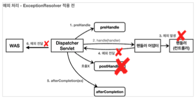
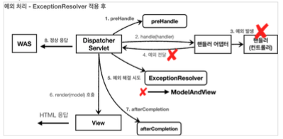
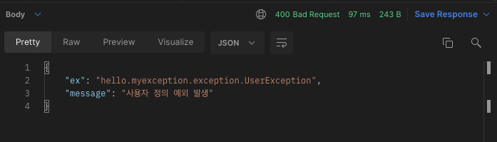

우리는 지금까지 [서블릿을 통한 예외처리(링크)](https://imprint.tistory.com/271) 와 [스프링 부트를 통한 예외처리(링크)](https://imprint.tistory.com/272) 에 대해서 알아보았다.
이번 장에서는 화면을 위한 예외처리가 아닌 API 요청에 대한 예외를 처리하는 방법에 대해서 알아본다.
모든 코드는 [깃허브(링크)](https://github.com/roy-zz/mvc) 에 올려두었다.

---

### 개요

화면을 위한 `HTML` 파일 요청에 대한 예외 처리는 오류 페이지만 만들면 대부분의 문제를 처리할 수 있다.  
하지만 API 요청에 대한 예외 처리를 하는 경우 오류 응답 스펙을 결정하고 JSON 형식으로 데이터를 내려주어야 한다.  

서블릿을 사용하여 API 요청에 대한 예외 처리를 하는 방법에 대해서 알아본다.

### 서블릿을 사용한 API 예외 처리 

#### WebServerFactoryCustomizer 구현체

`Exception`이 `WAS`까지 전달되거나 `response.sendError()`가 호출된 경우에 예외 처리 컨트롤러를 매핑하는 `WebServerCustomizer` 클래스를 생성한다.

```java
@Component
public class WebServerCustomizer implements WebServerFactoryCustomizer<ConfigurableWebServerFactory> {
    @Override
    public void customize(ConfigurableWebServerFactory factory) {
        ErrorPage errorPage404 = new ErrorPage(NOT_FOUND, "/error-page/404");
        ErrorPage errorPage500 = new ErrorPage(INTERNAL_SERVER_ERROR, "/error-page/500");
        ErrorPage errorPageException = new ErrorPage(RuntimeException.class, "/error-page/500");
        factory.addErrorPages(errorPage404, errorPage500, errorPageException);
    }
}
```

#### ApiExceptionController

테스트를 위한 `ApiExceptionController`를 생성한다.  
우리가 원하는 상황에 예외를 발생시킬 수 있도록 경로 변수로 `exception`이라는 아이디가 입력되면 예외를 발생시키도록 구현하였다.

```java
@Slf4j
@RestController
public class ApiExceptionController {
    @GetMapping("/api/members/{id}")
    public MemberDto getMember(@PathVariable("id") String id) {
        if (id.equals("exception")) {
            throw new RuntimeException("잘못된 사용자 아이디");
        }
        return new MemberDto(id, "id: " + id);
    }
    @Data
    @AllArgsConstructor
    static class MemberDto {
        private String memberId;
        private String name;
    }
}
```

`exception`이 아닌 다른 아이디로 요청되는 경우 정상적으로 데이터를 반환하지만 아이디를 `exception`으로 하여 요청하는 경우 기존에 만들어 두었던 `HTML` 파일이 반환되는 것을 확인할 수 있다.  
API 요청이기 때문에 반환도 `HTML`이 아닌 `JSON` 형식으로 할 수 있도록 수정해 본다.

#### API용 예외 처리 추가

기존에 생성한 `ExceptionHandleController` 클래스에 `API`요청에 대한 예외를 처리하는 메서드를 추가한다.

```java
@Slf4j
@Controller
@RequestMapping("/error-page")
public class ExceptionHandleController {
    // ...
    @RequestMapping(value = "/500", produces = MediaType.APPLICATION_JSON_VALUE)
    public ResponseEntity<Map<String, Object>> errorPage500Api(HttpServletRequest request) {
        log.info("call error page api");
        Map<String, Object> result = new HashMap<>();
        Exception exception = (Exception) request.getAttribute(ERROR_EXCEPTION);
        result.put("status", request.getAttribute(ERROR_STATUS_CODE));
        result.put("message", exception.getMessage());
        Integer statusCode = (Integer) request.getAttribute(RequestDispatcher.ERROR_STATUS_CODE);
        return new ResponseEntity<>(result, HttpStatus.valueOf(statusCode));
    }
    // ...
}
```

`produces` 값을 `MediaType.APPLICATION_JSON_VALUE`로 지정하여 클라이언트가 요청할 때 HTTP 헤더에 `Accept`값을 `application/json`으로 지정하는 경우 해당 메서드가 호출된다.  
결국 `/error-page/500` 경로를 가지는 메서드는 두 개 있지만 클라이언트가 결과로 `JSON` 형식을 원하는 경우 새로 생성한 `errorPage500Api`메서드가 호출되는 것이다.  
응답 데이터를 위해 `Map`을 사용하였고 응답 형식을 `ResponseEntity`로 지정하였기 때문에 메시지 컨버터에 의해 기본으로 내장되는 `Jackson` 라이브러리를 통해 `Map`이 `JSON`으로 변환된다.

---

### 스프링 부트를 사용한 API 예외 처리

이번에는 서블릿이 아닌 스프링 부트를 활용하여 API 예외 처리를 진행해본다.  
API 예외 처리를 위해서도 `HTML` 요청에 대한 예외 처리를 위해 사용되었던 `BasicErrorController`가 사용된다.
  
`BasicErrorController` 코드를 확인해보면 `/error`이라는 경로의 요청을 처리하는 `errorHtml()`, `error()` 두 메서드가 있는 것을 확인할 수 있다.
  
- `errorHtml`: `produces = MediaType.TEXT_HTML_VALUE`와 같이 클라이언트 요청의 `Accept` 헤더 값이 `text/html`인 경우에 `errorHtml` 메서드를 호출하여 View 페이지를 제공한다.
- `error`: `errorHtml`가 호출되는 경우를 제외하고 호출되며 `ResponseEntity`로 HTTP Body에 JSON 데이터를 반환한다.
  
스프링이 제공하는 `BasicErrorController`를 사용하기 위해서 `WebServerCustomizer`의 `@Component` 애노테이션을 주석처리하고 `/api/members` API를 호출해본다.  
경로 변수로 예외를 발생시키기 위해 `exception`을 입력하면 아래와 같이 예외에 대한 정보가 출력되는 것을 확인할 수 있다.

```json
{
    "timestamp": "2022-06-02T08:12:20.648+00:00",
    "status": 500,
    "error": "Internal Server Error",
    "exception": "java.lang.RuntimeException",
    "trace": "java.lang.RuntimeException: 잘못된 사용자 아이디\n\tat hello.myexception.api.ApiExceptionController.getMember(ApiExceptionController.java:17)\n\tat java.base/jdk.internal.reflect.NativeMethodAccessorImpl.invoke0(Native Method)\n\tat java.base/jdk.internal.reflect.NativeMethodAccessorImpl.invoke(NativeMethodAccessorImpl.java:62)\n\tat java.base/jdk.internal.reflect.DelegatingMethodAccessorImpl.invoke(DelegatingMethodAccessorImpl.java:43)\n\tat java.base/java.lang.reflect.Method.invoke(Method.java:566)\n\tat org.springframework.web.method.support.InvocableHandlerMethod.doInvoke(InvocableHandlerMethod.java:205)\n\tat org.springframework.web.method.support.InvocableHandlerMethod.invokeForRequest(InvocableHandlerMethod.java:150)\n\tat org.springframework.web.servlet.mvc.method.annotation.ServletInvocableHandlerMethod.invokeAndHandle(ServletInvocableHandlerMethod.java:117)\n\tat org.springframework.web.servlet.mvc.method.annotation.RequestMappingHandlerAdapter.invokeHandlerMethod(RequestMappingHandlerAdapter.java:895)\n\tat org.springframework.web.servlet.mvc.method.annotation.RequestMappingHandlerAdapter.handleInternal(RequestMappingHandlerAdapter.java:808)\n\tat org.springframework.web.servlet.mvc.method.AbstractHandlerMethodAdapter.handle(AbstractHandlerMethodAdapter.java:87)\n\tat org.springframework.web.servlet.DispatcherServlet.doDispatch(DispatcherServlet.java:1067)\n\tat org.springframework.web.servlet.DispatcherServlet.doService(DispatcherServlet.java:963)\n\tat org.springframework.web.servlet.FrameworkServlet.processRequest(FrameworkServlet.java:1006)\n\tat org.springframework.web.servlet.FrameworkServlet.doGet(FrameworkServlet.java:898)\n\tat javax.servlet.http.HttpServlet.service(HttpServlet.java:655)\n\tat org.springframework.web.servlet.FrameworkServlet.service(FrameworkServlet.java:883)\n\tat javax.servlet.http.HttpServlet.service(HttpServlet.java:764)\n\tat org.apache.catalina.core.ApplicationFilterChain.internalDoFilter(ApplicationFilterChain.java:227)\n\tat org.apache.catalina.core.ApplicationFilterChain.doFilter(ApplicationFilterChain.java:162)\n\tat org.apache.tomcat.websocket.server.WsFilter.doFilter(WsFilter.java:53)\n\tat org.apache.catalina.core.ApplicationFilterChain.internalDoFilter(ApplicationFilterChain.java:189)\n\tat org.apache.catalina.core.ApplicationFilterChain.doFilter(ApplicationFilterChain.java:162)\n\tat hello.myexception.filter.LogFilter.doFilter(LogFilter.java:31)\n\tat org.apache.catalina.core.ApplicationFilterChain.internalDoFilter(ApplicationFilterChain.java:189)\n\tat org.apache.catalina.core.ApplicationFilterChain.doFilter(ApplicationFilterChain.java:162)\n\tat org.springframework.web.filter.RequestContextFilter.doFilterInternal(RequestContextFilter.java:100)\n\tat org.springframework.web.filter.OncePerRequestFilter.doFilter(OncePerRequestFilter.java:117)\n\tat org.apache.catalina.core.ApplicationFilterChain.internalDoFilter(ApplicationFilterChain.java:189)\n\tat org.apache.catalina.core.ApplicationFilterChain.doFilter(ApplicationFilterChain.java:162)\n\tat org.springframework.web.filter.FormContentFilter.doFilterInternal(FormContentFilter.java:93)\n\tat org.springframework.web.filter.OncePerRequestFilter.doFilter(OncePerRequestFilter.java:117)\n\tat org.apache.catalina.core.ApplicationFilterChain.internalDoFilter(ApplicationFilterChain.java:189)\n\tat org.apache.catalina.core.ApplicationFilterChain.doFilter(ApplicationFilterChain.java:162)\n\tat org.springframework.web.filter.CharacterEncodingFilter.doFilterInternal(CharacterEncodingFilter.java:201)\n\tat org.springframework.web.filter.OncePerRequestFilter.doFilter(OncePerRequestFilter.java:117)\n\tat org.apache.catalina.core.ApplicationFilterChain.internalDoFilter(ApplicationFilterChain.java:189)\n\tat org.apache.catalina.core.ApplicationFilterChain.doFilter(ApplicationFilterChain.java:162)\n\tat org.apache.catalina.core.StandardWrapperValve.invoke(StandardWrapperValve.java:197)\n\tat org.apache.catalina.core.StandardContextValve.invoke(StandardContextValve.java:97)\n\tat org.apache.catalina.authenticator.AuthenticatorBase.invoke(AuthenticatorBase.java:541)\n\tat org.apache.catalina.core.StandardHostValve.invoke(StandardHostValve.java:135)\n\tat org.apache.catalina.valves.ErrorReportValve.invoke(ErrorReportValve.java:92)\n\tat org.apache.catalina.core.StandardEngineValve.invoke(StandardEngineValve.java:78)\n\tat org.apache.catalina.connector.CoyoteAdapter.service(CoyoteAdapter.java:360)\n\tat org.apache.coyote.http11.Http11Processor.service(Http11Processor.java:399)\n\tat org.apache.coyote.AbstractProcessorLight.process(AbstractProcessorLight.java:65)\n\tat org.apache.coyote.AbstractProtocol$ConnectionHandler.process(AbstractProtocol.java:890)\n\tat org.apache.tomcat.util.net.NioEndpoint$SocketProcessor.doRun(NioEndpoint.java:1743)\n\tat org.apache.tomcat.util.net.SocketProcessorBase.run(SocketProcessorBase.java:49)\n\tat org.apache.tomcat.util.threads.ThreadPoolExecutor.runWorker(ThreadPoolExecutor.java:1191)\n\tat org.apache.tomcat.util.threads.ThreadPoolExecutor$Worker.run(ThreadPoolExecutor.java:659)\n\tat org.apache.tomcat.util.threads.TaskThread$WrappingRunnable.run(TaskThread.java:61)\n\tat java.base/java.lang.Thread.run(Thread.java:829)\n",
    "message": "잘못된 사용자 아이디",
    "path": "/api/members/exception"
}
```  

`HTML` 예외 처리와 동일하게 예시처럼 오류에 대한 상세 정보를 출력하는 것은 보안상 위험하기 때문에 상용으로 배포하는 경우에는 조심해야 한다.

#### HTML 페이지와 API 오류 처리 차이

`BasicErrorController`의 기능을 확장하면 JSON 메시지도 우리가 원하는 형태로 변경이 가능하다.
  
스프링 부트에서 지원하는 `BasicErrorController`는 HTML 페이지를 제공하는 경우에는 에러 코드에 따라서 우리가 정해놓은 화면을 렌더링 해주기 때문에 편리한 기능이다.  
하지만 일반적으로 API의 경우 화면보다 갯수가 많으며 같은 오류라도 API마다 다르게 처리해줘야 할 수도 있기 때문에 매우 세밀하고 복잡한 처리가 필요하다.  
결과적으로 HTML 예외 처리를 위해서는 `BasicErrorController`을 사용하고 API 예외 처리를 위해서는 `@ExceptionHandler` 애노테이션을 사용하여 해결해야 한다.

---

### HandlerExceptionResolver

예외가 발생하여 `WAS`까지 예외가 전달되면 HTTP 상태코드가 500인 상태로 클라이언트에게 전달된다.  
`HandlerExceptionResolver`를 사용하면 예외의 종류에 따라서 400, 401, 4002와 같이 우리가 원하는 상태 코드로 변경이 가능하며 메시지의 형식등을 API 마다 다르게 처리할 수 있다.  
  
이번에는 `IllegalArgumentException`이 발생한 경우 클라이언트에게 상태 코드를 500이 아니라 400으로 변경해서 전달하는 방법에 대해서 알아본다.

#### HandlerExceptionResolver 란?

`HandlerExceptionResolver`를 사용하면 컨트롤러(핸들러) 밖으로 예외가 던져진 경우 예외를 해결하고 결과를 재정의 할 수 있다.  
`HandlerExceptionResolver`는 일반적으로 `ExceptionResolver`로 줄여서 부르기도 한다.

**ExceptionResolver 적용 전**



핸들러에서 예외가 발생하면 `Dispatcher Servlet`을 통해서 **`WAS`에게 예외가 전달**된다.  
이때 `postHandle`는 호출되지 않으며 `afterCompletion`은 호출된다.
  
**ExceptionResolver 적용 후**



핸들러에서 예외가 발생하면 `Dispatcher Servlet`으로 예외가 전달된다.  
예외가 발생한 경우 `Dispatcher Servlet`은 예외를 처리할 수 있는 `Exception Resolver`를 찾는다.  
만약 처리가 가능한 `Exception Resolver`가 있다면 예외를 처리하고 `WAS`에게 정상적으로 응답한다.  
처리가 불가능한 예외라면 핸들러에서 발생한 예외를 `WAS`에게 전달한다.  
예외가 처리되더라도 예외가 발생했다는 사실은 바뀌지 않기 때문에 `postHandle` 은 호출되지 않는다.
  
`HandlerExceptionResolver` 인터페이스를 살펴보면 아래와 같이 `resolveException` 메서드를 가지고 있으며 `ModelAndView`를 반환하는 것을 알 수 있다.
  
```java
public interface HandlerExceptionResolver {
	@Nullable
	ModelAndView resolveException(
			HttpServletRequest request, HttpServletResponse response, @Nullable Object handler, Exception ex);
}
```

`handler`의 경우 예외가 발생한 핸들러를 의미하며 `ex`는 핸들러에서 발생한 예외를 의미한다.
  
#### HandlerExceptionResolver 구현체

예외 처리를 위하여 `HandlerExceptionResolver`를 구현하는 `MyHandlerExceptionResolver` 클래스를 생성한다.

```java
@Slf4j
public class MyHandlerExceptionResolver implements HandlerExceptionResolver {
    @Override
    public ModelAndView resolveException(HttpServletRequest request, HttpServletResponse response, Object handler, Exception ex) {
        log.info("call resolver exception", ex);
        try {
            if (ex instanceof IllegalArgumentException) {
                log.info("ex is a IllegalArgumentException");
                response.sendError(HttpServletResponse.SC_BAD_REQUEST, ex.getMessage());
                return new ModelAndView();
            }
        } catch (IOException e) {
            log.error("resolver ex", e);
        }
        return null;
    }
}
```

`ExceptionResolver`가 `ModelAndView`를 반환하는 이유는 `try, catch`를 사용하는 것 처럼 `Exception`을 처리해서 클라이언트에게 정상적으로 화면을 보여주기 위함이다.  
예시에서는 `IllegalArgumentException`이 발생하면 `response.sendError(HttpServletResponse.SC_BAD_REQUEST)`를 호출하여 HTTP 상태 코드를 400으로 지정한다.  
이후 비어있는 `ModelAndView`를 반환한다.  
`DispatcherServlet`은 `HandlerExceptionResolver`의 반환 값에 따라서 아래와 같이 동작한다.

- 빈 ModelAndView: 예시처럼 비어있는 `ModelAndView`를 반환하면 뷰를 렌더링하지 않고 정상적인 흐름대로 서블릿이 리턴된다.
- ModelAndView 지정: `ModelAndView`에 `View`, `Model`등의 정보를 지정해서 반환하면 지정한 뷰를 렌더링 한다.
- null: `ExceptionResolver`는 여러개 등록이 가능하다. `null`이 반환된 경우 다른 `ExceptionResolver`를 찾는다.  
  만약 처리 가능한 `ExceptionResolver`가 없다면 최초에 발생한 예외를 `WAS`에 전달한다.

#### 구성 정보 수정

우리가 만든 `MyHandlerExceptionResolver`를 사용하려면 아래처럼 구성 정보를 수정해야 한다.

```java
@Configuration
public class WebConfig implements WebMvcConfigurer {
    @Override
    public void extendHandlerExceptionResolvers(List<HandlerExceptionResolver> resolvers) {
        resolvers.add(new MyHandlerExceptionResolver());
    }
    // ...
}
```

`configureHandlerExceptionREsolvers()` 를 사용하는 경우 스프링의 기본 `ExceptionHandler`가 제거되기 때문에 새로운 `ExceptionHandler`를 추가하기 위해서는 `extendHandlerExceptionResolvers`를 사용해야 한다.

---

지금부터 `HandlerExceptionResolver`를 실제로 사용하는 방법에 대해서 알아본다.  
예외가 발생한 경우의 프로세스를 돌아보면 예외가 `WAS`까지 전달되고, `WAS`는 오류 페이지 정보를 찾기 위해 다시 `/error`를 찾기 위해 다시 호출해야 한다.  
예외가 발생할 때마다 이렇게 복잡한 프로세스를 진행해야 하는 것은 비효율적이며 `ExceptionResolver`를 사용하면 이런 복잡한 과정이 불필요해진다.
  
#### UserException

`RuntimeException`을 상속받는 `UncheckedException`인 `UserException` 클래스를 생성한다.  

```java
public class UserException extends RuntimeException {
    public UserException() {
        super();
    }
    public UserException(String message) {
        super(message);
    }
    public UserException(String message, Throwable cause) {
        super(message, cause);
    }
    public UserException(String message, Throwable cause, boolean enableSuppression, boolean writableStackTrace) {
        super(message, cause, enableSuppression, writableStackTrace);
    }
}
```

#### ApiExceptionController 수정

기존 API에서 경로 변수로 "user-exception"이 입력되는 경우 `UserException`을 발생시키도록 수정한다.

```java
@Slf4j
@RestController
public class ApiExceptionController {
    @GetMapping("/api/members/{id}")
    public MemberDto getMember(@PathVariable("id") String id) {
        switch (id) {
            case "exception":
                throw new RuntimeException("잘못된 사용자 아이디");
            case "bad-request":
                throw new IllegalArgumentException("잘못된 요청");
            case "user-exception":
                throw new UserException("사용자 정의 예외 발생");
            default:
                return new MemberDto(id, "id: " + id);
        }
    }
    // ...
}
```

#### UserHandlerExceptionResolver

`UserException`을 처리할 수 있는 `UserHandlerExceptionResolver` 클래스를 생성한다.

```java
@Slf4j
public class UserHandlerExceptionResolver implements HandlerExceptionResolver {
    private static final String APPLICATION_JSON_VALUE = "application/json";
    private final ObjectMapper objectMapper = new ObjectMapper();
    @Override
    public ModelAndView resolveException(HttpServletRequest request, HttpServletResponse response, Object handler, Exception ex) {
        try {
            if (ex instanceof UserException) {
                log.info("UserException resolver to 400");
                String acceptHeader = request.getHeader("accept");
                response.setStatus(HttpServletResponse.SC_BAD_REQUEST);
                if (APPLICATION_JSON_VALUE.equals(acceptHeader)) {
                    Map<String, Object> errorResult = new HashMap<>();
                    errorResult.put("ex", ex.getClass());
                    errorResult.put("message", ex.getMessage());
                    String result = objectMapper.writeValueAsString(errorResult);
                    response.setContentType(APPLICATION_JSON_VALUE);
                    response.setCharacterEncoding("utf-8");
                    response.getWriter().write(result);
                    return new ModelAndView();
                } else {
                    return new ModelAndView("error/500");
                }
            }
        } catch (IOException e) {
            log.error("resolver ex", e);
        }
        return null;
    }
}
```

코드를 보면 알 수 있듯이 복잡해서 이러한 방식으로는 사용되지 않는 방식이므로 이해만 하고 넘어가도록 한다.  
`HTTP` 요청 헤더의 `ACCEPT` 값이 `application/json`이면 JSON 형식으로 오류를 반환하고 그 외의 경우에는 `error/500.html` 오류 페이지를 반환한다.

#### 구성 요소 수정

`extendHandlerExceptionResolvers`를 통해서 새로 만든 `UserHandlerExceptionResolver`가 반환될 수 있도록 수정한다.

```java
@Configuration
public class WebConfig implements WebMvcConfigurer {
    @Override
    public void extendHandlerExceptionResolvers(List<HandlerExceptionResolver> resolvers) {
        resolvers.add(new MyHandlerExceptionResolver());
        resolvers.add(new UserHandlerExceptionResolver());
    }
    // ...
}
```

서버를 재실행시키고 `/api/members/user-exception`과 같이 요청을 보내면 아래와 같이 우리가 원하는 결과가 나오는 것을 확인할 수 있다.



지금까지의 방법을 적용하면 `ExceptionResolver`에 의해서 예외 상황이 발생하더라도 `WAS`까지 예외가 전달되지 않고 스프링 내부에서 예외 처리가 끝나는 것을 확인할 수 있었다.  
결과적으로 `WAS`가 보기에는 정상적으로 처리된 결과를 클라이언트에게 전달한 것이다.  
하지만 `UserHandlerExceptionResolver` 코드를 살펴보면 상당히 지저분하고 중복되는 내용이 반복되는 것을 확인할 수 있다.
  
스프링이 제공하는 `ExceptionResolver`를 사용하면 이보다 편하게 예외 처리가 가능하다.

---

**참고한 강의**:
- https://www.inflearn.com/course/%EC%8A%A4%ED%94%84%EB%A7%81-%ED%95%B5%EC%8B%AC-%EC%9B%90%EB%A6%AC-%EA%B8%B0%EB%B3%B8%ED%8E%B8
- https://www.inflearn.com/course/%EC%8A%A4%ED%94%84%EB%A7%81-mvc-1
- https://www.inflearn.com/course/%EC%8A%A4%ED%94%84%EB%A7%81-mvc-2

**참고한 문서**:
- [Thymeleaf 기본 메뉴얼](https://www.thymeleaf.org/doc/tutorials/3.0/usingthymeleaf.html)
- [Thymeleaf 스프링 통합 메뉴얼](https://www.thymeleaf.org/doc/tutorials/3.0/thymeleafspring.html)