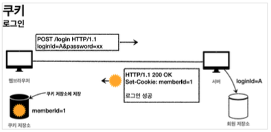
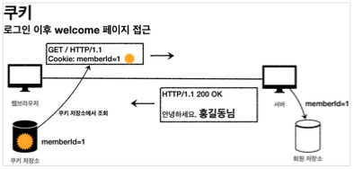
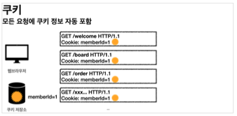
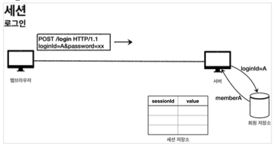
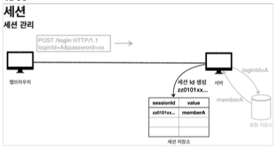
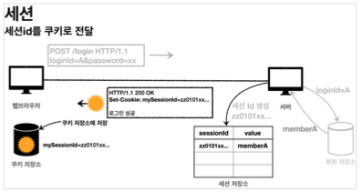
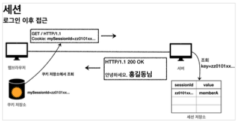

이번 장에서는 스프링의 `쿠키`와 `세션`을 사용하여 로그인을 구현하는 방법에 대해서 알아본다.
모든 코드는 [깃허브(링크)](https://github.com/roy-zz/mvc) 에 올려두었다.

---

화면을 구현하는 방법은 다루지 않으므로 깃허브의 소스코드를 참고한다.

### 패키지 구조

프로젝트를 생성하고 패키지 구조를 잡는 것은 생각보다 중요한 작업이다.  
핵심 비즈니스 로직이 수정되었다고 해서 프론트엔드 코드가 변경되어서는 안되고 프론트엔드 코드가 변경되었다고 해서 핵심 비즈니스 로직이 있는 부분의 코드가 수정되어서는 안된다.  
핵심 비즈니스 로직을 담고 있는 부분을 도메인(domain)이라고 하며 프론트엔드 코드와 격리하여 패키지 구조를 잡아야 한다. 

- root
  - domain
    - item
    - member
    - login
  - web
    - item
    - member
    - login

이렇게 패키지 구조를 잡게 되면 추후 웹을 구현하는 구현체(예 타임리프)가 변경되어도 도메인 패키지는 전혀 영향을 받지 않는다.  
웹 패키지는 도메인을 참조하고 있지만 도메인은 웹 패키지를 참조하지 않도록 구현했기 때문에 가능한 일이다.

---

### 쿠키를 사용한 로그인 방식

로그인을 성공하고 HTTP 헤더가 아닌 쿼리 파라미터에 인증관련 정보를 계속 보내는 것은 번거로운 작업이다.  
서버에서 로그인에 성공하면 HTTP 응답에 쿠키를 담아서 클라이언트에 전달하고 클라이언트는 해당 쿠키를 지속해서 보내준다.  
쿠키에 대해서 잘 모른다면 [여기(링크)](https://imprint.tistory.com/31) 에 글을 적어두었으니 확인해보도록 한다.

1. 클라이언트가 로그인을 요청하면 서버에서 로그인 결과를 확인하여 성공하는 경우 헤더에 쿠키를 담아서 보낸다.



2. 클라이언트는 이후 요청부터 헤더에 쿠키를 담아서 전송하기 때문에 서버는 어떠한 사용자의 요청인지 알 수 있다.





```java
@Controller
@RequiredArgsConstructor
public class LoginController {
    private final LoginService loginService;
    @PostMapping("/login")
    public String login(@Valid @ModelAttribute LoginForm form, BindingResult bindingResult, HttpServletResponse response) {
        if (bindingResult.hasErrors()) {
            // 파라미터 바인딩 오류 처리
        }
        Member loginMember = loginService.login(form.getLoginId(), form.getPassword());
        if (loginMember == null) {
            bindingResult.reject("loginFail", "아이디 또는 비밀번호가 맞지 않습니다.");
            // 로그인 실패 처리
        }
        Cookie idCookie = new Cookie("memberId", String.valueOf(loginMember.getId()));
        response.addCookie(idCookie);
        // 로그인 성공 처리
    }
}
```

로그인에 성공하면 쿠키를 생성하고 `HttpServletReponse`에 쿠키를 추가한다.  
쿠키 이름은 `memberId`이며, 값은 회원의 `id`를 담아서 전달하면 클라이언트는 종료 전까지 회원의 `id`를 서버에 계속 보내줄 것이다.
  
이것으로 로그인을 하고 쿠키를 설정하는 방법에 대해서 알아보았다. 쿠키를 사용하는 코드는 아래와 같다.

```java
@Controller
@RequiredArgsConstructor
public class HomeController { 
    private final MemberRepository memberRepository;
    @GetMapping("/")
    public String homeLogin(
              @CookieValue(name = "memberId", required = false) Long memberId, 
              Model model) {
        
        if (memberId == null) {
            return "home";
        }
        Member loginMember = memberRepository.findById(memberId); 
        if (loginMember == null) {
              return "home";
        }
        model.addAttribute("member", loginMember);
        return "loginHome";
    }
}
```

`@CookieValue` 애노테이션을 사용하면 쿠키를 편하게 조회할 수 있다. 로그인 하지 않은 사용자도 홈에 접근할 수 있도록 `required` 속성을 `false`로 설졍하였다.
  
쿠키를 사용할 때 로그아웃을 하는 방법은 두 가지가 있다.  
1. 클라이언트가 웹 브라우저를 종료하는 방법(세션 쿠키인 경우)
2. 서버에서 해당 쿠키의 종료 날짜를 0으로 수정하는 경우

아래의 코드는 2번 방법을 구현한 코드다.

```java
@PostMapping("/logout")
public String logout(HttpServletResponse response) {
    expireCookie(response, "memberId");
    return "redirect:/";
}
private void expireCookie(HttpServletResponse response, String cookieName) {
    Cookie cookie = new Cookie(cookieName, null);
    cookie.setMaxAge(0);
    response.addCookie(cookie);
}
```

---

### 쿠키와 보안 문제

쿠키를 사용해서 `loginId`를 전달해서 로그인을 유지할 수 있다.  
하지만 이러한 방식에는 보안상 치명적인 문제가 있다.

- 사용자가 쿠키의 정보를 다른 값으로 변경하면 다른 사용자의 정보를 볼 수 있다.
- 쿠키에 보관된 정보는 보안솽 취약하여 나의 PC가 노출되거나 HTTP 요청이 노출되면 쿠키 정보가 제3자에게 전달된다.
- 누군가 나의 쿠키를 알게되면 해당 쿠키를 사용하여 악의적으로 사용이 가능하다.

#### 대안

- 쿠키의 중요한 값을 노출하지 않고, 사용자 별로 예측 불가능한 임의의 토큰(랜덤 값)을 노출하고, 서버에서 토큰과 `loginId`를 매핑해서 인식한다.
  이렇게 구현하기 위해서는 서버에서 토큰을 관리해야 한다.
- 클라이언트가 임의로 토큰의 값을 변경하여도 유효한 값이 되지 않도록 해야 한다.
- 제3자가 토큰의 값을 알게 되더라도 토큰의 만료기간을 짧게 유지하여 일정시간 이후에 이전에 발급된 토큰은 무효화 되도록 구현해야 한다.
  또한, 토큰이 유출이 의심되는 경우 해당 토큰을 서버에서 강제로 제거해야 한다.

---

### 쿠키와 세션을 사용한 로그인 방식

우리는 `쿠키를 사용한 로그인 방법`을 살펴보면서 보안적으로 문제가 되는 것을 확인하였다.  
발생한 보안적 문제들은 대부분 클라이언트가 중요한 정보를 가지고 있기 때문에 발생하였기 때문에 이러한 문제를 해결하기 위해서는 중요한 정보를 서버에 저장해야 한다.  
클라이언트가 요청하였을 때 중요한 정보를 찾기 위한 랜덤한 키값을 제공해야 한다.
  
서버에 중요한 정보를 저장하고 클라이언트의 쿠키에는 서버에 저장된 중요한 정보를 찾기 위한 키를 저장하는 방법을 **세션** 이라고 한다.
  
1. 사용자가 아이디와 비밀번호를 서버에 전달하면 서버는 로그인이 가능한 유효한 정보인지 확인한다.



2. 1단계에서 검증한 로그인 정보가 유효한 정보라면 서버는 `세션 ID`를 생성해야 한다.  
   이때 생성하는 `세션 ID`는 추정이 불가능해야 하며 클라이언트 임의로 수정하면 무효한 값으로 변경되어야 한다.  
   생성된 `세션 ID`를 키로 사용하는 값을 **세션 저장소** 에 저장한다.



3. 2단계에서 생성된 `세션 ID`를 `mySessionId`라는 이름으로 쿠키에 담아서 클라이언트에 전달한다.  
   쿠키를 전달받은 클라이언트는 `mySessionId`를 **쿠키 저장소** 에 저장한다.  
   서버는 `세션 ID`를 제외한 회원 관련 정보는 클라이언트에 전달하지 않아야 한다.



4. 로그인 이후 클라이언트는 요청시에 `mySessionId` 쿠키를 같이 전달한다.  
   서버에서는 클라이언트가 전달한 `mySessionId` 쿠키 정보로 **세션 저장소**를 조회하여 로그인시 보관한 세션 정보를 사용한다.



---

### 로그인 처리 - 세션 매니저 직접 생성

스프링이 제공하는 `SessionManager`를 사용하기 이전에 우리가 직접 `SessionManager`를 생성하여 우리의 코드에 적용시켜 본다.
우리가 생성하는 `SessionManager` 객체는 크게 아래와 같은 3가지 기능을 제공해야 한다.

- 세션 생성
  - sessionId 생성
  - 세션 저장소에 sessionId와 사용자 정보를 저장
  - sessionId로 응답 쿠키를 생성하여 클라이언트에 전달
- 세션 조회
  - 클라이언트가 전달한 sessionId 쿠키 값을 키로 사용하여 세션 저장소에서 사용자 정보를 조회
- 세션 만료
  - 클라이언트가 전달한 sessionId 쿠키 값을 키로 사용하여 세션 저장소에 보관한 sessionId와 사용자 정보 제거

#### Session Manager 생성

```java
import java.util.Objects;@Component
public class SessionManager {
    public static final String SESSION_COOKIE_NAME = "mySessionId";
    private Map<String, Object> sessionStore = new ConcurrentHashMap<>();
    
    public void createSession(Object value, HttpServletResponse response) {
        String sessionId = UUID.randomUUID().toString();
        sessionStore.put(sessionId, value);
        Cookie mySessionCookie = new Cookie(SESSION_COOKIE_NAME, sessionId);
        response.addCookie(mySessionCookie);
    }
    public Object getSession(HttpServletRequest request) {
        Cookie sessionCookie = findCookie(request, SESSION_COOKIE_NAME);
        return Objects.isNull(sessionCookie) 
            ? null 
            : sessionStore.get(sessionCookie.getValue());
    }
    public void expire(HttpServletRequest request) {
        Cookie sessionCookie = findCookie(request, SESSION_COOKIE_NAME);
        if (sessionCookie != null) {
            sessionStore.remove(sessionCookie.getValue());
        }
    }
    public Cookie findCookie(HttpServletRequest request, String cookieName) {
        if (request.getCookies() == null) {
            return null;
        }
        return Arrays.stream(request.getCookies())
                .filter(cookie -> cookie.getName().equals(cookieName))
                .findAny()
                .orElse(null);
    }
}
```

- `@Component`를 사용하여 스프링 빈으로 등록되도록 하였다.
- 스프링 빈의 경우 기본적으로 싱글톤이기 때문에 `Thread-Safe`한 환경을 만들기 위하여 `HashMap`이 아닌 `ConcurrentHashMap`을 사용하였다.

#### Session Manager 사용

```java
@Controller
@RequiredArgsConstructor
public class LoginController {
    private final LoginService loginService;
    private final SessionManager sessionManager;
    @PostMapping("/login")
    public String login(@Valid @ModelAttribute LoginForm form, BindingResult bindingResult, HttpServletResponse response) {
        if (bindingResult.hasErrors()) {
            // 파라미터 바인딩 실패 처리
        }
        Member loginMember = loginService.login(form.getLoginId(), form.getPassword());
        if (loginMember == null) {
            bindingResult.reject("로그인 실패", "아이디 또는 비밀번호가 일치하지 않습니다.");
            // 로그인 실패 처리
        }
        sessionManager.createSession(loginMember, response);
        // 로그인 성공 처리
    }
    @PostMapping("/logout")
    public String logout(HttpServletRequest request) {
        sessionManager.expire(request);
        // 로그아웃 처리
    }
}
```

```java
@Controller
@RequiredArgsConstructor
public class HomeController {
    private final MemberRepository memberRepository;
    private final SessionManager sessionManager;
    @GetMapping("/")
    public String home(HttpServletRequest request, Model model) {
        Member member = (Member) sessionManager.getSession(request);
        if (member == null) {
            // 세션 매니저에서 조회된 사용자 정보가 없는 경우 처리
        }
        model.addAttribute("member", member);
        // 세션 매니저에서 정상적으로 사용자 정보가 조회된 경우 처리
    }
}
```

---

### 로그인 처리 - 서블릿 HTTP 세션 사용

세션은 웹이 등장하면서 동시에 등장한 개념이므로 대부분의 웹 애플리케이션에 필요하다.  
우리가 사용하는 서블릿은 세션을 위해 `HttpSession`이라는 기능을 제공하며 지금까지 발생한 문제들을 해결해준다.  
우리가 직접 구현한 기능이외에 사용되지 않는 세션을 제거하는 기능(TTL)과 같은 부가적인 기능도 제공한다.
  
`HttpSession`의 경우 서블릿을 통해 생성되며 이름이 `JSESSIONID`인 추정 불가능한 랜덤한 값의 쿠키를 생성한다.  
`Cookie: JSESSIONID=5B78E23B513F50164D6FDD8C97B0AD05`

#### Http Session 사용

```java
@Controller
@RequiredArgsConstructor
public class LoginController {
    private final LoginService loginService;
    @PostMapping("/login")
    public String login(@Valid @ModelAttribute LoginForm form, BindingResult bindingResult, HttpServletRequest request) {
        if (bindingResult.hasErrors()) {
            // 파라미터 바인딩 오류 처리
        }
        Member loginMember = loginService.login(form.getLoginId(), form.getPassword());
        if (loginMember == null) {
            bindingResult.reject("로그인 실패", "아이디 또는 비밀번호가 일치하지 않습니다.");
            // 로그인 실패 처리
        }
        HttpSession session = request.getSession();
        session.setAttribute(SessionConst.LOGIN_MEMBER, loginMember);
        // 로그인 성공 처리
    }
    @PostMapping("/logout")
    public String logout(HttpServletRequest request) {
        HttpSession session = request.getSession(false);
        if (session != null) {
            session.invalidate();
        }
        // 로그아웃 처리
    }
}
```

```java
@Controller
@RequiredArgsConstructor
public class HomeController {
    private final MemberRepository memberRepository;
    @GetMapping("/")
    public String home(HttpServletRequest request, Model model) {
        HttpSession session = request.getSession(false);
        if (session == null) {
            // 세션이 없는 경우 처리
        }
        Member loginMember = (Member) session.getAttribute(SessionConst.LOGIN_MEMBER);
        if (loginMember == null) {
            // 세션 매니저에서 조회된 사용자 정보가 없는 경우 처리
        }
        model.addAttribute("member", loginMember);
        // 세션 매니저에서 정상적으로 사용자 정보가 조회된 경우 처리
    }
}
```

- `request.getSession()`은 기본값이 `true`로 만약 값을 입력하지 않는다면 조회하는 시점에 세션이 없다면 새로운 세션을 생성하여 반환하게 된다.  
  세션이 없는 경우 생성하지 않게 하기 위해서는 인자값을 `false`로 지정해야 한다.

#### @SessionAttribute

위에서 다룬 내용으로도 충분히 세션 기능을 사용할 수 있지만 스프링에서는 더 편리하게 사용할 수 있도록 `@SessionAttribute` 애노테이션을 제공한다.  
이미 로그인 된 사용자의 정보를 찾기 위해서는 아래와 같이 사용하면 되며 `request.getSession(true)`와 같이 새로운 세션을 생성하지 않는다.  

```java
@Controller
@RequiredArgsConstructor
public class HomeController {
    @GetMapping("/")
    public String homeLoginV3Spring(
        @SessionAttribute(name = SessionConst.LOGIN_MEMBER, required = false) Member loginMember, 
        Model model) {
        if (loginMember == null) {
            // 세션 매니저에서 조회된 사용자 정보가 없는 경우 처리
        }
        model.addAttribute("member", loginMember);
        // 세션 매니저에서 정상적으로 사용자 정보가 조회된 경우 처리
    }
}
```

#### Tracking Modes

로그인을 처음 시도하면 자동으로 `URL`이 쿼리 파라미터 형식으로 `jsessionid`를 포함하게 된다.  
웹 브라우저가 쿠키를 지원하지 않을 때 쿠키 대신 `URL`을 사용하여 세션을 유지하는 방법으로 매번 요청마다 `URL`에 `세션 ID`가 포함되어야 한다.  
서버는 클라이언트가 사용하는 브라우저가 쿠키를 지원하는지 최초에 판단할 수 없으므로 쿠키의 값도 전달하고 `URL`에 `jsessionid`도 함께 전달하게 되는 것이다.  
  
`URL`을 통한 세션 유지 방식을 비활성화 하고 싶다면 `application.properties` 또는 `application.yml`파일에 아래의 설정을 추가해야 한다. 
  
```yaml
server.servlet.session.tracking-modes=cookie
```

#### 세션 정보와 타임아웃 설정

`HttpSession`에는 `세션 ID`를 제외하고도 아래와 같은 많은 정보를 포함하고 있다.  

- maxInactiveInterval: 세션의 유효시간
- creationTime: 세션 생성일시
- lastAccessedTime: 세션과 연결된 사용자가 최근에 서버에 접근한 시간, 클라이언트에서 서버로 `sessionId`를 요청한 경우에 갱신
- isNew: 새로 생성된 세션인지, 아니면 이미 과거에 만들어졌고, 클라이언트에서 서버로 `sessionId`를 요청해서 조회된 세션인지 여부
  
우리가 구현한 코드는 사용자가 로그아웃 API를 요청하여 `session.invalidate()`를 호출하는 시점에 세션을 삭제하도록 구현하였다.  
하지만 대부분의 사용자는 로그아웃을 하지 않고 브라우저를 종료하는 방식을 선택한다. 클라이언트와 서버는 HTTP 통신을 하고 있으며 비연결성(ConnectionLess)이므로 서버는 사용자가 브라우저를 종료했다는 사실을 알 수 없다.  
서버에서는 세션의 데이터를 언제 삭제해야 하는지 판단할 수 없으므로 일단 저장하고 있을 수 밖에 없고 아래와 같은 문제가 발생할 수 있다.
  
- 세션과 관련된 쿠키가 노출된 경우 동일한 쿠키를 지속적으로 사용할 수 있다.
- 세션은 기본적으로 메모리에 생성되는데 메모리의 크기가 무한하지 않기 때문에 불필요한 세션을 지워주지 않으면 메모리가 낭비된다.
  
이러한 이유로 우리는 일정한 주기동안 사용되지 않는 세션은 세션 스토리지에서 제거해주어야 한다.  
여기서 일정한 주기동안 사용되지 않았다는 기준은 생성된 시간을 기준으로 하는 것이 아니라 **사용자가 마지막으로 세션에 접근한 시간을 기준**으로 해야 한다.
만약 스프링의 기본값을 사용하면 사용자가 마지막으로 접속한 접근한 시간(session.getLastAccessedTime)을 기준으로 타임아웃 시간이 지나면 WAS에서 해당 세션을 제거한다.  
  
타임아웃 시간을 설정하고 싶다면 아래와 같이 `application.properties` 또는 `application.yml` 파일을 수정해야 한다.

```yaml
server.servlet.session.timeout={0}
``` 

마지막으로 다시 한번 강조되는 부분은 세션 스토리지는 메모리에 저장되므로 최소한의 데이터만 저장해야 한다.  
또한 사용자가 급증하면 세션 스토리지의 데이터도 급증하여 장애로 이어질 수 있으므로 세션 타임아웃 시간을 조절하며 모니터링 해야 한다.

---

**참고한 강의**:
- https://www.inflearn.com/course/%EC%8A%A4%ED%94%84%EB%A7%81-%ED%95%B5%EC%8B%AC-%EC%9B%90%EB%A6%AC-%EA%B8%B0%EB%B3%B8%ED%8E%B8
- https://www.inflearn.com/course/%EC%8A%A4%ED%94%84%EB%A7%81-mvc-1
- https://www.inflearn.com/course/%EC%8A%A4%ED%94%84%EB%A7%81-mvc-2

**참고한 문서**:
- [Thymeleaf 기본 메뉴얼](https://www.thymeleaf.org/doc/tutorials/3.0/usingthymeleaf.html)
- [Thymeleaf 스프링 통합 메뉴얼](https://www.thymeleaf.org/doc/tutorials/3.0/thymeleafspring.html)