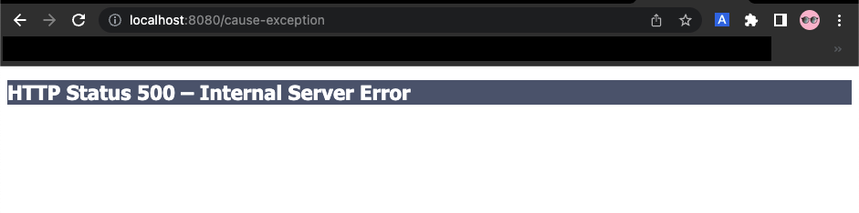

이번 장에서는 서블릿을 통해서 예외 처리를 하는 방법에 대해서 알아본다.
모든 코드는 [깃허브(링크)](https://github.com/roy-zz/mvc) 에 올려두었다.

---

### 개요

스프링을 사용하지 않은 순수 서블릿 컨테이너는 아래와 같은 2가지 방식으로 예외 처리를 지원한다.
  
- Exception(예외)
- response.sendError(HTTP status code, Error Message)

#### Exception

**자바**
  
자바의 메인 메서드를 직접 실행하는 경우에 `main`이라는 이름을 가진 스레드가 실행된다.  
실행 도중에 예외를 처리하지 않아서 처음에 실행된 `main` 스레드까지 예외가 전달되면 발생한 예외에 대한 정보를 출력하고 스레드는 종료된다.
  
**웹 애플리케이션**
  
웹 애플리케이션은 사용자의 요청별로 스레드풀에 있는 스레드가 할당되고 서블릿 컨테이너 안에서 실행된다.  
애플리케이션에서 예외가 발생하는 경우 `try & catch`를 사용하여 예외를 처리하면 문제가 발생하지 않지만 만약 개발자가 예상하지 못한 예외가 서블릿의 외부로 전달되면 아래와 같은 방식으로 동작한다.
  
```
WAS <- 필터 <- 서블릿 <- 인터셉터 <- 컨트롤러(예외의 시작)
```
  
컨트롤러에서 발생한 예외가 인터셉터, 서블릿, 필터를 거쳐서 WAS(일반적으로 톰캣)까지 전달된다.
  
#### 예외 처리 확인

예외가 `WAS`까지 전달되는 경우 어떻게 동작하는지 테스트를 해본다.  
스프링 부트에서 기본으로 제공하는 예외 페이지를 비활성화 하기 위해서 아래와 같이 `application.properties` 파일을 수정한다.
  
```properties
server.error.whitelabel.enabled=false
```

호출되는 경우 바로 `RuntimeException`을 발생시키는 컨트롤러를 생성한다.

```java
@Controller
public class ServletExceptionController {
    @GetMapping("/cause-exception")
    public void causeException() {
        throw new RuntimeException("강제로 발생시킨 예외");
    }
}
```

서버를 실행시키고 위에서 만든 주소로 접속하면 500 예외가 발생하는 경우 톰캣에서 기본으로 제공하는 페이지를 확인할 수 있다.



우리가 만들지 않은 페이지에 접근하는 경우에도 `HTTP status code`만 변경되고 동일한 페이지가 보여지는 것을 확인할 수 있다.


---

이번에는 예외를 발생시키는 것이 아니라 `HttpServletResponse`의 `sendError`메서드를 사용해본다.  
`sendError`메서드는 바로 예외를 발생시키는 것이 아니라 서블릿 컨테이너에게 예외가 발생한 상황을 전달하는 것이다.
  
```
WAS(sendError 호출 기록 확인) <- 필터 <- 서블릿 <- 인터셉터 <- 컨트롤러
```
  
`sendError`메서드를 호출하면 `response` 내부에는 오류가 발생했다는 상태를 저장한다.  
서블릿 컨테이너는 고객에게 응답하기 전에 `response`에 `sendError`가 호출되었는지 확인하고 호출된 경우 호출시점에 인자값으로 전달받은 오류 코드에 맞추어 기본 오류 페이지를 보여준다.
  
```java
@Controller
public class ServletExceptionController {
    @GetMapping("/cause-404-exception")
    public void cause404Exception(HttpServletResponse response) throws IOException {
        response.sendError(HttpStatus.NOT_FOUND.value(), "404 메시지");
    }
    @GetMapping("/cause-500-exception")
    public void cause500Exception(HttpServletResponse response) throws IOException {
        response.sendError(HttpStatus.INTERNAL_SERVER_ERROR.value(), "500 메시지");
    }
}
```

`~/cause-404-exception`, `~/cause-500-exception` 주소로 접속해보면 직접 Exception을 throws하여 예외를 발생시킨 것과 동일한 화면이 나오는 것을 확인할 수 있다.

---

### 오류 화면 제공

우리는 위에서 예외가 발생하는 경우 서블릿에서 제공하는 기본 예외 처리 화면을 제공하였다.  
하지만 서비스를 개발하면서 고객에게 이러한 화면을 제공하는 것은 무리가 있으며 발생한 예외에 맞게 고객 친화적인 화면을 제공해야 한다.  
  
지금부터 고객에게 예외가 발생한 상황에 따른 화면을 제공하는 방법에 대해서 알아본다.
  
#### WebServerFactoryCustomizer 구현체

스프링 부트가 제공하는 기능을 사용하기 위해서 `WebServerFactoryCustomizer` 인터페이스를 구현하는 클래스를 생성한다.

```java
@Component
public class WebServerCustomizer implements WebServerFactoryCustomizer<ConfigurableWebServerFactory> {
    @Override
    public void customize(ConfigurableWebServerFactory factory) {
        ErrorPage errorPage404 = new ErrorPage(NOT_FOUND, "/error-page/404");
        ErrorPage errorPage500 = new ErrorPage(INTERNAL_SERVER_ERROR, "/error-page/500");
        ErrorPage errorPageException = new ErrorPage(RuntimeException.class, "/error-page/500");
        factory.addErrorPages(errorPage404, errorPage500, errorPageException);
    }
}
```
  
빈으로 등록하기 위해 `@Component` 애노테이션을 사용하였다.  
`response.sendError(404)`가 호출되는 경우 `errorPage404`를 호출한다.  
`response.sendError(500)`가 호출되는 경우 `errorPage500`을 호출한다.  
`RuntimeException` 이나 그 자식 타입(Unchecked Exception)의 예외가 발생하는 경우 `errorPageException`을 호출한다.

#### 예외 처리용 컨트롤러

예외 상황이 발생하였을 때 처리할 수 있는 컨트롤러인 `ExceptionHandleController`를 생성한다.  
여기서 컨트롤러는 위에서 생성한 `ErrorPage`들의 파라미터로 전달된 `/error-page/404`와 같은 경로를 포함해야 한다.

```java
@Slf4j
@Controller
@RequestMapping("/error-page")
public class ExceptionHandleController {
    @RequestMapping("/404")
    public String errorPage404(HttpServletRequest request, HttpServletResponse response) {
        log.info("call error page 404");
        printErrorInfo(request);
        return "error-page/404";
    }
    @RequestMapping("/500")
    public String errorPage500(HttpServletRequest request, HttpServletResponse response) {
        log.info("call error page 500");
        printErrorInfo(request);
        return "error-page/500";
    }
}
```

#### View

`resources/template` 경로에 컨트롤러에서 렌더링하려는 `error-page/404.html`, `error-page/500.html` 파일을 생성한다.

```html
<!DOCTYPE HTML>
<html>
<head>
    <meta charset="utf-8">
</head>
<body>
<div class="container" style="max-width: 600px">
    <div class="py-5 text-center">
        <h2>404 예외 발생</h2>
    </div>
    <div>
        <p>관리자에게 문의하세요.</p>
    </div>
    <hr class="my-4">
</div>
</body>
</html>
```

`500.html`의 경우 내용은 거의 동일하며 예외 발생 종류 문구만 변경되므로 본 문서에서는 생략한다.

#### 확인

서버를 실행시키고 우리가 지정한 주소로 접속하여 정상적으로 화면이 표시되는지 확인해본다.

**/error-page/404**


**/error-page/500**


---

### 오류 페이지 작동 원리

서블릿은 `Exception`이 발생하여 서블릿 밖으로 전달되거나 `response.sendError()`가 호출되는 경우 설정되어 있는 오류 페이지를 찾는다.

**예외 발생 흐름**
  
```
WAS(전파) <- 필터 <- 서블릿 <- 인터셉터 <- 컨트롤러(예외발생)
```
  
**sendError 호출 흐름**

```
WAS(sendError 호출 이력 확인) <- 필터 <- 서블릿 <- 인터셉터 <- 컨트롤러(response.sendError())
```

예를 들어 `UncheckedException`인 `RuntimeException` 예외가 `WAS`까지 전달되면, `WAS`는 오류 페이지 정보를 확인한다.  
우리가 이전 단계에서 만들었던 것처럼 `RuntimeException`의 오류 페이지로 `/error-page/500`을 지정하였다면 **`WAS`는 오류 페이지를 출력하기 위해 `/error-page/500`을 다시 요청**한다.

**오류 페이지 요청 흐름**

```
WAS(/error-page/500) 재요청 -> 필터 -> 서블릿 -> 인터셉터 -> 컨트롤러(/error-page/500) -> View
```

**예외 발생과 오류 페이지 요청 흐름**

```
컨트롤러(예외 발생) -> 인터셉터 -> 서블릿 -> 필터 -> WAS(예외 전파, /error-page/500 재요청) -> 필터 -> 서블릿 -> 인터셉터 -> 컨트롤러(/error-page/500) -> View 
```

여기서 중요한 포인트는 웹 브라우저는 서버 내부에서 이런 프로세스로 처리되고 있는 것을 모른다는 점이다.  
서버 내부에서 오류 페이지를 찾기 위한 필터, 서블릿, 인터셉터, 컨트롤러가 모두 다시 호출된다는 것이다.

#### 오류 정보 추가

`WAS`는 오류 페이지를 재요청할 때 오류에 대한 정보를 `request`에 담아서 보내준다.  
아래와 같은 방법으로 `WAS`에서 전달한 오류의 정보를 확인할 수 있다.

```java
@Slf4j
@Controller
@RequestMapping("/error-page")
public class ExceptionHandleController {
    public static final String ERROR_EXCEPTION = "javax.servlet.error.exception";
    public static final String ERROR_EXCEPTION_TYPE = "javax.servlet.error.exception_type";
    public static final String ERROR_MESSAGE = "javax.servlet.error.message";
    public static final String ERROR_REQUEST_URI = "javax.servlet.error.request_uri";
    public static final String ERROR_SERVLET_NAME = "javax.servlet.error.servlet_name";
    public static final String ERROR_STATUS_CODE = "javax.servlet.error.status_code";

    // ...

    private void printErrorInfo(HttpServletRequest request) {
        log.info("ERROR_EXCEPTION: {}", request.getAttribute(ERROR_EXCEPTION));
        log.info("ERROR_EXCEPTION_TYPE: {}", request.getAttribute(ERROR_EXCEPTION_TYPE));
        log.info("ERROR_MESSAGE: {}", request.getAttribute(ERROR_MESSAGE));
        log.info("ERROR_REQUEST_URI: {}", request.getAttribute(ERROR_REQUEST_URI));
        log.info("ERROR_SERVLET_NAME: {}", request.getAttribute(ERROR_SERVLET_NAME));
        log.info("ERROR_STATUS_CODE: {}", request.getAttribute(ERROR_STATUS_CODE));
        log.info("dispatchType={}", request.getDispatcherType());
    }
}
```

---

### 필터

우리는 예외가 발생하는 경우 오류 페이지를 출력하기 위해 `WAS`가 오류 페이지를 찾기 위해 재요청하는 것에 대해서 학습하였다.  
이때 필터, 서블릿, 인터셉터, 컨트롤러도 모두 호출된다. 하지만 로그인 검증이나, 서버 접속 로그와 같은 기능은 이미 처음 요청에서 필터 또는 인터셉터에서 처리가 되었다.  
오류 페이지를 찾기 위한 요청은 클라이언트에 의한 요청이 아니며 단순히 `WAS`가 오류 페이지를 찾기 위해 발생시킨 요청이므로 동일한 필터 또는 인터셉터는 호출될 필요가 없다.  
클라이언트의 요청인지 오류 페이지를 찾기 위한 재요청인지 **구분하기 위하여 서블릿은 `DispatcherType`이라는 정보를 추가로 제공**한다.

#### DispatcherType

`HttpServletRequest` 객체에는 `DispatcherType`이라는 정보가 있으며 `getDispatcherType()` 메서드를 통하여 호출할 수 있다.  
`javax.servlet.DispatcherType`에는 아래와 같은 종류가 있다.

```java
public enum DispatcherType {
    FORWARD, // 클라이언트의 요청인 경우
    ERROR,   // 오류 요청인 경우 
    INCLUDE, // 서블릿에서 다른 서블릿이나 JSP의 결과를 포함하는 경우
    REQUEST, // 서블릿에서 다른 서블릿이나 JSP를 호출하는 경우
    ASYNC,   // 서블릿 비동기 호출인 경우 
}
```

이러한 정보를 통해서 클라이언트의 요청인지 오류 페이지를 찾기 위한 `WAS`의 재요청인지 구분이 가능해진다.

#### 구성 정보 수정

필터를 추가하는 `WebConfig` 클래스 파일에서 `FilterRegistrationBean`을 생성할 때 `setDispatcherTypes`를 호출하여 원하는 `DispatcherType`을 지정한다.

```java
@Configuration
public class WebConfig implements WebMvcConfigurer {
    @Bean
    public FilterRegistrationBean<Filter> logFilter() {
        FilterRegistrationBean<Filter> filterRegistrationBean = new FilterRegistrationBean<>();
        filterRegistrationBean.setFilter(new LogFilter());
        filterRegistrationBean.setOrder(1);
        filterRegistrationBean.addUrlPatterns("/*");
        filterRegistrationBean.setDispatcherTypes(DispatcherType.REQUEST, DispatcherType.ERROR);
        return filterRegistrationBean;
    }
}
```

`setDispatcherType()`의 기본값은 `DispatcherType.REQUEST`이므로 위처럼 따로 `DispatcherType.ERROR`을 등록해주어야 재요청인 경우에도 필터가 적용된다.  
기본값은 클라이언트의 요청에만 필터가 적용되므로 재요청인 경우도 필터 적용이 필요하다면 위처럼 필터를 등록하면 된다.

---

### 인터셉터

필터의 경우 `setDispatcherTypes` 메서드를 통하여 우리가 원하는 `DispatcherType`인 경우 호출되도록 구현할 수 있었다.  
하지만 인터셉터는 서블릿이 아닌 스프링에서 제공하는 기능이기 때문에 `DispatcherType`과 무관하게 항상 호출된다.  
인터셉터의 경우 `DispatcherType`으로 구분하는 것이 아니라 `excludePathPatterns`에 오류 페이지의 경로를 지정하여 오류 페이지를 호출하는 요청에는 인터셉터가 요청되지 않도록 구현할 수 있다.

```java
@Configuration
public class WebConfig implements WebMvcConfigurer {
    @Override
    public void addInterceptors(InterceptorRegistry registry) {
        registry.addInterceptor(new LogInterceptor())
            .order(1)
            .addPathPatterns("/**")
            .excludePathPatterns("/css/**", "*.ico", "/error", "/error-page/**");
    }
    // ...
}
```

위처럼 `excludePathPatterns`를 지정하게 되면 오류 페이지를 찾기 위한 경로인 `/error`와 `/error-page/**` 요청에 대해서는 인터셉터가 적용되지 않는다.
  
`DispatcherType`을 적용하여 전체적인 흐름을 다시 정리하면 아래와 같다.

**정상적인 요청**

```
WAS(DispatcherType.REQUEST) -> 필터 -> 서블릿 -> 인터셉터 -> 컨트롤러 -> View
```

**오류가 발생하는 요청**

```
WAS(DispatcherType.REQUEST) -> 필터 -> 서블릿 -> 인터셉터 -> 컨트롤러 -> 인터셉터 -> 서블릿 -> 필터 -> 
WAS(전파, 오류 페이지 재요청, DispatcherType.ERROR) -> 필터(적용 X) -> 서블릿 -> 인터셉터(적용 X) -> 컨트롤러 -> View
```

---

**참고한 강의**:
- https://www.inflearn.com/course/%EC%8A%A4%ED%94%84%EB%A7%81-%ED%95%B5%EC%8B%AC-%EC%9B%90%EB%A6%AC-%EA%B8%B0%EB%B3%B8%ED%8E%B8
- https://www.inflearn.com/course/%EC%8A%A4%ED%94%84%EB%A7%81-mvc-1
- https://www.inflearn.com/course/%EC%8A%A4%ED%94%84%EB%A7%81-mvc-2

**참고한 문서**:
- [Thymeleaf 기본 메뉴얼](https://www.thymeleaf.org/doc/tutorials/3.0/usingthymeleaf.html)
- [Thymeleaf 스프링 통합 메뉴얼](https://www.thymeleaf.org/doc/tutorials/3.0/thymeleafspring.html)