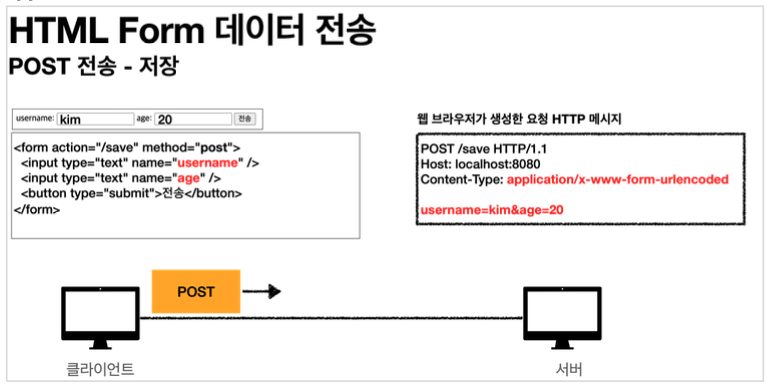
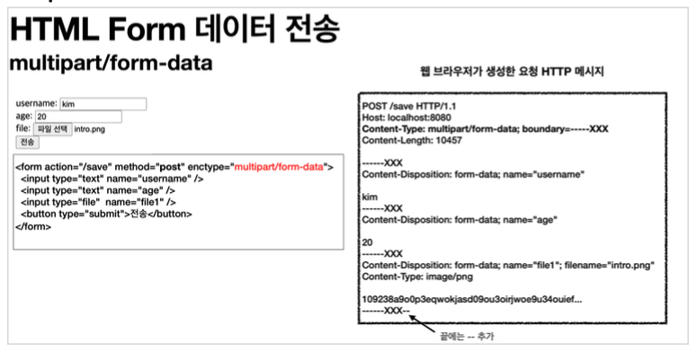

이번 장에서는 서블릿과 스프링의 파일 업로드 기능에 대해서 알아본다.
모든 코드는 [깃허브(링크)](https://github.com/roy-zz/mvc) 에 올려두었다.

---

### 파일 업로드

`HTML Form` 전송 방식은 아래와 같은 두 가지 방식이 있다.

- `application/x-www-form-urlencoded`
- `multipart/form-data`

#### application/x-www-form-urlencoded



`application/x-www-form-urlencoded`은 가장 기본적으로 HTML 폼 데이터를 서버로 전송하기 위해 사용되는 방법이다.  
`Form` 태그에 별도의 `enctype` 옵션이 없으면 브라우저는 요청 HTTP 메시지의 헤더에 컨텐츠 타입(`Content-Type: application/x-www-form-urlencoded`)을 추가한다.  
HTML 폼에 입력되어 전송될 항목을 `HTTP Body`에 문자로 `username=roy&age=30`과 같이 `&`으로 구분하여 전송한다.
  
하지만 파일을 업로드하기 위해서는 일반 문자열이 아닌 바이너리(binary) 데이터로 전송해야 한다.  
문자열을 전송하기 위한 `x-www-form-urlencoded`와 같은 방식으로는 파일을 전송하기 쉽지 않으며 폼으로 데이터를 전송할 때 파일만 전송되는 것이 아니라 추가 데이터까지 전송되기 때문에 파일 업로드에 무리가 있다.  
결국 일반적으로 사용되는 **문자열과 바이너리를 동시에 전송**하기 위해서 `HTTP`는 `multipart/form-data`라는 전송 방식을 사용한다.

---

#### multipart/form-data



`multipart/form-data`(이하 `multipart`)를 사용하기 위해서는 Form 태그에 `enctype="multipart/form-data"`로 지정해야 한다.  
`multipart`의 경우 이름에서 알 수 있듯이 종류가 다른 여러가지의 파일과 폼 데이터를 전송할 수 있다.  
HTTP 메시지를 확인해보면 각각의 전송 항목이 구분되어 있으며 `Content-Disposition`이라는 헤더와 함께 부가 정보가 있다.  
폼의 일반적인 데이터는 문자로 전송되며 파일의 경우에는 파일명과 함께 `Content-Type`이 추가되어 바이너리 데이터가 전송된다.  
`multipart`의 경우 `application/x-www-form-urlencoded`와 비교해서 구조가 복잡하고 각각의 부분(part)으로 나누어져 있다.
  
결국 `multipart`는 각각의 항목을 구분해서 한번에 전송하는 기능이다. 

---

### 서블릿 파일 업로드

스프링의 파일 업로드 기능을 알아보기 이전에 서블릿의 파일 업로드 기능을 알아본다.

#### 옵션

파일 업로드 관련된 옵션에 대해서 알아본다.  
  
**application.properties**

```properties
logging.level.org.apache.coyote.http11=debug
spring.servlet.multipart.max-file-size=100MB
spring.servlet.multipart.max-request-size=1000MB

spring.servlet.multipart.enabled=false
file.dir=업로드 경로
```

- `logging.level.org.apache.coyote.http11`: HTTP 요청 메시지를 확인하기 위해서 사용되는 옵션이다.  
  상당히 많은 양의 로그가 생성되므로 개발 시점에 디버깅 및 학습용도로만 사용하고 프로덕션 환경에서는 사용하지 않아야 한다.
- `spring.servlet.multipart.max-file-size`: 업로드하는 파일 하나의 최대 사이즈 크기를 제한한다.  
  제한된 사이즈를 초과하는 경우 `SizeLimitExceededException`이 발생한다.
- `spring.servlet.multipart.max-request-size`: 요청 한 번에 최대로 전송할 수 있는 파일 용량의 합을 의미한다.  
  제한된 사이즈를 초과하는 경우 `SizeLimitExceededException`이 발생한다.
- `spring.servlet.multipart.enabled`: 멀티파트 데이터 처리 유무를 의미한다.  
  기본값은 `true`이며 해당 옵션이 `false`가 되는 경우 스프링은 서블릿 컨테이너에게 멀티파트 데이터를 처리하지 않도록 설정하기 때문에 서블릿은 멀티파트 관련 처리를 할 수 없다.
- `file.dir`: 업로드되는 파일이 저장될 위치를 의미하며 모든 디렉토리는 파일이 저장되기 이전에 생성되어 있어야 한다.

#### 컨트롤러

```java
@Slf4j
@Controller
@RequestMapping("/servlet")
public class ServletUploadController {
    @Value("${file.dir}")
    private String fileDir;
    
    @PostMapping("/upload")
    public String saveFile(HttpServletRequest request) throws ServletException, IOException {
        log.info("request = {}", request);
        String itemName = request.getParameter("itemName");
        log.info("itemName = {}", itemName);
        Collection<Part> parts = request.getParts();
        log.info("parts = {}", parts);

        int index = 0;
        for (Part part : parts) {
            index++;
            log.info("===== PART - {} =====", index);
            log.info("name = {}", part.getName());
            Collection<String> headerNames = part.getHeaderNames();
            for (String headerName : headerNames) {
                log.info("header {}: {}", headerName, part.getHeader(headerName));
            }

            log.info("submittedFileName = {}", part.getSubmittedFileName());
            log.info("size = {}", part.getSize());

            InputStream inputStream = part.getInputStream();
            String body = StreamUtils.copyToString(inputStream, StandardCharsets.UTF_8);
            log.info("body = {}", body);

            if (StringUtils.hasText(part.getSubmittedFileName())) {
                String fullPath = fileDir + part.getSubmittedFileName();
                log.info("fullPath = {}", fullPath);
                part.write(fullPath);
            }
        }
        return "upload-form";
    }
}
```

- `part.getSubmittedFileName()`: 클라이언트가 전달한 파일명을 의미한다.
- `part.getInputStream()`: `Part`를 통해 전송된 데이터를 읽을 때 사용한다.
- `part.write()`: `Part`를 통해 전송된 데이터를 저장할 때 사용한다.
  
파일을 업로드하면서 출력된 결과는 아래와 같다.

```
request = org.springframework.web.multipart.support.StandardMultipartHttpServletRequest@119d4fb
itemName = aaa
parts = [org.apache.catalina.core.ApplicationPart@20c72688, org.apache.catalina.core.ApplicationPart@4a61f377]
===== PART - 1 =====
name = itemName
header content-disposition: form-data; name="itemName"
submittedFileName = null
size = 3
body = aaa
===== PART - 2 =====
name = file
header content-disposition: form-data; name="file"; filename="logo.png"
header content-type: image/png
submittedFileName = logo.png
size = 4780
body = �PNG...
```

---

### 스프링의 파일 업로드


---

**참고한 강의**:
- https://www.inflearn.com/course/%EC%8A%A4%ED%94%84%EB%A7%81-%ED%95%B5%EC%8B%AC-%EC%9B%90%EB%A6%AC-%EA%B8%B0%EB%B3%B8%ED%8E%B8
- https://www.inflearn.com/course/%EC%8A%A4%ED%94%84%EB%A7%81-mvc-1
- https://www.inflearn.com/course/%EC%8A%A4%ED%94%84%EB%A7%81-mvc-2

**참고한 문서**:
- [Thymeleaf 기본 메뉴얼](https://www.thymeleaf.org/doc/tutorials/3.0/usingthymeleaf.html)
- [Thymeleaf 스프링 통합 메뉴얼](https://www.thymeleaf.org/doc/tutorials/3.0/thymeleafspring.html)