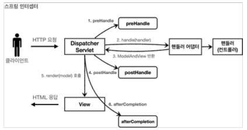
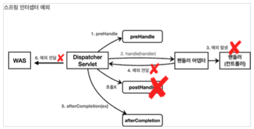

[이전 장(링크)](https://imprint.tistory.com/269) 에서는 스프링 필터를 사용하여 로그를 출력하고 인증된 사용자인지 검증하는 방법에 대해서 알아보았다.
이번 장에서는 스프링의 인터셉터를 사용하는 방법에 대해서 알아본다.
모든 코드는 [깃허브(링크)](https://github.com/roy-zz/mvc) 에 올려두었다.

---

### 소개

**스프링 인터셉터**도 `서블릿 필터`와 같이 웹과 관련된 공통 관심 사항을 호율적으로 처리할 수 있는 기능이다.  
서블릿 필터는 자바의 서블릿이 제공하는 기술이지만, 스프링 인터셉터는 스프링 MVC에서 제공하는 기능이기 때문에 스프링에 더 특화되어 있으며 제공하는 기능도 많다.  
둘의 기능은 비슷하지만 처리되는 순서와 범위가 다르다는 특징이 있다.

#### 필터의 흐림

```
HTTP 요청 -> WAS -> 필터 -> 서블릿 -> 스프링 인터셉터 -> 컨트롤러
```

- `디스패처 서블릿`을 지나서 `컨트롤러`가 호출되기 직전에 호출된다.
- 스프링 인터셉터는 스프링에서 제공하는 기능이기 때문에 디스패처 서블릿 이후에 호출된다.  
  스프링 MVC의 시작점이 디스패처 서블릿이라고 생각하면 시작점을 기억하기 쉽다.  
- 스프링 인터셉터에도 URL 패턴을 적용할 수 있으며 서블릿 URL 패턴과는 다르게 정밀하게 설정이 가능하다.

인터셉터를 사용하여 로그인된 사용자와 로그인되지 않은 사용자를 구분하여 로그인되지 않은 사용자의 요청은 컨트롤러까지 도달하지 않도록 구현할 수 있다.  
인터셉터에서 적절하지 않은 요청이라고 판단되는 시점에 요청 처리를 종료할 수 있으므로 로그인 여부를 검증하기 좋은 방법이다.

```
HTTP 요청 -> WAS -> 서블릿 -> 스프링 인터셉터(로그인 O) -> 컨트롤러
HTTP 요청 -> WAS -> 서블릿 -> 스프링 인터셉터(로그인 X) -> 이후 진행 X
```

동시에 여러개의 인터셉터를 체이닝하여 우리가 원하는 기능을 하도록 구현할 수 있다.

```
HTTP 요청 -> WAS -> 서블릿 -> 요청 로그 인터셉터 -> 로그인 검증 인터셉터 -> 컨트롤러 
```

만약 예시와 같이 구현되어 있다면 로그인하지 않은 사용자의 요청은 `로그인 검증 인터셉터`에 의해 컨트롤러까지 도달하지 못하지만 `요청 로그 인터셉터`에 의해 로그로 남게 할 수 있다.  
서블릿 필터와 호출되는 순서를 제외하고 동일한 방식으로 작동되지만 스프링 인터셉터는 서블릿 필터보다 사용법이 간단하며 더 많은 기능을 제공한다.

#### HandlerInterceptor

우리가 구현해야 하는 `HandlerInterceptor` 인터페이스는 아래와 같은 구조로 되어 있다.

```java
public interface HandlerInterceptor {
	default boolean preHandle(HttpServletRequest request, HttpServletResponse response, Object handler)
			throws Exception {
		return true;
	}
	default void postHandle(HttpServletRequest request, HttpServletResponse response, Object handler,
			@Nullable ModelAndView modelAndView) throws Exception {
	}
	default void afterCompletion(HttpServletRequest request, HttpServletResponse response, Object handler,
			@Nullable Exception ex) throws Exception {
	}
}
```

서블릿 필터의 경우 요청전에 호출되는 `doFilter()`만 호출되었지만 인터셉터는 컨트롤러 호출 전 & 후, 요청 완료 이후(afterCompletion) 단계별로 작업할 수 있다.  
또한 서블릿 필터는 `request`, `response`만 제공하였지만, 인터셉터는 어떠한 핸들러가 호출되었는지 호출 정보와 어떠한 값을 반환하였는지에 대한 응답 정보도 받을 수 있다.
  
스프링 인터셉터의 호출 흐름은 아래와 같다.



- preHandle: 핸들러 어댑터 호출 전에 호출된다.
  `preHandle()` 메서드는 반환이 `boolean` 타입인데 응답값이 `true`면 다음으로 진행하고, `false`면 더이상 진행하지 않는다.  
  여기서 더이상 진행하지 않는다는 의미는 이후의 인터셉터, 핸들러 어댑터 전부 호출되지 않는다는 의미다.
- postHandle: 컨트롤러 호출 후에 호출된다.
- afterCompletion: 클라이언트에 응답한 이후에 호출된다.

호출 중간에 예외가 발생하는 경우의 흐름은 아래와 같다.



- preHandle: 핸들러 어댑터 호출 전에 호출된다.
- postHandle: 컨트롤러에서 예외가 발생하면 `postHandle`는 호출되지 않는다.
- afterCompletion: `finally`와 같이 예외가 발생하여도 항상 호출되므로 예외가 발생한 경우 로그를 출력할 수 있다.
  
예외가 발생하지 않은 경우를 위한 후처리는 `postHandle`을 사용하고 예외가 발생하여도 진행해야 하는 후처리는 `afterCompletion`을 사용해야 한다.
  
**인터셉터**는 스프링 MVC에 특화된 필터 기능이므로 특별히 서블릿 필터를 사용해야 하는 상황이 아니라면 **스프링 인터셉터**를 사용하는 것이 유리하다.
  
---

### 요청 로그 인터셉터

가장 단순한 인터셉터인 모든 요청의 로그를 남기는 인터셉터를 만들어 본다.

#### LogInterceptor 구현체

`HandleInterceptor` 인터페이스를 구현하는 `LogInterceptor` 클래스를 생성한다.

```java
@Slf4j
public class LogInterceptor implements HandlerInterceptor {
    public static final String LOG_ID = "logId";
    @Override
    public boolean preHandle(HttpServletRequest request, HttpServletResponse response, Object handler) throws Exception {
        String requestURI = request.getRequestURI();
        String uuid = UUID.randomUUID().toString();
        request.setAttribute(LOG_ID, uuid);
        log.info("REQUEST [{}][{}][{}]", uuid, requestURI, handler);
        return handler instanceof HandlerMethod;
    }
    @Override
    public void postHandle(HttpServletRequest request, HttpServletResponse response, Object handler, ModelAndView modelAndView) throws Exception {
        log.info("postHandle [{}]", modelAndView);
    }
    @Override
    public void afterCompletion(HttpServletRequest request, HttpServletResponse response, Object handler, Exception ex) throws Exception {
        String requestURI = request.getRequestURI();
        String logId = (String) request.getAttribute(LOG_ID);
        log.info("RESPONSE [{}][{}][{}]", logId, requestURI, handler);
        if (ex != null) {
            log.error("afterCompletion error!!", ex);
        }
    }
}
```

- UUID: 한번에 여러개의 요청이 왔을 때 요청을 구분하기 위해 임의의 `uuid`를 출력하기 위해 사용된다.
- request.setAttribute: 서블릿 필터의 경우 지역변수로 해결이 가능하지만, 스프링 인터셉터는 호출 시점이 분리되어 있기 때문에 지역변수로는 해결이 불가능하다.  
  하지만 하나의 요청이기 때문에 `preHandle`에서 `attribute`로 지정하면 `postHandle`, `afterCompletion`에서도 사용이 가능하다.
- return true: `true`를 반환하는 경우 정상적으로 다음 인터셉터나 핸들러 어댑터가 호출된다.
  
- HandlerMethod: 핸들러 정보는 어떠한 핸들러를 사용하는지에 따라서 달라진다. 일반적으로 많이 사용하는 `@Controller`, `@RequestMapping`을 사용하면 `HandlerMethod`를 사용할 수 있다.
- ResourceHttpRequestHandler: `/resources/static`과 같은 정적 리소스가 호출되는 경우 `ResourceHttpRequestHandler`를 사용할 수 있다.  
  만약 여러 종류의 핸들러를 사용한다면 타입에 따른 분기처리가 필요하다.
  
#### 인터셉터 등록

인터셉터를 빈으로 등록하기 위해서는 아래와 같이 구성 요소로 등록해주어야 한다.  
서블릿 필터와 다른 점은 `WebMvcConfigurer`를 구현해야 하며 `addInterceptors`를 오버라이딩하여 재정의 해야 한다는 점이다.

```java
@Configuration
public class WebConfig implements WebMvcConfigurer {
    @Override
    public void addInterceptors(InterceptorRegistry registry) {
        registry.addInterceptor(new LogInterceptor())
                .order(1)
                .addPathPatterns("/**")
                .excludePathPatterns("/css/**", "/*.ico", "/error");
    }
}
```

- registry.addInterceptor(): 등록하고자 하는 인터셉터를 입력한다.
- order(1): 여러 인터셉터가 체이닝 되어있는 경우 호출되는 순서를 지정한다.
- addPathPatterns(): 인터셉터에 적용할 URL 패턴을 지정한다.
- excludePathPatterns(): 인터셉터에서 제외할 패턴을 지정한다.(서블릿 필터의 화이트리스트와 같은 역할을 한다.)
  
#### 스프링 URL

스프링이 제공하는 URL 경로(PathPattern)는 서블릿의 URL 경로와는 다르며 더 자세하고 세밀하게 설정할 수 있다.  
모두 기억하고 있는 것은 힘들기 때문에 적용하는 시점에 [공식문서(링크)](https://docs.spring.io/spring-framework/docs/current/javadoc-api/org/springframework/web/util/pattern/PathPattern.html) 를 참고하여 작성하도록 한다.

---

**참고한 강의**:
- https://www.inflearn.com/course/%EC%8A%A4%ED%94%84%EB%A7%81-%ED%95%B5%EC%8B%AC-%EC%9B%90%EB%A6%AC-%EA%B8%B0%EB%B3%B8%ED%8E%B8
- https://www.inflearn.com/course/%EC%8A%A4%ED%94%84%EB%A7%81-mvc-1
- https://www.inflearn.com/course/%EC%8A%A4%ED%94%84%EB%A7%81-mvc-2

**참고한 문서**:
- [Thymeleaf 기본 메뉴얼](https://www.thymeleaf.org/doc/tutorials/3.0/usingthymeleaf.html)
- [Thymeleaf 스프링 통합 메뉴얼](https://www.thymeleaf.org/doc/tutorials/3.0/thymeleafspring.html)