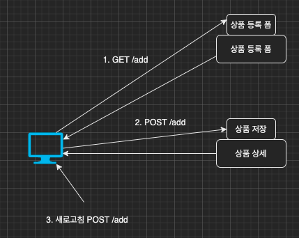
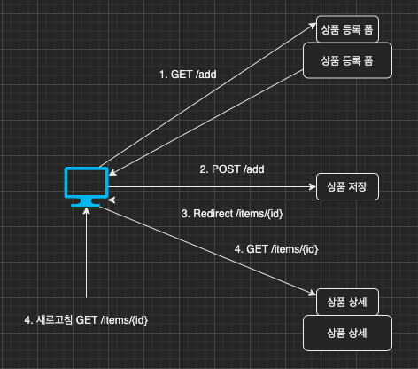

이번 장에서는 PRG(Post/Redirect/Get)에 대해서 알아본다.
글의 하단부에 참고한 강의와 공식문서의 경로를 첨부하였으므로 자세한 내용은 강의나 공식문서에서 확인한다.
모든 코드는 [깃허브(링크)](https://github.com/roy-zz/mvc)에 올려두었다.

---

### PRG(Post/Redirect/Get)

상품을 등록하는 폼 화면이 있고 클라이언트가 저장을 누르면 상품을 저장하는 POST API를 호출한다고 가정해본다.



이러한 구조에서 상품을 등록하고 클라이언트가 새로고침을 누른다면 지속적으로 새로운 상품이 등록될 것이다.
API를 요청하는 방식이 아니라 상품 상세 화면을 렌더링하면서 폼 데이터를 전송하고 전송된 데이터를 기반으로 새로운 아이템을 생성하기 때문이다.

클라이언트가 상품을 등록했으면 더 이상 상품을 등록하지 못하게 하도록 상품 상세 화면을 떠나게 해야한다.
변경된 흐름을 살펴본다.



클라이언트는 상품 등록 폼에서 아이템의 정보를 입력하고 저장 버튼을 클릭한다.
상품 저장 컨트롤러는 상품을 저장(POST)하고 응답 값으로 ```Redirect:상세 화면```과 같은 방식으로 다른 페이지로 이동시킨다(Redirect).
사용자는 Redirect된 페이지롤 요청(GET)하여 다른 페이지로 이동한다.

전체적인 흐름을 보면 POST -> Redirect -> GET이다. 이러한 흐름을 줄여서 PRG라고 한다.

문제가 되던 컨트롤러의 기존 코드는 아래와 같다.

```java
@Controller
@RequiredArgsConstructor
@RequestMapping("/basic/items")
public class BasicItemController {
    private final ItemRepository itemRepository;
    @PostMapping("/add")
    public String addItemV4(Item item) {
        itemRepository.save(item);
        return "basic/item";
    }
}
```

컨트롤러를 수정하여 클라이언트를 다른 페이지로 Redirect 하게 끔 수정한다.

```java
@Controller
@RequiredArgsConstructor
@RequestMapping("/basic/items")
public class BasicItemController {
    private final ItemRepository itemRepository;

    public String addItemV5(Item item) {
        itemRepository.save(item);
        return "redirect:/basic/items/" + item.getId();
    }
}
```

---

### RedirectAttributes

redirect를 사용하여 다른 페이지로 이동시키는 경우 PathVariable을 사용한다면 변수를 인코딩 하지않고 이동시키는 것은 예상치 못한 상황을 만들 수 있다.
이러한 문제를 해결하기 위해 우리는 RedirectAttributes를 사용해야한다.
RedirectAttributes를 사용하면 URL인코딩과 함께 PathVariable까지 동시에 처리해준다.

수정된 컨트롤러는 아래와 같다.

```java
@Controller
@RequiredArgsConstructor
@RequestMapping("/basic/items")
public class BasicItemController {
    private final ItemRepository itemRepository;
    @PostMapping("/add")
    public String addItemV6(Item item, RedirectAttributes redirectAttributes) {
        Item savedItem = itemRepository.save(item);
        redirectAttributes.addAttribute("itemId", savedItem.getId());
        redirectAttributes.addAttribute("status", true);
        return "redirect:/basic/items/{itemId}";
    }
}
```


---

**참고한 강의**:

- https://www.inflearn.com/course/%EC%8A%A4%ED%94%84%EB%A7%81-%ED%95%B5%EC%8B%AC-%EC%9B%90%EB%A6%AC-%EA%B8%B0%EB%B3%B8%ED%8E%B8

- https://www.inflearn.com/course/%EC%8A%A4%ED%94%84%EB%A7%81-mvc-1

**Spring 공식문서**:

- https://docs.spring.io/spring-framework/docs/current/reference/html/web.html#spring-web