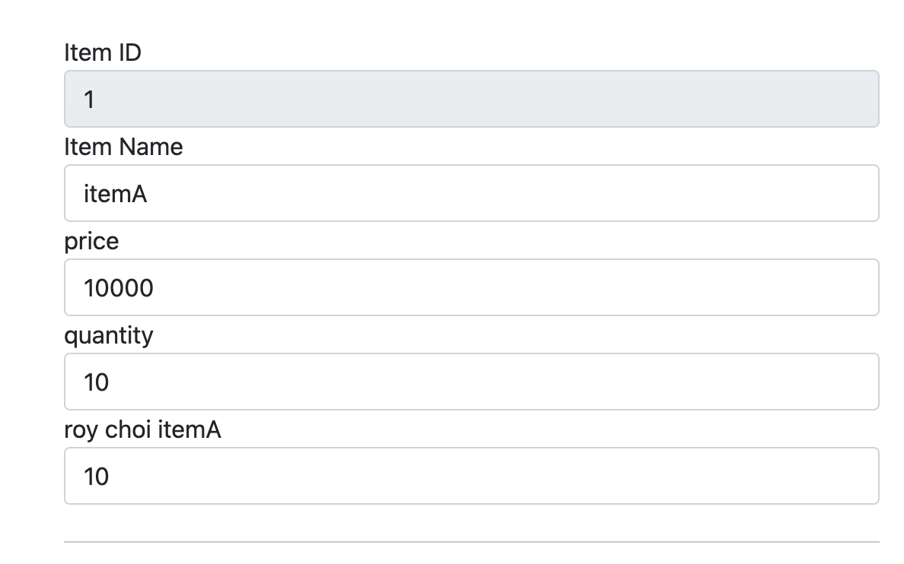

[이전 장(링크)](https://imprint.tistory.com/263) 에서는 `메시지, 국제화`를 적용하고 테스트하는 방법에 대해서 알아보았다.  
이번 장에서는 하드코딩 되어 있는 `HTML`파일을 `메시지, 국제화`를 적용하는 방법에 대해서 알아보도록 한다.  
글의 하단부에 참고한 강의와 공식문서의 경로를 첨부하였으므로 자세한 내용은 강의나 공식문서에서 확인한다.  
모든 코드는 [깃 허브(링크)](https://github.com/roy-zz/mvc) 에 올려두었다.

---

### Legacy

예시에서는 `상품 ID`, `상품명`, `가격`, `수량`에만 적용한다.  
다른 곳에도 적용하는 방법이 궁금하다면 필자의 깃허브에 있는 `mvc` 리포지토리를 확인하도록 한다. 

먼저 하드코딩되어 유지보수가 어려운 코드를 확인해본다.

```html
<div>
    <label for="id">상품 ID</label>
    <input type="text" id="id" class="form-control" th:field="*{id}" readonly>
</div>
<div>
    <label for="itemName">상품명</label>
    <input type="text" id="itemName" class="form-control" th:field="*{itemName}" >
</div>
<div>
    <label for="price">가격</label>
    <input type="text" id="price" class="form-control" th:field="*{price}">
</div>
<div>
    <label for="quantity">수량</label>
    <input type="text" id="quantity" class="form-control" th:field="*{quantity}">
</div>
```

---

### properties 추가

메시지 국제화를 적용시키기 위해 `/resources`경로에 `messages.properties` 파일과 `messages_en.properties`파일을 추가한다.

**messages.properties**
```properties
name=로이
name.full=로이 최 {0}

label.item=상품
label.item.id=상품 ID
label.item.itemName=상품명
label.item.price=가격
label.item.quantity=수량
```

**messages_en.properties**
```properties
name=roy
name.full=roy choi {0}

label.item=Item
label.item.id=Item ID
label.item.itemName=Item Name
label.item.price=price
label.item.quantity=quantity
```

---

### HTML 수정

`th:text=~` 부분의 값을 `properties`에 입력한 키 값으로 변경한다.  
파라미터를 우리가 만든 `properties` 파일의 `name.full` 키는 파라미터를 입력받도록 되어 있다.  
5번째 `div` 영역을 확인해보면 `#{키값(파라미터)}` 형식으로 파라미터를 입력받는 것을 확인할 수 있다.  

```html
<div>
    <label for="id" th:text="#{label.item.id}">상품 ID</label>
    <input type="text" id="id" th:field="*{id}" class="form-control" readonly>
</div>
<div>
    <label for="itemName" th:text="#{label.item.itemName}">상품명</label>
    <input type="text" id="itemName" th:field="*{itemName}" class="form-control">
</div>
<div>
    <label for="price" th:text="#{label.item.price}">가격</label>
    <input type="text" id="price" th:field="*{price}" class="form-control">
</div>
<div>
    <label for="quantity" th:text="#{label.item.quantity}">수량</label>
    <input type="text" id="quantity" th:field="*{quantity}" class="form-control">
</div>
<div>
    <label for="parameter" th:text="#{name.full(${item.itemName})}">파라미터 테스트</label>
    <input type="text" id="parameter" th:field="*{quantity}" class="form-control">
</div>
```

프로젝트를 재실행시키고 해당 페이지에 접속해보면 아래와 같이 정상적으로 변경된 것을 확인할 수 있다.  
필자의 경우 `PC`와 브라우저의 기본 언어를 영어로 설정해두어 자동으로 영어가 선택되어 출력되는 것을 확인할 수 있다.  



---

### LocaleResolver

`MessageSource`를 사용한 메시지 기능은 `Locale`정보를 알아야 언어를 선택할 수 있다.  
스프링에서 언어를 선택할 때 기본으로 사용하는 값은 헤더의 `Accept-Language`다. 만약 `Accept-Language`가 생소하다면 [여기](https://imprint.tistory.com/26) 에서 확인하도록 한다.

개발을 하다보면 `Accept-Language`가 아니라 다른 헤더값이나 다른 방식으로 언어를 적용하고 싶은 경우가 있을 것이다.  
이런 경우 `LocaleResolver`의 구현체를 변경하여 쿠키, 세션기반처럼 우리가 원하는 기능을 찾아서 사용하면 된다.

```java
public interface LocaleResolver {
    Locale resolveLocale(HttpServletRequest request);
    void setLocale(HttpServletRequest request, @Nullable HttpServletResponse
            response, @Nullable Locale locale);
}
```

### 오류 코드 메시지 관리 전략

`MessageCodesResolver`는 `required.item.itemName`과 같이 구체적인 코드를 우선으로 생성하고, `required`와 같이 덜 구체적인 것은 나중에 만든다.  
모든 오류 코드를 개발자가 직접 정의하고 관리하면 사용하기 힘들기 때문에 `required` 같은 메시지로 끝내고, 정말 중요한 메시지는 꼭 필요할 때 구체적으로 적어서 사용하는 방식이 더 효율적이다.  

**errors.properties**

```yaml
required.item.itemName=상품 이름은 필수 입니다.
required.java.lang.String=필수 문자입니다.
required=필수 값 입니다.
```

`itemName`의 경우 `required` 검증 오류 메시지가 발생함녀 다음 코드 순서대로 메시지가 생성된다.

1. required.item.itemName
2. required.itemName
3. required.java.lang.String
4. required

이렇게 생성된 메시지 코드를 기반으로 슨서대로 `MessageSource`에서 메시지를 찾는다.  
구체적인 것을 시작으로 덜 구체적인 메시지를 찾아나선다. (1 -> 2 -> 3 -> 4)
이렇게 되면 만약에 크게 중요하지 않은 오류 메시지는 기존에 정의된 것을 그냥 재활용하면 된다.

#### ValidationUtils

`ValidationUtils`을 사용하면 한줄로 파라미터 검증을 할 수 있다.  
하지만 `Empty`, `공백` 같이 단순한 기능만을 제공한다. 아래는 같은 기능을 하는 코드다.

```java
if (!StringUtils.hasText(item.getItemName())) { 
    bindingResult.rejectValue("itemName", "required", "기본: 상품 이름은 필수입니다."); 
}
```

```java
ValidationUtils.rejectIfEmptyOrWhitespace(bindingResult, "itemName", "required");
```

1. `rejectValue()` 호출한다.
2. `MessageCodesResolver`를 사용해서 검증 오류 코드로 메시지 코드들을 생성한다.
3. `new FieldError()`를 생성하면서 메시지 코드들을 보관한다.
4. `thymeleaf`에서 `th:errors`를 통해 메시지 코드들로 메시지를 순서대로 찾고 화면에 표시한다.

---

---

**참고한 강의**:
- https://www.inflearn.com/course/%EC%8A%A4%ED%94%84%EB%A7%81-%ED%95%B5%EC%8B%AC-%EC%9B%90%EB%A6%AC-%EA%B8%B0%EB%B3%B8%ED%8E%B8
- https://www.inflearn.com/course/%EC%8A%A4%ED%94%84%EB%A7%81-mvc-1
- https://www.inflearn.com/course/%EC%8A%A4%ED%94%84%EB%A7%81-mvc-2

**참고한 문서**:
- [Thymeleaf 공식 사이트](https://www.thymeleaf.org/)
- [Thymeleaf 기본 기능](https://www.thymeleaf.org/doc/tutorials/3.0/usingthymeleaf.html)
- [Thymeleaf 스프링 통합](https://www.thymeleaf.org/doc/tutorials/3.0/thymeleafspring.html)