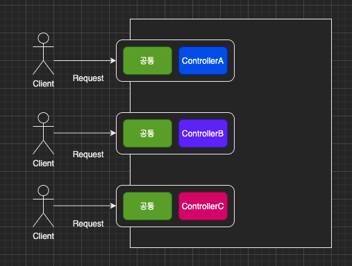
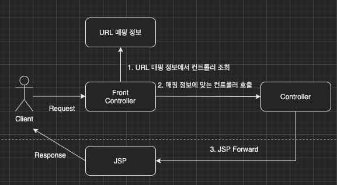

이번 장부터 프론트 컨트롤러 패턴을 적용하여 MVC 프레임워크를 만들어본다.
글의 하단부에 참고한 강의와 공식문서의 경로를 첨부하였으므로 자세한 내용은 강의나 공식문서에서 확인한다.
모든 코드는 [깃허브(링크)](https://github.com/roy-zz/mvc)에 올려두었다.

---

### 프론트 컨트롤러

우리는 지금까지 Servlet의 문제점을 JSP로 개선하고 JSP의 문제점을 MVC 패턴으로 개선하였다.
하지만 많은 코드들이 중복된다는 MVC 패턴의 한계점을 해결하지 못하였다.
아래의 이미지와 같이 컨트롤러마다 공통되는 부분이 중복되어 들어가는 상황이 발생하였다.
(물론 공통되는 부분을 하나의 메서드로 추출해도 되지만 추출된 메서드를 호출하는 것조차도 중복이라고 볼 수 있다.)



프론트 컨트롤러를 도입하게 되면 컨트롤러(or 서블릿) 앞단에 마치 프록시처럼 작동하는 컨트롤러가 놓이게된다.
이 컨트롤러는 다른 컨트롤러들의 공통사항을 앞단에서 미리 처리한 뒤 다른 컨트롤러에게 전달해주는 역할을 한다.


결국 프론트 컨트롤러는 단순 프록시라고 보기보다는 공통 관심사를 처리하는 프록시 혹은 라우터라고 보는 편이 맞다.
스프링의 웹 MVC의 핵심도 프론트 컨트롤러이며 스프링 웹 MVC의 DispatcherServlet 또한 FrontController 패턴으로 구현되어 있다.

---

### 프론트 컨트롤러 도입

이번에는 기존에 MVC 패턴을 적용하였던 코드를 최대한 유지하면서 프론트 컨트롤러를 적용해본다.
아래의 그림처럼 기존 구조에서 프론트 컨트롤러가 추가되어 매핑 정보를 조회하여 요청 타입에 맞는 컨트롤러로 전달한다.



필자가 참고한 강의에서는 각 버전별로 컨트롤러(이번 예제에서는 MyControllerV1) 인터페이스가 최상위 인터페이스였다.
하지만 필자는 모든 버전들을 상위에 있는 MyController를 추가하였다. 이유는 추후 Version 5를 만들면서 살펴보도록 한다.

**MyController**

예제의 모든 컨트롤러(프론트 컨트롤러 제외)의 최상위 인터페이스이며 공통된 메서드를 가지고 있다.

```java
public interface MyController {

    MemberRepository memberRepository = MemberRepository.getInstance();

    default void forward(String viewPath, HttpServletRequest request, HttpServletResponse response) throws ServletException, IOException {
        RequestDispatcher dispatcher = request.getRequestDispatcher(viewPath);
        dispatcher.forward(request, response);
    }

    default void saveMemberAndSetAttribute(HttpServletRequest request) {
        String username = request.getParameter("username");
        int age = Integer.parseInt(request.getParameter("age"));
        Member member = new Member(username, age);
        memberRepository.save(member);
        request.setAttribute("member", member);
    }

    default void getMembersAndSetAttribute(HttpServletRequest request) {
        List<Member> storedMembers = memberRepository.findAll();
        request.setAttribute("members", storedMembers);
    }
}
```

**MyControllerV1**

Version1에서 사용되는 컨트롤러들의 인터페이스이다.
매개변수로 HttpServletRequest, HttpServletResponse를 입력받는다.

```java
public interface MyControllerV1 extends MyController {
    void process(HttpServletRequest request, HttpServletResponse response) throws ServletException, IOException;
}
```

**MemberFormControllerV1**

클라이언트에게 사용자를 저장하기 위한 입력 화면을 제공하는 컨트롤러다.
MyController 인터페이스로 공통 메서드를 추출하여 기존보다 코드가 짧아졌다. (이번 장의 핵심은 아니다.)

```java
public class MemberFormControllerV1 implements MyControllerV1 {
    @Override
    public void process(HttpServletRequest request, HttpServletResponse response) throws ServletException, IOException {
        String viewPath = "/WEB-INF/views/new-form.jsp";
        forward(viewPath, request, response);
    }
}
```

**MemberSaveControllerV1**

클라이언트로부터 사용자의 정보를 입력받아 저장하는 컨트롤러다.
MyController 인터페이스로 공통 메서드를 추출하여 기존보다 코드가 짧아졌다. (이번 장의 핵심은 아니다.)

```java
public class MemberSaveControllerV1 implements MyControllerV1 {
    @Override
    public void process(HttpServletRequest request, HttpServletResponse response) throws ServletException, IOException {
        saveMemberAndSetAttribute(request);
        String viewPath = "/WEB-INF/views/save-result.jsp";
        forward(viewPath, request, response);
    }
}
```

**MemberListControllerV1**

클라이언트에게 저장되어 있는 사용자의 정보를 보여주는 페이지로 이동시켜주는 컨트롤러다.
MyController 인터페이스로 공통 메서드를 추출하여 기존보다 코드가 짧아졌다. (이번 장의 핵심은 아니다.)

```java
public class MemberListControllerV1 implements MyControllerV1 {
    @Override
    public void process(HttpServletRequest request, HttpServletResponse response) throws ServletException, IOException {
        getMembersAndSetAttribute(request);
        String viewPath = "/WEB-INF/views/members.jsp";
        forward(viewPath, request, response);
    }
}
```

**FrontControllerV1**

이번 장의 핵심은 프론트 컨트롤러가 등장했다.
모든 컨트롤러의 정보를 controllerMap에 저장하고 있다.
사용자의 요청이 들어오면 요청에 맞는 컨트롤러를 검색하여 전달하는 역할을 한다.

```java
@WebServlet(name = "frontControllerServletV1", urlPatterns = "/front-controller/v1/*")
public class FrontControllerV1 extends HttpServlet {
    private final Map<String, MyControllerV1> controllerMap = new HashMap<>();
    @PostConstruct
    private void initialization() {
        controllerMap.put("/front-controller/v1/members/new-form", new MemberFormControllerV1());
        controllerMap.put("/front-controller/v1/members/save", new MemberSaveControllerV1());
        controllerMap.put("/front-controller/v1/members", new MemberListControllerV1());
    }

    @Override
    protected void service(HttpServletRequest request, HttpServletResponse response) throws ServletException, IOException {
        String requestURI = request.getRequestURI();
        MyControllerV1 controller = controllerMap.get(requestURI);
        if (Objects.isNull(controller)) {
            response.setStatus(HttpServletResponse.SC_NOT_FOUND);
            return;
        }
        controller.process(request, response);
    }
}
```


---

**참고한 강의**:

- https://www.inflearn.com/course/%EC%8A%A4%ED%94%84%EB%A7%81-%ED%95%B5%EC%8B%AC-%EC%9B%90%EB%A6%AC-%EA%B8%B0%EB%B3%B8%ED%8E%B8

- https://www.inflearn.com/course/%EC%8A%A4%ED%94%84%EB%A7%81-mvc-1

**Spring 공식문서**:

- https://docs.spring.io/spring-framework/docs/current/reference/html/web.html#spring-web