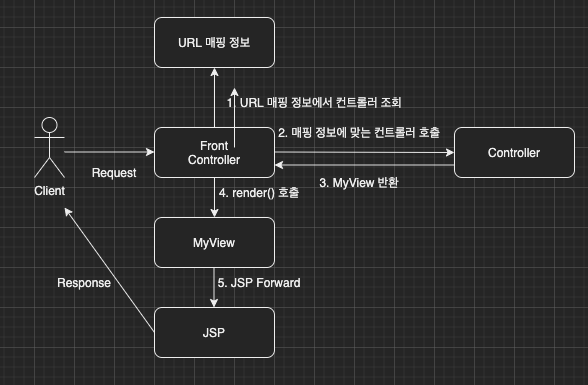

이번 장부터 [프론트 컨트롤러 Version1(링크)](https://imprint.tistory.com/188?category=1067499)에 이어 MVC 프레임워크를 만들어본다.
글의 하단부에 참고한 강의와 공식문서의 경로를 첨부하였으므로 자세한 내용은 강의나 공식문서에서 확인한다.
모든 코드는 [깃허브(링크)](https://github.com/roy-zz/mvc)에 올려두었다.

---

이전 장에서는 프론트 컨트롤러를 도입하여 클라이언트 요청의 진입점을 하나로 통일하는 작업을 진행하였다.
이번 장에서는 MyView라는 클래스를 생성하여 컨트롤러에서 View로 이동하는 부분이 중복되는 문제를 해결해본다.
전체적인 다이어그램은 아래의 이미지와 같다.



**MyView**

이전 장에서는 없었던 MyView가 추가되었다.
생성 시점에 view의 경로로 생성되며 render가 호출되면 경로에 있는 view로 forward 시킨다. 

```java
@AllArgsConstructor
public class MyView {
    private String viewPath;
    public void render(HttpServletRequest request, HttpServletResponse response) throws ServletException, IOException {
        RequestDispatcher dispatcher = request.getRequestDispatcher(viewPath);
        dispatcher.forward(request, response);
    }
}
```

**MyControllerV2**

이전 장에서는 리턴 타입이 void 였지만 중복되는 코드가 MyView로 추출되어 리턴 타입이 생겼다.

```java
public interface MyControllerV2 extends MyController {
    MyView process(HttpServletRequest request, HttpServletResponse response) throws ServletException, IOException;
}
```

**MemberFormControllerV2**

이전 장에서는 필자가 forward라는 메서드로 공통되는 부분을 추출하였었다.
하지만 화면을 forward하는 컨트롤러에서 모든 메서드에서 forward를 호출하는 것조차 중복이다.
MyView를 생성하는 것으로 중복코드를 한번 더 줄였다.

```java
public class MemberFormControllerV2 implements MyControllerV2 {
    @Override
    public MyView process(HttpServletRequest request, HttpServletResponse response) throws ServletException, IOException {
        return new MyView("/WEB-INF/views/new-form.jsp");
    }
}
```

**MemberSaveControllerV2**

MemberFormControllerV2와 동일하다.

```java
public class MemberSaveControllerV2 implements MyControllerV2 {
    @Override
    public MyView process(HttpServletRequest request, HttpServletResponse response) throws ServletException, IOException {
        saveMemberAndSetAttribute(request);
        return new MyView("/WEB-INF/views/save-result.jsp");
    }
}
```

**MemberListControllerV2**

MemberFormControllerV2와 동일하다.

```java
public class MemberListControllerV2 implements MyControllerV2 {
    @Override
    public MyView process(HttpServletRequest request, HttpServletResponse response) throws ServletException, IOException {
        getMembersAndSetAttribute(request);
        return new MyView("/WEB-INF/views/members.jsp");
    }
}
```

**FrontControllerV2**

크게 변경된 부분은 없다.
기존에는 각 컨트롤러의 process 메서드에서 화면을 렌더링하는 부분이 있어서 process 메서드가 마지막에 호출되었지만
Version2의 컨트롤러의 process 메서드는 화면을 렌더링하는 기능이 없기 MyView의 render 메서드를 따로 호출해주었다.

```java
@WebServlet(name = "frontControllerServletV2", urlPatterns = "/front-controller/v2/*")
public class FrontControllerV2 extends HttpServlet {
    private final Map<String, MyControllerV2> controllerMap = new HashMap<>();
    @PostConstruct
    private void initialization() {
        controllerMap.put("/front-controller/v2/members/new-form", new MemberFormControllerV2());
        controllerMap.put("/front-controller/v2/members/save", new MemberSaveControllerV2());
        controllerMap.put("/front-controller/v2/members", new MemberListControllerV2());
    }

    @Override
    protected void service(HttpServletRequest request, HttpServletResponse response) throws ServletException, IOException {
        String requestURI = request.getRequestURI();
        MyControllerV2 controller = controllerMap.get(requestURI);
        if (Objects.isNull(controller)) {
            response.setStatus(HttpServletResponse.SC_NOT_FOUND);
            return;
        }
        MyView view = controller.process(request, response);
        view.render(request, response);
    }
}
```

---

**참고한 강의**:

- https://www.inflearn.com/course/%EC%8A%A4%ED%94%84%EB%A7%81-%ED%95%B5%EC%8B%AC-%EC%9B%90%EB%A6%AC-%EA%B8%B0%EB%B3%B8%ED%8E%B8

- https://www.inflearn.com/course/%EC%8A%A4%ED%94%84%EB%A7%81-mvc-1

**Spring 공식문서**:

- https://docs.spring.io/spring-framework/docs/current/reference/html/web.html#spring-web