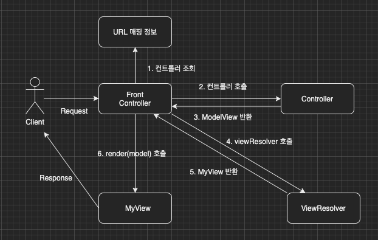

이번 장부터 [프론트 컨트롤러 Version2(링크)](https://imprint.tistory.com/189?category=1067499)에 이어 MVC 프레임워크를 만들어본다.
글의 하단부에 참고한 강의와 공식문서의 경로를 첨부하였으므로 자세한 내용은 강의나 공식문서에서 확인한다.
모든 코드는 [깃허브(링크)](https://github.com/roy-zz/mvc)에 올려두었다.

---

이전 장에서는 MyView라는 클래스를 생성하여 View로 이동하는 부분이 중복되는 문제를 해결하였다.
지금까지의 컨트롤러는 서블릿에 종속적인 HttpServletRequest을 사용하였다.
데이터를 담는 모델 또한 request.setAttribute()를 통해서 전달하였다.

이번 장에서는 요청 파라미터를 HttpServletRequest가 아닌 자바의 Map으로 대신하고 직접 Model 클래스를 생성하여 서블릿에 대한 의존성을 제거해본다.
전체적인 다이어그램은 아래의 이미지와 같다.



**ModelView**

이전 장에서는 없었던 ModelView가 추가되었다.
생성 시점에 view의 논리 이름을 주입받는다.
mapOfModel은 기존에 HttpServletRequest의 Attribute를 대신할 Map 객체다.

```java
@Getter @Setter
public class ModelView {
    private String viewName;
    private Map<String, Object> mapOfModel = new HashMap<>();
    public ModelView(String viewName) {
        this.viewName = viewName;
    }
}
```

**MyControllerV3**

더 이상 매개변수로 HttpServletRequest를 입력받지 않는다.
Map으로 변경된 HttpServletRequest를 입력받아서 매개변수로 입력받기 때문에 컨트롤러들의 서블릿에 대한 의존성이 사라졌다.

```java
public interface MyControllerV3 extends MyController {
    ModelView process(Map<String, String> params);
}
```

**MyController**

모든 컨트롤러들의 최상위 인터페이스에 Version 3를 위한 메서드가 추가되었다.
사실 필자는 추상 클래스로 만들고 싶었으나 추상 클래스로 만드는 경우 MyControllerV3가 MyController를 상속받지 못하게 되어 인터페이스의 default를 사용하여 구현하였다.

```java
public interface MyController {

    MemberRepository memberRepository = MemberRepository.getInstance();

    default void forward(String viewPath, HttpServletRequest request, HttpServletResponse response) throws ServletException, IOException {
        RequestDispatcher dispatcher = request.getRequestDispatcher(viewPath);
        dispatcher.forward(request, response);
    }

    default void saveMemberAndSetAttribute(HttpServletRequest request) {
        String username = request.getParameter("username");
        int age = Integer.parseInt(request.getParameter("age"));
        request.setAttribute("member", saveMember(username, age));
    }

    default void getMembersAndSetAttribute(HttpServletRequest request) {
        request.setAttribute("members", getMembers());
    }

    default ModelView saveMemberAndSetViewModel(Map<String, String> params, String viewName) {
        String username = params.get("username");
        int age = Integer.parseInt(params.get("age"));
        ModelView modelView = new ModelView(viewName);
        modelView.getMapOfModel().put("member", saveMember(username, age));
        return modelView;
    }

    default ModelView getMembersAndSetViewModel(String viewModel) {
        ModelView modelView = new ModelView(viewModel);
        modelView.getMapOfModel().put("members", getMembers());
        return modelView;
    }

    private Member saveMember(String username, int age) {
        Member member = new Member(username, age);
        memberRepository.save(member);
        return member;
    }

    private List<Member> getMembers() {
        return memberRepository.findAll();
    }
}
```

**MemberFormControllerV3**

MyControllerV3와 동일하다.

```java
public class MemberFormControllerV3 implements MyControllerV3 {
    @Override
    public ModelView process(Map<String, String> params) {
        return new ModelView("new-form");
    }
}
```

**MemberListControllerV3**

MyControllerV3와 동일하다.

```java
public class MemberListControllerV3 implements MyControllerV3 {
    @Override
    public ModelView process(Map<String, String> params) {
        return getMembersAndSetViewModel("members");
    }
}
```

**MemberSaveControllerV3**

MyControllerV3와 동일하다.

```java
public class MemberSaveControllerV3 implements MyControllerV3 {
    @Override
    public ModelView process(Map<String, String> params) {
        return saveMemberAndSetViewModel(params, "save-result");
    }
}
```

**MyView**

Map<String, Object>를 매개변수로 받는 render가 추가되었다.
매개변수로 받은 model을 HttpServletRequest로 변경하여 물리 경로의 jsp 파일로 forward 한다.

```java
@AllArgsConstructor
public class MyView {
    private String viewPath;
    public void render(HttpServletRequest request, HttpServletResponse response) throws ServletException, IOException {
        RequestDispatcher dispatcher = request.getRequestDispatcher(viewPath);
        dispatcher.forward(request, response);
    }

    public void render(Map<String, Object> model, HttpServletRequest request, HttpServletResponse response) throws ServletException, IOException {
        modelToRequestAttribute(model, request);
        RequestDispatcher dispatcher = request.getRequestDispatcher(viewPath);
        dispatcher.forward(request, response);
    }

    private void modelToRequestAttribute(Map<String, Object> model, HttpServletRequest request) {
        model.forEach(request::setAttribute);
    }
}
```

**FrontControllerV3**

지금까지 MyView 객체를 생성하기 위해서 "/WEB-INF/views/~~.jsp"와 같이 문자열이 중복되었는데 이러한 중복을 제거하기 위해서 viewResolver 메서드가 추가되었다.
서블릿과의 의존성을 제거하기 위하여 HttpServletRequest를 Map객체로 변환해주는 mapOfParam이 추가되었다.

```java
@WebServlet(name = "frontControllerServletV3", urlPatterns = "/front-controller/v3/*")
public class FrontControllerV3 extends HttpServlet {

    private final Map<String, MyControllerV3> controllerMap = new HashMap<>();

    @PostConstruct
    private void initialization() {
        controllerMap.put("/front-controller/v3/members/new-form", new MemberFormControllerV3());
        controllerMap.put("/front-controller/v3/members/save", new MemberSaveControllerV3());
        controllerMap.put("/front-controller/v3/members", new MemberListControllerV3());
    }

    @Override
    protected void service(HttpServletRequest request, HttpServletResponse response) throws ServletException, IOException {
        String requestURI = request.getRequestURI();
        MyControllerV3 controller = controllerMap.get(requestURI);
        if (Objects.isNull(controller)) {
            response.setStatus(HttpServletResponse.SC_NOT_FOUND);
            return;
        }
        Map<String, String> params = mapOfParam(request);
        ModelView modelView = controller.process(params);

        String viewName = modelView.getViewName();
        MyView view = viewResolver(viewName);
        view.render(modelView.getMapOfModel(), request, response);
    }

    private Map<String, String> mapOfParam(HttpServletRequest request) {
        Map<String, String> params = new HashMap<>();
        request.getParameterNames().asIterator()
                .forEachRemaining(param -> params.put(param, request.getParameter(param)));
        return params;
    }

    private MyView viewResolver(String viewName) {
        return new MyView("/WEB-INF/views/" + viewName + ".jsp");
    }
}
```

---

**참고한 강의**:

- https://www.inflearn.com/course/%EC%8A%A4%ED%94%84%EB%A7%81-%ED%95%B5%EC%8B%AC-%EC%9B%90%EB%A6%AC-%EA%B8%B0%EB%B3%B8%ED%8E%B8

- https://www.inflearn.com/course/%EC%8A%A4%ED%94%84%EB%A7%81-mvc-1

**Spring 공식문서**:

- https://docs.spring.io/spring-framework/docs/current/reference/html/web.html#spring-web