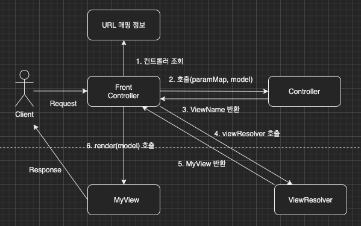

이번 장부터 [프론트 컨트롤러 Version3(링크)](https://imprint.tistory.com/190?category=1067499)에 이어 MVC 프레임워크를 만들어본다.
글의 하단부에 참고한 강의와 공식문서의 경로를 첨부하였으므로 자세한 내용은 강의나 공식문서에서 확인한다.
모든 코드는 [깃허브(링크)](https://github.com/roy-zz/mvc)에 올려두었다.

---

이전 장에서는 서블릿의 의존성을 제거하기 위하여 HttpServletRequest가 아닌 자바의 Map으로 데이터를 전달하였다.
하지만 아직 매번 ModelView 객체를 생성하고 반환해야하는 번거로운 부분이 있다.

이번 장에서는 컨트롤러가 ModelView를 생성하는 것이 아니라 View의 이름만 반환하도록 수정해본다.

전체적인 구조를 확인해보면 이전 장에서 다루었던 Version3와 동일하고 컨트롤러가 ModelView 객체가 아닌 ViewName을 반환하도록 변경되었다.



**MyControllerV4**

반환 타입이 ModelView에서 String으로 변경되었다.
기존에는 컨트롤러가 ModelView를 생성하는 책임까지 가지고 있었지만 이제는 ViewName까지만 반환하면 된다.

```java
public interface MyControllerV4 extends MyController {
    String process(Map<String, String> params, Map<String, Object> model);
}
```

**MemberFormControllerV4**

기존에는 Model정보가 있는 ModelView를 반환하였지만 이제 View의 이름만 반환한다.
ViewModel에 있었던 Model의 정보가 필요하기 때문에 매개변수로 Model을 받고 있다.

```java
public class MemberFormControllerV4 implements MyControllerV4 {
    @Override
    public String process(Map<String, String> params, Map<String, Object> model) {
        return "new-form";
    }
}
```

**MemberListControllerV4**

변경 포인트는 MemberFormControllerV4와 동일하다.

```java
public class MemberListControllerV4 implements MyControllerV4 {
    @Override
    public String process(Map<String, String> params, Map<String, Object> model) {
        Member newMember = saveMember(params.get("username"), Integer.parseInt(params.get("age")));
        model.put("member", newMember);
        return "save-result";
    }
}
```

**MemberSaveControllerV4**

변경 포인트는 MemberFormControllerV4와 동일하다.

```java
public class MemberSaveControllerV4 implements MyControllerV4 {
    @Override
    public String process(Map<String, String> params, Map<String, Object> model) {
        List<Member> storedMembers = getMembers();
        model.put("members", storedMembers);
        return "members";
    }
}
```

**FrontControllerV4**

FrontControllerV3와 변경된 부분이 많지는 않다.
기존에는 컨트롤러에서 반환하던 ModelView를 사용하였다면 이제 컨트롤러에서 전달받은 ViewName만으로 렌더링하도록 변경되었다.

```java
@WebServlet(name = "frontControllerServletV4", urlPatterns = "/front-controller/v4/*")
public class FrontControllerV4 extends HttpServlet {

    private final Map<String, MyControllerV4> controllerMap = new HashMap<>();

    @PostConstruct
    private void initialization() {
        controllerMap.put("/front-controller/v4/members/new-form", new MemberFormControllerV4());
        controllerMap.put("/front-controller/v4/members/save", new MemberSaveControllerV4());
        controllerMap.put("/front-controller/v4/members", new MemberListControllerV4());
    }

    @Override
    protected void service(HttpServletRequest request, HttpServletResponse response) throws ServletException, IOException {
        String requestURI = request.getRequestURI();

        MyControllerV4 controller = controllerMap.get(requestURI);
        if (Objects.isNull(controller)) {
            response.setStatus(HttpServletResponse.SC_NOT_FOUND);
            return;
        }

        Map<String, String> params = createParams(request);
        Map<String, Object> model = new HashMap<>();

        String viewName = controller.process(params, model);

        MyView view = viewResolver(viewName);
        view.render(model, request, response);
    }

    private Map<String, String> createParams(HttpServletRequest request) {
        Map<String, String> params = new HashMap<>();
        request.getParameterNames().asIterator()
                .forEachRemaining(param -> params.put(param, request.getParameter(param)));
        return params;
    }

    private MyView viewResolver(String viewName) {
        return new MyView("/WEB-INF/views/" + viewName + ".jsp");
    }
}
```

---

**참고한 강의**:

- https://www.inflearn.com/course/%EC%8A%A4%ED%94%84%EB%A7%81-%ED%95%B5%EC%8B%AC-%EC%9B%90%EB%A6%AC-%EA%B8%B0%EB%B3%B8%ED%8E%B8

- https://www.inflearn.com/course/%EC%8A%A4%ED%94%84%EB%A7%81-mvc-1

**Spring 공식문서**:

- https://docs.spring.io/spring-framework/docs/current/reference/html/web.html#spring-web