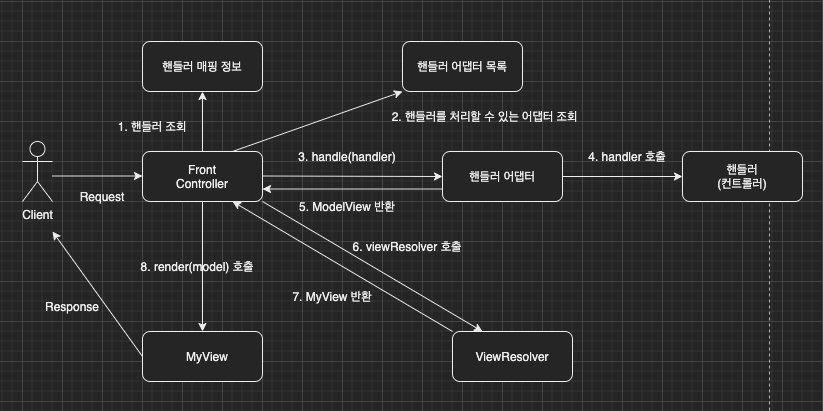

이번 장부터 [프론트 컨트롤러 Version4(링크)](https://imprint.tistory.com/190?category=1067499)에 이어 MVC 프레임워크를 만들어본다.
글의 하단부에 참고한 강의와 공식문서의 경로를 첨부하였으므로 자세한 내용은 강의나 공식문서에서 확인한다.
모든 코드는 [깃허브(링크)](https://github.com/roy-zz/mvc)에 올려두었다.

---

이전 장에서는 컨트롤러가 ViewModel 객체를 생성하는 것이 아니라 단순히 ViewName을 반환하도록 수정해서 컨트롤러에게서 ViewModel을 생성하는 책임을 제거하였다.
하지만 기존 Version3 방식처럼 ModelView를 반환하는 컨트롤러를 사용하고 싶다면 현재 구조에서는 MyControllerV3, MyControllerV4가 완전히 다른 인터페이스이기 때문에 불가능하다.

서로 호환되지 않는 컨트롤러들 간에 호환을 맞추기 위해 중간에 어댑터를 두는 어댑터 패턴을 적용하여 우리의 프론트 컨트롤러가 다양한 방식의 컨트롤러를 초리할 수 있도록 변경해본다.
전체적인 구조는 아래와 같다.



기존의 버전들과는 다르게 상당히 복잡해보이는 구조로 변경되었다. 하지만 실제로 스프링 MVC도 비슷한 구조로 설계되어 있으며 어댑터 패턴 또한 면접 단골 질문이므로 꼭 이해하고 넘어가도록 한다.

**핸들러 어댑터**: 중간에 컨트롤러의 호환을 맞추어주는 어댑터다.

**핸들러**: 컨트롤러가 더 많은 역할을 하게 되었으므로 이름을 확장하여 핸들러로 변경하였다. 컨트롤러의 개념뿐만 아니라 어댑터만 있으면 어떤 종류의 요청도 처리가 가능하기 때문이다.

---

**MyHandlerAdapter**

어댑터의 규약을 정의한 인터페이스다.
여기서 필자가 MyControllerV* 인터페이스들의 최상위 인터페이스로 MyController를 지정한 이유가 나온다.
만약 MyControllerV*가 MyController를 상속받지 않았다면 support 메서드는 매개변수로 MyController가 아닌 Object를 받아야한다.
Object로 받아서 MyControllerV*로 캐스팅하면 되지 않냐는 질문이 나올 수 있지만 성능이나 안정성 측면에서 제네릭을 사용하는 방법이 좋다.
이 부분에 대한 자세한 답변은 자바의 제네릭의 장점과 연관이 있으므로 이번 장에서는 설명하지 않는다. 
하지만 중요한 부분이므로 필자의 설명이 이해되지 않는다면 자바의 제네릭에 대해서 반드시 공부하고 넘어가도록 한다. (글의 하단부에 제네릭 관련된 토비님의 유튜브 강의(무료) 링크를 첨부한다.)

```java
public interface MyHandlerAdapter {
    <T extends MyController> boolean support(T handler);
    <T extends MyController> ModelView handle(
            HttpServletRequest request,
            HttpServletResponse response,
            T handler) throws ServletException, IOException;

    default Map<String, String> createParam(HttpServletRequest request) {
        Map<String, String> params = new HashMap<>();
        request.getParameterNames().asIterator()
                .forEachRemaining(paramName -> params.put(paramName, request.getParameter(paramName)));
        return params;
    }
}
```

- handler는 컨트롤러를 의미하며 어댑터가 매개변수로 입력받은 컨트롤러를 처리할 수 있는지를 응답한다.

- 어댑터는 실제 컨트롤러를 호출하고 결과로 ModelView를 반환해야 한다.
  실제 컨트롤러가 ModelView를 반환하지 않고 Version4처럼 String을 반환한다면 어댑터에서 ModelView를 만들어서 호환성을 맞추어야한다.

- Version3, Version4 컨트롤러 모두 createParam 메서드를 가지고 있어서 인터페이스 레벨로 뽑아냈다.

---

**MyControllerV3HandlerAdapter**

간단한 코드이므로 설명 생략

```java
public class MyControllerV3HandlerAdapter implements MyHandlerAdapter {
    @Override
    public <T extends MyController> boolean support(T handler) {
        return handler instanceof MyControllerV3;
    }

    @Override
    public <T extends MyController> ModelView handle(HttpServletRequest request, HttpServletResponse response, T handler) throws ServletException, IOException {
        MyControllerV3 controller = (MyControllerV3) handler;
        Map<String, String> params = createParam(request);
        return controller.process(params);
    }
}
```

**MyControllerV4HandlerAdapter**

Version4 컨트롤러는 ModelView가 아닌 ViewName인 String을 반환한다.
어댑터에는 ModelView를 반환하기로 약속이 되어있으므로 어댑터에서 ModelView를 생성해서 반환해야 한다.

```java
public class MyControllerV4HandlerAdapter implements MyHandlerAdapter {
    @Override
    public <T extends MyController> boolean support(T handler) {
        return handler instanceof MyControllerV4;
    }

    @Override
    public <T extends MyController> ModelView handle(HttpServletRequest request, HttpServletResponse response, T handler) throws ServletException, IOException {
        MyControllerV4 controller = (MyControllerV4) handler;
        Map<String, String> params = createParam(request);
        Map<String, Object> model = new HashMap<>();
        String viewName = controller.process(params, model);

        ModelView modelView = new ModelView(viewName);
        modelView.setMapOfModel(model);
        return modelView;
    }
}
```

**FrontControllerV5**

FrontControllerV5 객체가 생성되면 @PostConstruct 애노테이션이 붙은 initHandlerMappingMap()과 initHandlerAdapters()가 호출되어 handlerMappingMap과 handlerAdapters를 초기화 한다.
사용자의 요청이 들어오면 handlerMappingMap에서 요청을 처리할 수 있는 컨트롤러를 조회한다.
조회된 컨트롤러를 바로 사용하는 것이 아니라 컨트롤러에 맞는 어댑터를 찾아서 어댑터의 handle 메서드를 호출한다.

어댑터가 컨트롤러와 클라이언트 사이에서 중개자 역할을 한다고 보면 이해가 쉽다.

```java
@WebServlet(name = "frontControllerServletV5", urlPatterns = "/front-controller/v5/*")
public class FrontControllerV5 extends HttpServlet {

    private final Map<String, MyController> handlerMappingMap = new HashMap<>();
    private final List<MyHandlerAdapter> handlerAdapters = new ArrayList<>();

    @PostConstruct
    private void initHandlerMappingMap() {
        handlerMappingMap.put("/front-controller/v5/v3/members/new-form", new MemberFormControllerV3());
        handlerMappingMap.put("/front-controller/v5/v3/members/save", new MemberSaveControllerV3());
        handlerMappingMap.put("/front-controller/v5/v3/members", new MemberListControllerV3());
        handlerMappingMap.put("/front-controller/v5/v4/members/new-form", new MemberFormControllerV4());
        handlerMappingMap.put("/front-controller/v5/v4/members/save", new MemberSaveControllerV4());
        handlerMappingMap.put("/front-controller/v5/v4/members", new MemberListControllerV4());
    }

    @PostConstruct
    private void initHandlerAdapters() {
        handlerAdapters.add(new MyControllerV3HandlerAdapter());
        handlerAdapters.add(new MyControllerV4HandlerAdapter());
    }

    @Override
    protected void service(HttpServletRequest request, HttpServletResponse response) throws ServletException, IOException {
        MyController handler = getHandler(request);
        if (Objects.isNull(handler)) {
            response.setStatus(HttpServletResponse.SC_NOT_FOUND);
            return;
        }

        MyHandlerAdapter adapter = getHandlerAdapter(handler);
        ModelView modelView = adapter.handle(request, response, handler);

        MyView view = viewResolver(modelView.getViewName());
        view.render(modelView.getMapOfModel(), request, response);
    }

    private MyController getHandler(HttpServletRequest request) {
        String requestURI = request.getRequestURI();
        return handlerMappingMap.get(requestURI);
    }

    private MyHandlerAdapter getHandlerAdapter(MyController handler) {
        return handlerAdapters.stream()
                .filter(adapter -> adapter.support(handler))
                .findFirst()
                .orElseThrow(() -> new IllegalArgumentException("Not Found Adapter"));
    }

    private MyView viewResolver(String viewName) {
        return new MyView("/WEB-INF/views/" + viewName + ".jsp");
    }
}
```

---

**참고한 강의**:

- https://www.inflearn.com/course/%EC%8A%A4%ED%94%84%EB%A7%81-%ED%95%B5%EC%8B%AC-%EC%9B%90%EB%A6%AC-%EA%B8%B0%EB%B3%B8%ED%8E%B8

- https://www.inflearn.com/course/%EC%8A%A4%ED%94%84%EB%A7%81-mvc-1

**Spring 공식문서**:

- https://docs.spring.io/spring-framework/docs/current/reference/html/web.html#spring-web

**제네릭 강의(토비)**:

- https://www.youtube.com/watch?v=ipT2XG1SHtQ&ab_channel=TobyLee

- https://www.youtube.com/watch?v=PQ58n0hk7DI&ab_channel=TobyLee