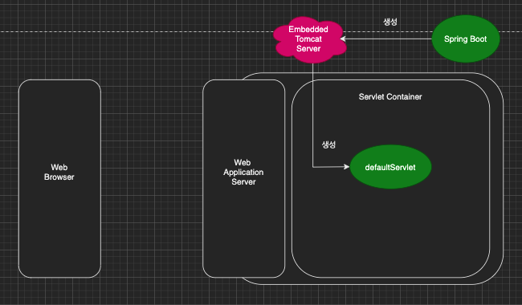
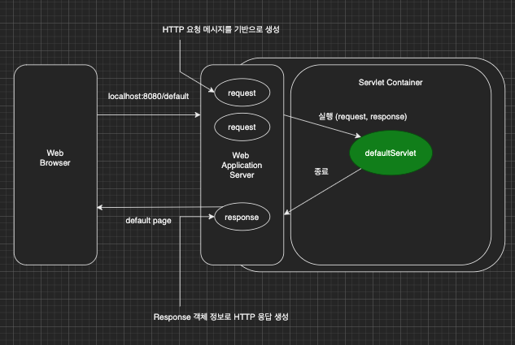

이번 장에서는 Java Servlet에 대해서 알아본다.
글의 하단부에 참고한 강의와 공식문서의 경로를 첨부하였으므로 자세한 내용은 강의나 공식문서에서 확인한다.
모든 코드는 [깃허브(링크)](https://github.com/roy-zz/mvc)에 올려두었다.

---

### Java Servlet 이란?

> 자바 서블릿(Java Servlet)은 자바를 사용하여 웹페이지를 동적으로 생성하는 서버측 프로그램 혹은 그 사양을 말하며, 흔히 "서블릿"이라 불린다. 
> 자바 서블릿은 웹 서버의 성능을 향상하기 위해 사용되는 자바 클래스의 일종이다

<center>출처: 위키백과</center>

---

### Servlet 예제 페이지

서블릿의 작동 원리를 알아보기 위해서 간단한 기본 페이지를 작성해본다.
필자는 SpringBoot로 프로젝트를 생성하였지만 스프링 서블릿 기능만 사용하여 예제를 구성할 것이다. 

@SpringBootApplication 애노테이션이 붙은 클래스에 서블릿들을 컴포넌트 스캔하는 @ServletComponentScan 애노테이션을 추가한다.

```java
@ServletComponentScan
@SpringBootApplication
public class ServletApplication {
    public static void main(String[] args) {
        SpringApplication.run(ServletApplication.class, args);
    }
}
```

파라미터로 username을 입력받고 화면에 출력하는 간단한 서블릿 클래스를 작성한다.

```java
@WebServlet(name = "defaultServlet", urlPatterns = "/default")
public class DefaultServlet extends HttpServlet {

    @Override
    protected void service(HttpServletRequest request, HttpServletResponse response) throws ServletException, IOException {
        System.out.println("DefaultServlet.service");
        System.out.println("request = " + request);
        System.out.println("response = " + response);

        String username = request.getParameter("username");
        System.out.println("username = " + username);

        response.setContentType("text/plain");
        response.setCharacterEncoding("utf-8");
        response.getWriter().write("hello " + username);
    }
}
```

프로젝트를 실행시키고 사용하는 브라우저에서 아래의 주소로 접속한다.

```curl
http://localhost:8080/default?username=roy
```

출력되는 로그는 아래와 같다.

```bash
DefaultServlet.service
request = org.apache.catalina.connector.RequestFacade@49252bf7
response = org.apache.catalina.connector.ResponseFacade@376cd94
username = roy
```

더 많은 정보를 출력하기 위해 application.properties에 아래의 내용을 추가하고 프로젝트를 재샐행시킨 뒤 다시 페이지에 접속해본다.
우리가 원하던대로 자세한 요청 정보가 출력된다.

```bash
Received [GET /default?username=roy HTTP/1.1
Host: localhost:8080
Connection: keep-alive
Cache-Control: max-age=0
sec-ch-ua: " Not A;Brand";v="99", "Chromium";v="98", "Google Chrome";v="98"
sec-ch-ua-mobile: ?0
sec-ch-ua-platform: "macOS"
Upgrade-Insecure-Requests: 1
User-Agent: Mozilla/5.0 (Macintosh; Intel Mac OS X 10_15_7) AppleWebKit/537.36 (KHTML, like Gecko) Chrome/98.0.4758.109 Safari/537.36
Accept: text/html,application/xhtml+xml,application/xml;q=0.9,image/avif,image/webp,image/apng,*/*;q=0.8,application/signed-exchange;v=b3;q=0.9
Sec-Fetch-Site: none
Sec-Fetch-Mode: navigate
Sec-Fetch-User: ?1
Sec-Fetch-Dest: document
Accept-Encoding: gzip, deflate, br
Accept-Language: ko-KR,ko;q=0.9,en-US;q=0.8,en;q=0.7]
```

---

### Servlet 작동 원리

프로잭트를 실행시키면 Spring Boot가 내장하고 있는 톰캣을 실행시킨다.
톰캣 서버는 컴포넌트 스캔하여 서블릿들을 서블릿 컨테이너에 등록한다.



이후 고객의 요청이 들어오면 HTTP Request가 HttpServletRequest로 변경되어 서블릿으로 전달된다.



우리가 HttpServletResponse에 원하는 결과를 지정하면 자동으로 HTTP Response로 변경되어 브라우저에 전달된다.

이번 예제로 예를 들면 HTTP 요청과 응답은 아래와 같다.

**HTTP 요청**
GET /default?username=roy HTTP/1.1
Host: localhost:8080

**HTTP 응답**
HTTP/1.1 200 OK
Content-Type: text/plain;charset=utf-8
Content-Length: 9

hello roy

---

지금까지 간단한 서블릿 클래스를 생성하고 자바 서블릿의 작동원리에 대해서 알아보았다.
다음 장부터는 HttpServletRequest와 HttpServletResponse에 대해서 자세히 알아보도록 한다.

---

**참고한 강의**:

- https://www.inflearn.com/course/%EC%8A%A4%ED%94%84%EB%A7%81-%ED%95%B5%EC%8B%AC-%EC%9B%90%EB%A6%AC-%EA%B8%B0%EB%B3%B8%ED%8E%B8

- https://www.inflearn.com/course/%EC%8A%A4%ED%94%84%EB%A7%81-mvc-1

**Spring 공식문서**: 

- https://docs.spring.io/spring-framework/docs/current/reference/html/web.html#spring-web