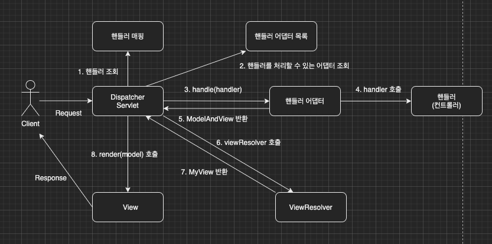

지금까지 우리는 MVC 프레임워크를 만들어보았다.
이번 장부터는 우리가 만든 MVC 프레임워크와 스프링 MVC의 차이를 알아보면서 스프링 MVC의 구조를 학습해본다.
글의 하단부에 참고한 강의와 공식문서의 경로를 첨부하였으므로 자세한 내용은 강의나 공식문서에서 확인한다.
모든 코드는 [깃허브(링크)](https://github.com/roy-zz/mvc)에 올려두었다.

---

### 우리의 MVC 프레임워크 vs 스프링 MVC

지금까지 우리가 만든 MVC 프레임워크는 아래와 같은 구조를 가지고 있다.


스프링 MVC의 구조는 우리의 MVC 프레임워크와 거의 동일한 구조를 가지고 있으며 명칭만 다르다.



구조간의 차이는 아래와 같다.
- FrontController -> DispatcherServlet
- handlerMappingMap -> HandlerMapping(인터페이스)
- MyHandlerAdapter -> HandlerAdapter
- ModelView -> ModelAndView
- viewResolver -> ViewResolver(인터페이스)
- MyView -> View

---

### 스프링 MVC 동작 순서

스프링 MVC는 아래와 같은 순서로 동작한다.

**1. 핸들러 조회**: 핸들러 매핑을 통해 요청 URL에 매핑되어 있는 핸들러(컨트롤러)를 조회한다.

**2. 핸들러 어댑터 조회**: 1단계에서 조회된 핸들러를 처리할 수 있는 핸들러 어댑터를 조회한다.

**3. 핸들러 어댑터 실행**: 2단계에서 조회된 어댑터의 handle()메서드를 호출한다.

**4. 핸들러 실행**: 핸들러 어댑터는 실제 핸들러(컨트롤러)를 호출하여 작업을 진행한다.

**5. ModelAndView 반환**: 핸들러 어댑터는 핸들러가 반환하는 정보를 기반으로 ModelAndView를 생성하여 반환한다.

**6. ViewResolver 호출**: 요청에 맞는 ViewResolver를 찾아서 실행한다. JSP를 사용하고 있다면 InternalResourceViewResolver가 자동 등록되어 사용된다.

**7. View 반환**: ViewResolver는 뷰의 논리 이름(단순 파일 이름)을 물리 이름(경로를 포함한 파일 이름)으로 변경하고 렌더링을 하는 뷰 객체를 반환한다. JSP의 경우 InternalResourceView를 반환하며 내부에 forward()로직이 있다.

**8. View Rendering**: 뷰 객체를 통하여 뷰를 렌더링하고 결과를 클라이언트에게 반환한다.

---

### 스프링 MVC의 강점

스프링 MVC의 큰 장점은 DispatcherServlet의 코드 변경없이 다양한 기능을 변경하거나 확장할 수 있다는 점이다.

간단한 예를 들어보면 우리가 사용하는 템플릿 엔진이 JSP라면 InternalResourceViewResolver를 사용하면 된다.

```java
public class InternalResourceViewResolver extends UrlBasedViewResolver {
  private static final boolean jstlPresent = ClassUtils.isPresent(
          "javax.servlet.jsp.jstl.core.Config", InternalResourceViewResolver.class.getClassLoader());
  // 중략
}
```
만약 FreeMarker로 변경된다면 DispatcherServlet의 코드 변경없이 Resolver를 FreeMarkerResolver로 변경하면 된다.

```java
public class FreeMarkerViewResolver extends AbstractTemplateViewResolver {
  /**
   * Sets the default {@link #setViewClass view class} to {@link #requiredViewClass}:
   * by default {@link FreeMarkerView}.
   */
  public FreeMarkerViewResolver() {
    setViewClass(requiredViewClass());
  }
  // 중략
}
```

갑자기 Mustache로 변경되었다면 MustacheViewResolver로 변경하면 된다.

```java
public class MustacheViewResolver extends AbstractTemplateViewResolver {
  private final Mustache.Compiler compiler;
  private String charset;
  // 중략
}
```

심지어 이러한 Resolver들은 이미 스프링에서 모두 구현해 놓았으므로 우리는 구현할 필요가 없다.

---

**참고한 강의**:

- https://www.inflearn.com/course/%EC%8A%A4%ED%94%84%EB%A7%81-%ED%95%B5%EC%8B%AC-%EC%9B%90%EB%A6%AC-%EA%B8%B0%EB%B3%B8%ED%8E%B8

- https://www.inflearn.com/course/%EC%8A%A4%ED%94%84%EB%A7%81-mvc-1

**Spring 공식문서**:

- https://docs.spring.io/spring-framework/docs/current/reference/html/web.html#spring-web