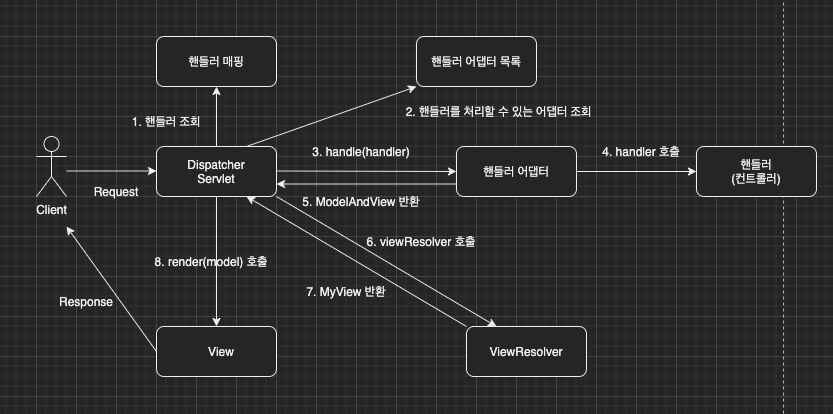

이번 장에서는 [스프링 MVC 구조()](https://imprint.tistory.com/195)에 이어 스프링 MVC의 핸들러에 대해서 알아본다.
글의 하단부에 참고한 강의와 공식문서의 경로를 첨부하였으므로 자세한 내용은 강의나 공식문서에서 확인한다.
모든 코드는 [깃허브(링크)](https://github.com/roy-zz/mvc)에 올려두었다.

---

스프링 MVC의 동작을 이해하기 위해 이전 장에서 그렸던 그림을 다시 한 번 살펴본다.



### Handler

우리가 MVC 프레임워크를 만들면서 최초 버전에서는 유연성이나 확장성이 떨어졌던 것과 유사하게 스프링 MVC 또한 초반에는 딱딱한 구조를 가지고 있었다.
아래는 스프링 초창기의 Controller 인터페이스다.

```java
@FunctionalInterface
public interface Controller {
	/**
	 * Process the request and return a ModelAndView object which the DispatcherServlet
	 * will render. A {@code null} return value is not an error: it indicates that
	 * this object completed request processing itself and that there is therefore no
	 * ModelAndView to render.
	 * @param request current HTTP request
	 * @param response current HTTP response
	 * @return a ModelAndView to render, or {@code null} if handled directly
	 * @throws Exception in case of errors
	 */
	@Nullable
	ModelAndView handleRequest(HttpServletRequest request, HttpServletResponse response) throws Exception;
}
```

구형 컨트롤러 인터페이스를 구현하여 구형 컨트롤러를 만들어본다.

```java
@Component("/springmvc/legacy-controller")
public class LegacyController implements Controller {
    @Override
    public ModelAndView handleRequest(HttpServletRequest request, HttpServletResponse response) throws Exception {
        System.out.println("LegacyController.handleRequest");
        return null;
    }
}
```

스프링이 컨트롤러를 호출하려면 이전 장에서 보았듯이 두 가지 클래스가 필요하다.

**1. HandlerMapping(핸들러 매핑)**: 핸들러의 이름은 "/springmvc/legacy-controller"로 지정해서 빈으로 등록하였다. 빈의 이름으로 핸들러를 찾아주는 핸들러 매핑이 필요하다.

**2. HandlerAdapter(핸들러 어댑터)**: 핸들러 매핑을 통해서 찾은 핸들러에 맞는 핸들러 어댑터가 필요하다. 이번 예시에서는 Controller 인터페이스의 구현체들을 실행할 수 있는 어댑터를 찾아야한다.

---

#### Handler Mapping & Handler Adapter 확인

스프링은 이미 많은 핸들러 매핑과 핸들러 어댑터가 있기 때문에 우리가 직접 등록해서 사용할 일은 없다.
물론 천상계 개발자들은 커스텀해서 사용할 수도 있을듯하다. 우리도 스프링은 어떻게 구현하였는지 살펴는 본다.

**RequestMappingHandlerMapping**: 
> Creates RequestMappingInfo instances from type and method-level @RequestMapping annotations in @Controller classes.

@Controller 애노테이션이 붙은 클래스 내에 메서드 중에 @RequestMapping 어노테이션을 사용한 메서드에 한해서 RequestMappingInfo 인스턴스를 생성해 준다.

**BeanNameUrlHandlerMapping**:
> Implementation of the org.springframework.web.servlet.HandlerMapping interface that maps from URLs to beans with names that start with a slash ("/"), similar to how Struts maps URLs to action names.

스프링 빈의 이름 중 "/"로 시작하는 핸들러를 찾는다.

**RequestMappingHandlerAdapter**:
> Extension of AbstractHandlerMethodAdapter that supports @RequestMapping annotated HandlerMethods.

AbstractHandlerMethodAdapter의 확장이며 @RequestMapping 애노테이션이 붙은 핸들러를 위해 사용된다.

**HttpRequestHandlerAdapter**:
> Adapter to use the plain HttpRequestHandler interface with the generic org.springframework.web.servlet.DispatcherServlet. Supports handlers that implement the LastModified interface.

HttpRequestHandler 인터페이스를 위해 사용된다.

**SimpleControllerHandlerAdapter**:
> Adapter to use the plain Controller workflow interface with the generic org.springframework.web.servlet.DispatcherServlet. Supports handlers that implement the LastModified interface.

Controller 인터페이스의 구현체인 핸들러들을 위해 사용된다.

---

스프링에서 준비한 HandlerMapping(이하 HandlerMapping)과 HandlerAdapter(이하 HandlerAdapter)를 살펴보았고 어떠한 방식으로 LegacyController를 사용하는지 확인해본다.

1. HandlerMapping을 순서대로 실행하여 개발자가 작성한 코드에서 핸들러를 찾는다.
2. LegacyController의 경우 @Component("/springmvc/legacy-controller")와 같이 Bean의 이름을 URL 형식으로 지정하였기 때문에 Bean의 이름으로 등록된다.
   이때 위에서 살펴본 BeanNameHandlerMapping이 실행되어 LegacyController를 반환한다. 
3. HandlerAdapter들을 돌면서 supports() 메서드를 호출하여 호환되는 어댑터를 찾는다.
4. LegacyController의 경우 Controller 인터페이스의 구현체이기 때문에 SimpleControllerHandlerAdapter가 반환된다.
5. DispatcherServlet이 조회한 SimpleControllerHandlerAdapter를 실행하면서 사용해야하는 핸들러의 정보도 함께 전달한다.
6. SimpleControllerHandlerAdapter는 우리가 작성한 핸들러인 LegacyController를 내부에서 실행하고 결과를 반환한다.

---

#### HttpRequestHandler 사용

Controller 인터페이스가 아닌 HttpRequestHandler를 사용하여 핸들러를 만들어본다.
HttpRequestHandler의 경우 우리가 서블릿에서 사용했던 것과 유사한 형태를 하고 있다.

```java
public interface HttpRequestHandler {
	void handleRequest(HttpServletRequest request, HttpServletResponse response)
			throws ServletException, IOException;
}
```

```java
@Component("/springmvc/request-handler")
public class MyHttpRequestHandler implements HttpRequestHandler {
    @Override
    public void handleRequest(HttpServletRequest request, HttpServletResponse response) throws ServletException, IOException {
        System.out.println("MyHttpRequestHandler.handleRequest");
    }
}
```

Controller 인터페이스를 사용했을 때와 유사한 방식으로 스프링은 작동한다.

1. HandlerMapping을 순서대로 실행하여 개발자가 작성한 코드에서 핸들러를 찾는다.
2. MyHttpRequestHandler의 경우 @Component("/springmvc/request-handler")와 같이 Bean의 이름을 URL 형식으로 지정하였기 때문에 Bean의 이름으로 등록된다.
   이때 위에서 살펴본 BeanNameHandlerMapping이 실행되어 MyHttpRequestHandler를 반환한다.
3. HandlerAdapter들을 돌면서 supports() 메서드를 호출하여 호환되는 어댑터를 찾는다.
4. MyHttpRequestHandler의 경우 HttpRequestHandler 인터페이스의 구현체이기 때문에 HttpRequestHandlerAdapter가 반환된다.
5. DispatcherServlet이 조회한 HttpRequestHandlerAdapter를 실행하면서 사용해야하는 핸들러의 정보도 함께 전달한다.
6. HttpRequestHandlerAdapter는 우리가 작성한 핸들러인 MyHttpRequestHandler를 내부에서 실행하고 결과를 반환한다.

현재 스프링에서 가장 우선순위가 높은 핸들러 매핑과 핸들러 어댑터는 RequestMappingHandlerMapping과 RequestMappingHandlerAdapter다.
이 둘은 @RequestMapping 애노테이션을 사용한 핸들러를 위한 어댑터이며 대부분의 회사에서 모든 핸들리가 사용하는 방법이다.

---

### View Resolver

이번에는 핸들러가 화면을 렌더링하게 하는 방식을 살펴본다.
위에서 작성한 LegacyController에서 화면을 렌더링하도록 유도하기 위해 ModelAndView객체를 반환하도록 수정한다.

```java
@Component("/springmvc/legacy-controller")
public class LegacyController implements Controller {
    @Override
    public ModelAndView handleRequest(HttpServletRequest request, HttpServletResponse response) throws Exception {
        System.out.println("LegacyController.handleRequest");
        return new ModelAndView("new-form");
    }
}
```

우리는 스프링에게 화면을 렌더링하기 위한 파일이 어디에 위치하는지 가르쳐주어야 하기 때문에 application.properties 파일에 아래와 같은 옵션을 추가해준다.

```bash
spring.mvc.view.prefix=/WEB-INF/views/
spring.mvc.view.suffix=.jsp
```

정상적으로 화면이 표시되는 것을 확인할 수 있다.

---

#### View Resolver 확인

**BeanNameViewResolver**:
> A simple implementation of ViewResolver that interprets a view name as a bean name in the current application context, i.e. 
> typically in the XML file of the executing DispatcherServlet or in a corresponding configuration class.

ViewResolver의 간단한 구현체이며 Bean의 이름으로 뷰를 찾아서 반환한다.

**InternalResourceViewResolver**:
> Convenient subclass of UrlBasedViewResolver that supports InternalResourceView (i.e. Servlets and JSPs) and subclasses such as JstlView.

서블릿과 JSP를 처리할 수 있는 뷰를 반환한다.

---

스프링에서 만들어 놓은 ViewResolver의 일부를 살펴보았고 어떠한 방식으로 사용되는지 알아본다.

1. HandlerAdapter를 통해 new-form이라는 뷰의 이름을 획득한다.
2. new-form이라는 이름으로 viewResolver를 순서대로 호출한다.
   BeanNameViewResolver는 new-form이라는 빈의 이름으로 뷰를 찾아야하는데 우리는 그런 빈을 만든 적이 없으므로 InternalResourceViewResolver가 호출된다.
3. InternalResourceViewResolver는 InternalResourceView 객체를 반환한다.
4. InternalResourceView의 forward()를 사용하여 JSP파일을 실행시킨다.

일반적인 템플릿 엔진들은 forward()과정 없이 바로 렌더링이 되지만 JSP의 경우 forward()과정이 필요하다.
Thymeleaf 템플릿을 사용하면 ThymeleafViewResolver를 사용하게 된다.

---

**참고한 강의**:

- https://www.inflearn.com/course/%EC%8A%A4%ED%94%84%EB%A7%81-%ED%95%B5%EC%8B%AC-%EC%9B%90%EB%A6%AC-%EA%B8%B0%EB%B3%B8%ED%8E%B8

- https://www.inflearn.com/course/%EC%8A%A4%ED%94%84%EB%A7%81-mvc-1

**Spring 공식문서**:

- https://docs.spring.io/spring-framework/docs/current/reference/html/web.html#spring-web