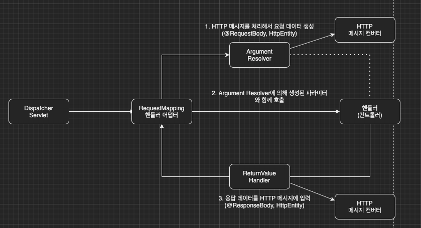

[이전 장(링크)](https://imprint.tistory.com/201?category=1067499)에서는 HTTP 메시지 컨버터가 어떠한 역할을 하는지에 대해서 알아보았다.
이번 장에서는 HTTP 메시지 컨버터가 어떠한 방식으로 작동하는지에 대해서 알아본다.
글의 하단부에 참고한 강의와 공식문서의 경로를 첨부하였으므로 자세한 내용은 강의나 공식문서에서 확인한다.
모든 코드는 [깃허브(링크)](https://github.com/roy-zz/mvc)에 올려두었다.

---

### RequestMapping 핸들러 어댑터

우리는 이전에 스프링 MVC가 아래의 이미지와 같은 구조로 작동하는 것을 확인하였다.


그림에는 보이지 않는 듯 하지만 핸들러 어댑터, @RequestMapping 애노테이션 기반의 핸들러를 처리하는 RequestMappingHandlerAdapter가 처리한다.


---

#### ArgumentResolver

애노테이션 기반의 컨트롤러는 HttpServletRequest, Model, @RequestParam 등 많은 파라미터를 사용할 수 있다.
사용가능한 파라미터를 모두 보고 싶다면 [공식문서(링크)](https://docs.spring.io/spring-framework/docs/current/reference/html/web.html#mvc-ann-arguments)를 확인한다.
이렇게 유연한 사용이 가능한 이유는 우리가 모르는 사이에 파라미터를 생성해 주는 ArgumentResolver 때문이다.
애노테이션 기반 컨트롤러를 처리하는 RequestMappingHandlerAdapter가 ArgumentResolver를 호출하여 컨트롤러(핸들러)가 필요로 하는 파라미터의 값을 생성한다.
파라미터의 값이 모두 준비되면 컨트롤러를 호출하면서 생성된 파라미터를 같이 넘겨준다.

ArgumentResolver 또한 스프링에서 많이 준비해두었으며 컨트롤러에 전달되는 파라미터를 보고 적절하게 사용된다.
최상위 인터페이스인 HandlerMethodArgumentResolver를 확인해본다.

```java
public interface HandlerMethodArgumentResolver {
	boolean supportsParameter(MethodParameter parameter);
	@Nullable
	Object resolveArgument(MethodParameter parameter, @Nullable ModelAndViewContainer mavContainer,
			NativeWebRequest webRequest, @Nullable WebDataBinderFactory binderFactory) throws Exception;
}
```

ArgumentResolver의 supportsParameter()를 호출하여 파라미터를 지원하는지 확인하고 지원한다면 resolveArgument()를 호출하여 필요한 객체로 변경한다.
여기서 생성된 객체가 컨트롤러 호출 시 같이 전달된다. ArgumentResolver를 구현하여 우리가 원하는 ArgumentResolver를 생성할 수도 있다.

---

#### ReturnValueHandler

ReturnValueHandler 또한 ArgumentResolver와 유사하게 동작하고 응답 값을 변환하는 역할을 한다.
우리가 View의 논리 이름을 단순 문자열로 반환해도 ModelAndView 객체가 반환되어 화면이 렌더링되는 이유도 중간에서 ReturnValueHandler가 조작하기 때문이다.
사용가능한 응닶 값 종류를 모두 보고 싶다면 [공식문서(링크)](https://docs.spring.io/spring-framework/docs/current/reference/html/web.html#mvc-ann-
return-types)에서 확인하도록 한다.

ReturnValueHandler 또한 스프링에서 많이 준비해두었으며 우리가 반환하는 타입을 보고 적절하게 사용된다.

```java
public interface HandlerMethodReturnValueHandler {
	boolean supportsReturnType(MethodParameter returnType);
	void handleReturnValue(@Nullable Object returnValue, MethodParameter returnType,
			ModelAndViewContainer mavContainer, NativeWebRequest webRequest) throws Exception;
}
```

supportsReturnType을 호출하여 반환하려는 타입을 지원하는지 확인하고 지원한다면 handleReturnValue를 호출하여 필요한 객체로 변경하여 반환한다.

---

#### HTTP 메시지 컨버터 위치

HTTP 메시지 컨버터는 ArgumentResolver, ReturnValueHandler에서 사용된다.



**요청의 경우** @RequestBody를 처리하는 ArgumentResolver가 있고 HttpEntity를 처리하는 ArgumentResolver가 있다.
이때 사용되는 ArgumentResolver가 HTTP 메시지 컨버터를 사용하여 우리가 필요한 파라미터와 응답 값이 생성되는 것이다.

**응답의 경우** @ResponseBody, HttpEntity를 처리하는 ReturnValueHandler가 있다.
이때 ReturnValueHandler가 HTTP 메시지 컨버터를 사용하여 우리가 원하는 응답 값을 생성해 준다.

스프링은 HandlerMethodArgumentResolver, HandlerMethodReturnValueHandler, HttpMessageConverter을 모두 인터페이스로 제공한다.
우리는 필요에 따라 인터페이스를 구현하여 기능을 확장할 수 있다.

예를 들어 아래와 같이 WebMvcConfigurer를 상속받아 스프링 빈으로 등록하여 사용할 수 있다.

```java
@Bean
public WebMvcConfigurer webMvcConfigurer() {
    return new WebMvcConfigurer() {
        @Override
        public void configurePathMatch(PathMatchConfigurer configurer) {
            // do something..
        }

        @Override
        public void configureContentNegotiation(ContentNegotiationConfigurer configurer) {
            // do something..
        }
        // 이하 생략
    }
}
```

---

**참고한 강의**:

- https://www.inflearn.com/course/%EC%8A%A4%ED%94%84%EB%A7%81-%ED%95%B5%EC%8B%AC-%EC%9B%90%EB%A6%AC-%EA%B8%B0%EB%B3%B8%ED%8E%B8

- https://www.inflearn.com/course/%EC%8A%A4%ED%94%84%EB%A7%81-mvc-1

**Spring 공식문서**:

- https://docs.spring.io/spring-framework/docs/current/reference/html/web.html#spring-web