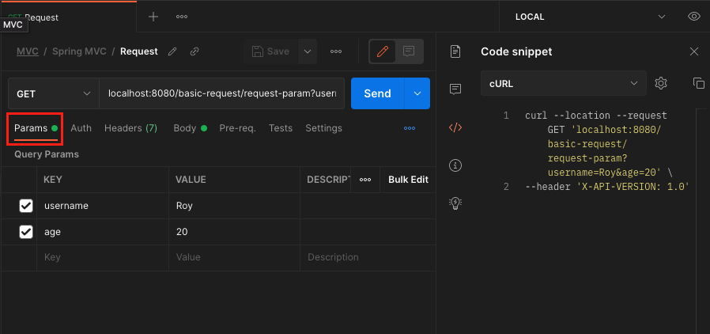
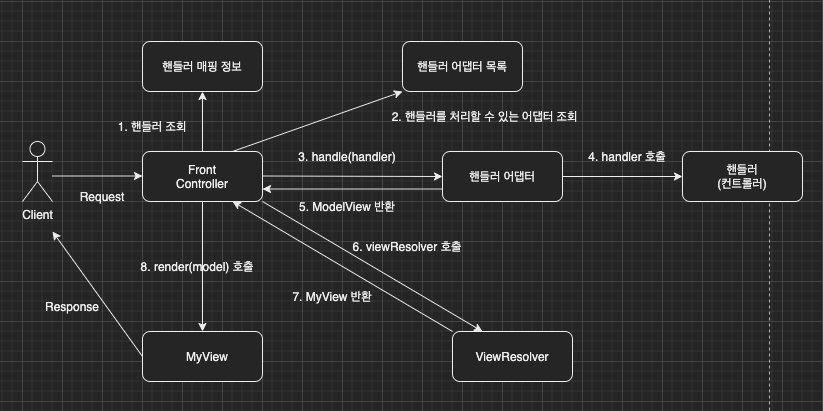

이번 장에서는 스프링 MVC의 HTTP Request의 기본적인 사용법에 대해서 알아본다.
글의 하단부에 참고한 강의와 공식문서의 경로를 첨부하였으므로 자세한 내용은 강의나 공식문서에서 확인한다.
모든 코드는 [깃허브(링크)](https://github.com/roy-zz/mvc)에 올려두었다.

---

### 헤더 조회

아래와 같은 방법으로 @RequestHeader 애노테이션을 사용하여 헤더의 정보를 조회할 수 있다.

```java
@Slf4j
@RestController
@RequestMapping(value = "/basic-request")
public class BasicRequestController {
    @GetMapping(value = "/header")
    public String headers(
            HttpServletRequest request, HttpServletResponse response,
            HttpMethod httpMethod, Locale locale,
            @RequestHeader MultiValueMap<String, String> headerMap,
            @RequestHeader("host") String host,
            @CookieValue(value = "cookieRun", required = false) String cookie
    ) {
        log.info("request: {}", request);
        log.info("response: {}", response);
        log.info("httpMethod: {}", httpMethod);
        log.info("locale: {}", locale);
        log.info("header: {}", headerMap);
        log.info("host: {}", host);
        log.info("cookieRun: {}", cookie);
        return "OK";
    }
}
```

출력 결과는 아래와 같다.

```bash
request: org.apache.catalina.connector.RequestFacade@6363e28b
response: org.apache.catalina.connector.ResponseFacade@70c0f6
httpMethod: GET
locale: en_KR
header: {user-agent=[PostmanRuntime/7.29.0], accept=[*/*], postman-token=[6c639112-e59a-4658-8cc9-f40b65f159c4], host=[localhost:8080], accept-encoding=[gzip, deflate, br], connection=[keep-alive], cookie=[cookieRun=Cookie is running]}
host: localhost:8080
cookieRun: null
```

위에서 조회한 정보 이외에도 획득할 수 있는 정보가 많이 있다.
우리가 필요로 하는 대부분의 정보는 이미 구현되어 있으므로 필요한 정보가 있다면 공식문서를 먼저 검색해보도록 한다.

**파라미터 목록(공식문서)**: https://docs.spring.io/spring-framework/docs/current/reference/html/web.html#mvc-ann-
arguments

**응답 값 목록(공식문서)**: https://docs.spring.io/spring-framework/docs/current/reference/html/web.html#mvc-ann-
return-types

---

### 요청 파라미터(쿼리 파라미터, HTML Form)

클라이언트에서 서버로 데이터를 전송하는 방법은 주로 세가지 방법 중에 선택된다.

**쿼리 파라미터(GET)**
**HTML Form(POST)**
**HTTP Message Body(POST, PUT, PATCH)**

---

#### 쿼리 파라미터 & HTML Form

두 방식은 거의 동일하므로 한 번에 테스트한다.
필자의 경우 html파일을 만들지 않고 전부 Postman으로 테스트를 진행할 예정이다.
Postman을 설정하는 방법은 아래와 같다.

**쿼리 파라미터로 전송하는 경우**



Params탭으로 이동하여 원하는 Key와 Value를 입력한다.
어떤 방식으로 요청이 가는지 궁금하다면 우측의 Code를 눌러서 확인해보도록 한다.

**Form-data로 전송하는 경우**



Body탭으로 이동하여 form-data를 선택하고 원하는 Key와 Value를 입력한다.
어떤 방식으로 요청이 가는지 궁금하다면 우측의 Code를 눌러서 확인해보도록 한다.


**Version1**: HttpServletRequest와 HttpServletResponse를 활용한다.
반환 타입이 없으면서 직접 response 객체에 값을 넣어주면 View를 조회하지 않는다.

```java
@Slf4j
@RestController
@RequestMapping(value = "/basic-request")
public class BasicRequestController {
    @GetMapping(value = "/request-param", headers = "X-API-VERSION=1.0")
    public void requestParamV1(HttpServletRequest request, HttpServletResponse response) throws IOException {
        String username = request.getParameter("username");
        int age = Integer.parseInt(request.getParameter("age"));
        log.info("username: {}, age: {}", username, age);
        response.getWriter().write("OK");
    }
}
```

**Version2**: @RequestParam의 name속성의 값과 파라미터의 Key를 바인딩한다.
@RequestBody를 추가하여 View 조회를 무시하고 결과 값을 HTTP Message Body에 넣는다.

```java
@Slf4j
@RestController
@RequestMapping(value = "/basic-request")
public class BasicRequestController {
    @ResponseBody
    @RequestMapping(value = "/request-param", headers = "X-API-VERSION=2.0")
    public String requestParamV2(
            @RequestParam("username") String memberName,
            @RequestParam("age") int memberAge
    ) {
        log.info("username: {}, age: {}", memberName, memberAge);
        return "OK";
    }
}
```

**Version3**: @RequestParam을 사용하고 HTTP 파라미터 이름의 변수와 자바 변수의 이름을 맞추어 @RequestParam의 name 속성을 생략한다.

```java
@Slf4j
@RestController
@RequestMapping(value = "/basic-request")
public class BasicRequestController {
    @ResponseBody
    @RequestMapping(value = "/request-param", headers = "X-API-VERSION=3.0")
    public String requestParamV3(
            @RequestParam String username,
            @RequestParam int age
    ) {
        log.info("username: {}, age: {}", username, age);
        return "OK";
    }
}
```

**Version4**: Primitive 타입이나, Primitive 타입을 감싸고 있는 Wrapper 클래스라면 @RequestParam을 생략해도 변수명만 동일하다면 바인딩이 가능하다.
직관적이지 못하기 때문에 사용이 추천되지 않는다.

```java
@Slf4j
@RestController
@RequestMapping(value = "/basic-request")
public class BasicRequestController {
    @ResponseBody
    @RequestMapping(value = "/request-param", headers = "X-API-VERSION=4.0")
    public String requestParamV4(String username, int age) {
        log.info("username: {}, age: {}", username, age);
        return "OK";
    }
}
```

---

### 파라미터 필수 여부 

아래의 이미지와 같이 @RequestParam 애노테이션의 required 속성으로 파라미터 필수 여부를 지정할 수 있다.
기본 값은 true이기 때문에 클라이언트가 선택적으로 입력할 수 있는 경우에만 false로 변경하면 된다.

```java
@Slf4j
@RestController
@RequestMapping(value = "/basic-request")
public class BasicRequestController {
    @ResponseBody
    @RequestMapping(value = "/request-param-required")
    public String requestParamRequired(
        @RequestParam(required = true) String username,
        @RequestParam(required = false) Integer age
    ) {
        log.info("username: {}, age: {}", username, age);
        return "OK";
    }
}
```

**주의!**

문자열의 경우 required = true는 Null만 걸러낸다. Empty와 같이 "" 빈 문자열은 걸러주지 못한다.
자료형을 int와 같은 primitive로 지정하고 required = false로 설정하면 primitive 타입에 null을 대입하여 오류가 발생한다.
이러한 경우 Wrapper 클래스인 Integer로 변경하거나 아래와 같이 defaultValue 속성을 사용해야 한다. 
(defaultValue가 있는 경우 required 속성은 의미가 없다.)

```java
@Slf4j
@Controller
@RequestMapping(value = "/basic-request")
public class BasicRequestController {
    @ResponseBody
    @RequestMapping(value = "/request-param-required")
    public String requestParamRequired(
        @RequestParam(required = true, defaultValue = "Roy") String username,
        @RequestParam(required = false, defaultValue = "0") Integer age
    ) {
        log.info("username: {}, age: {}", username, age);
        return "OK";
    }
}
```

---

### 파라미터 Map으로 조회

파라미터를 일일히 지정하여 받는 것이 아니라 Map형태로 받을 수 있다.

중복되는 Key가 없다는 확신이 있다면 아래와 같이 중복 Key가 허용되지 않는 Map을 사용한다.

```java
@Slf4j
@Controller
@RequestMapping(value = "/basic-request")
public class BasicRequestController {
    @ResponseBody
    @RequestMapping(value = "/not-duplicated-param-map")
    public String notDuplicatedParamMap(@RequestParam Map<String, Object> params) {
        log.info("username: {}, age: {}", params.get("username"), params.get("age"));
        return "OK";
    }
}
```

중복되는 Key가 있다면 아래와 같이 Key를 컬렉션 타입으로 반환하는 MultiValueMap을 사용해야한다.

```java
@Slf4j
@Controller
@RequestMapping(value = "/basic-request")
public class BasicRequestController {
    @ResponseBody
    @RequestMapping(value = "/duplicated-param-map")
    public String duplicatedParamMap(@RequestParam MultiValueMap<String, Object> params) {
        log.info("username: {}, age: {}", params.get("username"), params.get("age"));
        return "OK";
    }
}
```

---

### @ModelAttribute

```java
@Data
public class RequestDTO {
    private String username;
    private int age;
    private LocalDateTime fromAt;
    private LocalDateTime toAt;
}
```

RequestDTO로 데이터를 검색한다고 했을 때
파라미터로 값을 받아서 사용하면 필요한 객체를 생성하게 하면 컨트롤러는 아래와 같이 작성하게 될 것이다.

```java
@Slf4j
@Controller
@RequestMapping(value = "/basic-request")
public class BasicRequestController {
    @ResponseBody
    @RequestMapping(value = "/not-use-model-attribute")
    public String notUseModelAttribute(
            @RequestParam("username") String username,
            @RequestParam("age") int age,
            @RequestParam("fromAt") LocalDateTime fromAt,
            @RequestParam("toAt") LocalDateTime toAt
    ) {
        RequestDTO requestDTO = new RequestDTO();
        requestDTO.setUsername(username);
        requestDTO.setAge(age);
        requestDTO.setFromAt(fromAt);
        requestDTO.setToAt(toAt);
        return "OK";
    }
}
```

RequestDTO를 사용하는 곳이면 모든 곳에서 이러한 방식으로 받게 될 것이며 DTO에 수정사항이 발생하면 모든 코드를 수정해야한다.
개발자들의 이런 고민사항을 인지한 스프링에서 제공해주는 기능들이 있다. 하나씩 살펴보도록 한다.

**Version 1.0**: @ModelAttribute 애노테이션을 사용하면 스프링에서 setter를 사용하여 값을 대입시켜준다.

```java
@Slf4j
@Controller
@RequestMapping(value = "/basic-request")
public class BasicRequestController {
    @ResponseBody
    @RequestMapping(value = "/model-attribute", headers = "X-API-VERSION=1.0")
    public String modelAttributeV1(@ModelAttribute RequestDTO requestDTO) {
        log.info("username: {}, age: {}, fromAt: {}, toAt: {}",
                requestDTO.getUsername(), requestDTO.getAge(), requestDTO.getFromAt(), requestDTO.getToAt());
        return "OK";
    }
}
```

**Version 2.0**: Primitive, Wrapper 타입이 아니라면 @ModelAttribute 생략이 가능하다.
스프링은 Primitive, Wrapper 타입이면 자동으로 @RequestParam가 붙어있다고 판단하고 나머지들 중 Argument Resolver로 지정되지 않은 타입은 @ModelAttribute가 붙어있다고 판단한다.

```java
@Slf4j
@Controller
@RequestMapping(value = "/basic-request")
public class BasicRequestController {
    @ResponseBody
    @RequestMapping(value = "/model-attribute", headers = "X-API-VERSION=2.0")
    public String modelAttributeV2(RequestDTO requestDTO) {
        log.info("username: {}, age: {}, fromAt: {}, toAt: {}",
                requestDTO.getUsername(), requestDTO.getAge(), requestDTO.getFromAt(), requestDTO.getToAt());
        return "OK";
    }
}
```

---

### 단순 텍스트

HTTP message body에 데이터를 직접 담아서 요청하는 방식은 HTTP API에서 주로 사용된다.
데이터 형식은 주로 JSON이 사용되며 XML과 TEXT도 사용된다.
GET 메서드 뿐만 아니라 POST, PUT, PATCH도 사용할 수 있다.
요청 파라미터와 다르게 message body를 통해서 데이터가 넘어오기 때문에 @RequestParam, @ModelAttribute를 사용할 수 없다.

지금부터 message body의 데이터를 받는 방법에 대해서 알아본다.

**Version1**

HttpServletRequest의 ServletInputStream을 사용하여 데이터를 가져온다.

```java
@Slf4j
@Controller
@RequestMapping(value = "/basic-request")
public class BasicRequestController {
    @ResponseBody
    @RequestMapping(value = "/request-body-string", headers = "X-API-VERSION=1.0")
    public void requestBodyStringV1(HttpServletRequest request, HttpServletResponse response) throws IOException {
        ServletInputStream inputStream = request.getInputStream();
        String messageBody = StreamUtils.copyToString(inputStream, UTF_8);
        log.info("messageBody: {}", messageBody);
        response.getWriter().write("OK");
    }
}
```

**Version2**

InputStream, OutputStream을 사용하여 데이터를 가져온다.
- InputStream(Reader): HTTP 요청 메시지 바디의 내용을 직접 조회한다.
- OutputStream(Writer): HTTP 응답 메시지의 바디에 직접 결과를 출력한다.

```java
@Slf4j
@Controller
@RequestMapping(value = "/basic-request")
public class BasicRequestController {
    @ResponseBody
    @RequestMapping(value = "/request-body-string", headers = "X-API-VERSION=2.0")
    public void requestBodyStringV2(InputStream inputStream, Writer responseWriter) throws IOException {
        String messageBody = StreamUtils.copyToString(inputStream, UTF_8);
        log.info("messageBody: {}", messageBody);
        responseWriter.write("OK");
    }
}
```

**Version3**

HttpEntity를 사용하여 데이터를 가져온다. 
HttpEntity는 HTTP header, body 정보를 편리하게 조회하는데 사용된다.
HttpMessageConverter가 아닌 StringHttpMessageConverter를 사용한다.
View를 조회하지 않고 바로 메시지 바디에 데이터를 넣어서 반환한다.

HttpEntity를 상속받은 RequestEntity는 HttpMethod, URL등 추가 정보를 가지고 있다.
ResponseEntity를 사용하는 경우 추가로 HTTP 상태 코드 설정이 가능하다.

```java
@Slf4j
@Controller
@RequestMapping(value = "/basic-request")
public class BasicRequestController {
    @ResponseBody
    @RequestMapping(value = "/request-body-string", headers = "X-API-VERSION=3.0")
    public HttpEntity<String> requestBodyStringV3(HttpEntity<String> httpEntity) {
        String messageBody = httpEntity.getBody();
        log.info("messageBody: {}", messageBody);
        return new HttpEntity<>("OK");
    }
}
```

스프링 MVC 내부에서 HTTP message body를 읽어서 문자나 객체로 변환할 때 HttpMessageConverter가 사용된다.

**Version4**

@RequestBody를 사용하여 데이터를 가져온다.
@RequestParam의 Body버전이라고 보면된다. HttpMessageConverter가 아닌 StringHttpMessageConverter가 적용도니다.
하지만 헤더 정보나 URL 정보가 없기때문에 추가 정보가 필요하다면 HttpEntity나 하위 클래스의 객체를 사용해야 한다.

```java
@Slf4j
@Controller
@RequestMapping(value = "/basic-request")
public class BasicRequestController {
    @ResponseBody
    @PostMapping(value = "/request-body-string", headers = "X-API-VERSION=4.0")
    public String requestBodyStringV4(@RequestBody String messageBody) {
        log.info("messageBody: {}", messageBody);
        return "OK";
    }
}
```

---

### JSON

단순 텍스트가 아닌 JSON 데이터를 조회하는 방법에 대해서 알아본다.
JSON 데이터를 만들 때 사용될 RequestDTO 클래스는 아래와 같다.

```java
@Data
public class RequestDTO {
    private String username;
    private int age;
    private LocalDateTime fromAt;
    private LocalDateTime toAt;
}
```

**Version1**

서블릿에서 사용하던 방식과 유사하게 데이터를 가져온다.

```java
@Slf4j
@Controller
public class JsonRequestController {
    private final ObjectMapper objectMapper = new ObjectMapper();
    @ResponseBody
    @PostMapping(value = "/request-body-json", headers = "X-API-VERSION=1.0")
    public void requestBodyJsonV1(HttpServletRequest request, HttpServletResponse response) throws IOException {
        ServletInputStream inputStream = request.getInputStream();
        String messageBody = StreamUtils.copyToString(inputStream, UTF_8);
        log.info("messageBody: {}", messageBody);
        RequestDTO dto = objectMapper.readValue(messageBody, RequestDTO.class);
        log.info("username: {}, age: {}, fromAt: {}, toAt: {}",
                dto.getUsername(), dto.getAge(), dto.getFromAt(), dto.getToAt());
        response.getWriter().write("OK");
    }
}
```

**Version2**

@RequestBody 애노테이션을 사용하여 String으로 조회한다.
조회된 데이터를 RequestDTO로 변환 후 조회한다.
HttpMessageConverter 대신 StringHttpMessageConverter가 적용된다.

```java
@Slf4j
@Controller
public class JsonRequestController {
    private final ObjectMapper objectMapper = new ObjectMapper();
    @ResponseBody
    @PostMapping(value = "/request-body-json", headers = "X-API-VERSION=2.0")
    public String requestBodyJsonV2(@RequestBody String messageBody) throws IOException {
        RequestDTO dto = objectMapper.readValue(messageBody, RequestDTO.class);
        log.info("username: {}, age: {}, fromAt: {}, toAt: {}",
                dto.getUsername(), dto.getAge(), dto.getFromAt(), dto.getToAt());
        return "OK";
    }
}

```

**Version3**

@ModelAttribute에서 사용했던 것 처럼 @RequestBody를 사용하여 RequestDTO로 바로 조회한다.
HttpEntity나 @RequestBody를 사용하면 HttpMessageConverter가 메시지 바디의 내용을 우리가 원하는 문자나 개체로 변환해준다.

@ModelAttribute는 생략이 가능했지만 @RequestBody는 생략이 불가능하다.
Primitive 타입이나 Wrapper 타입인 경우 애노테이션을 생략하면 @RequestParam이 적용된 것과 동일하게 작동한다.
그 외에 ArgumentResolver로 지정한 타입이 아니라면 @ModelAttribute이 적용된 것과 동일하게 작동한다.
만약 우리가 @RequestBody를 생략하게 되면 스프링은 메시지 바디가 아니라 쿼리 파라미터로 데이터가 올 것이라고 예상하고 작동하게 된다.

주관적인 생각이지만 @ModelAttribute, @RequestParam, @RequestBody를 모두 생략하지 않고 사용하는 것이 혼란을 야기하지 않을 듯하다.

```java
@Slf4j
@Controller
public class JsonRequestController {
    private final ObjectMapper objectMapper = new ObjectMapper();
    @ResponseBody
    @PostMapping(value = "/request-body-json", headers = "X-API-VERSION=3.0")
    public String requestBodyJsonV3(@RequestBody RequestDTO dto) {
        log.info("username: {}, age: {}, fromAt: {}, toAt: {}",
                dto.getUsername(), dto.getAge(), dto.getFromAt(), dto.getToAt());
        return "OK";
    }
}
```

여기서 주의할 점은 HTTP 요청 시에 content-type을 application/json으로 지정해야한다.
지정을 해야지 스프링에서 많은 메시지 컨버터 중 Json을 처리할 수 있는 메시지 컨버터를 실행시킨다.

**Version4**

단순 텍스트를 조회한 것과 동일하게 HttpEntity를 사용하여 조회가 가능하다.

```java
@Slf4j
@Controller
public class JsonRequestController {
    private final ObjectMapper objectMapper = new ObjectMapper();
    @ResponseBody
    @PostMapping(value = "/request-body-json", headers = "X-API-VERSION=4.0")
    public String requestBodyJsonV4(@RequestBody HttpEntity<RequestDTO> httpEntity) {
        RequestDTO dto = httpEntity.getBody();
        log.info("username: {}, age: {}, fromAt: {}, toAt: {}",
                dto.getUsername(), dto.getAge(), dto.getFromAt(), dto.getToAt());
        return "OK";
    }
}
```

**Version5**

요청 메시지 바디를 조회하는 것은 Version3와 동일하다.
데이터를 반환하는 곳을 살펴보면 객체 자체를 반환하고 있다.
이렇게 반환하더라도 메시지 컨버터가 작동하여 JSON으로 응답한다.

```java
@Slf4j
@Controller
public class JsonRequestController {
    private final ObjectMapper objectMapper = new ObjectMapper();
    @ResponseBody
    @PostMapping(value = "/request-body-json", headers = "X-API-VERSION=5.0")
    public RequestDTO requestBodyJsonV5(@RequestBody RequestDTO dto) {
        log.info("username: {}, age: {}, fromAt: {}, toAt: {}",
                dto.getUsername(), dto.getAge(), dto.getFromAt(), dto.getToAt());
        return dto;
    }
}
```

---

지금까지 Http Request에 대해서 알아보았다.
다음 장에서는 Http Response에 대해서 알아보도록 한다.

---

**참고한 강의**:

- https://www.inflearn.com/course/%EC%8A%A4%ED%94%84%EB%A7%81-%ED%95%B5%EC%8B%AC-%EC%9B%90%EB%A6%AC-%EA%B8%B0%EB%B3%B8%ED%8E%B8

- https://www.inflearn.com/course/%EC%8A%A4%ED%94%84%EB%A7%81-mvc-1

**Spring 공식문서**:

- https://docs.spring.io/spring-framework/docs/current/reference/html/web.html#spring-web