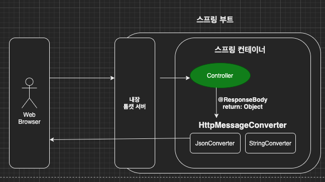
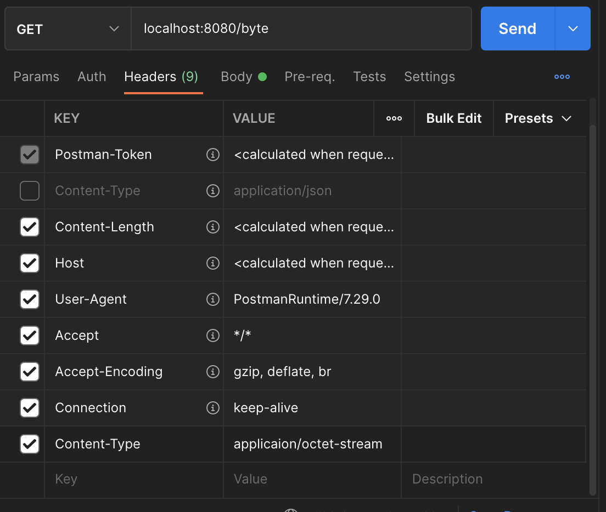
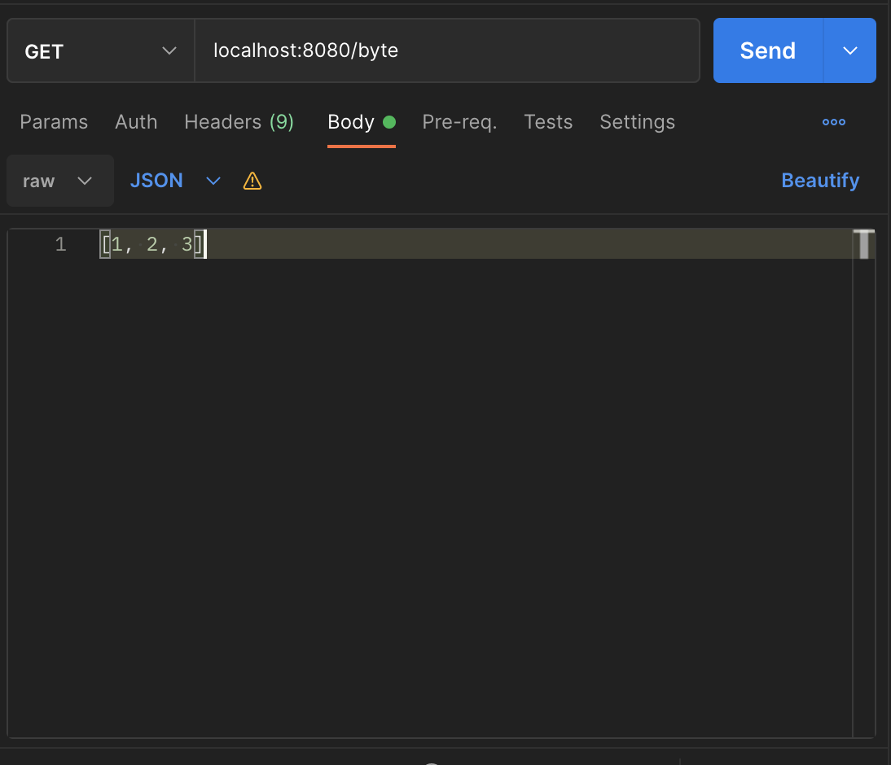
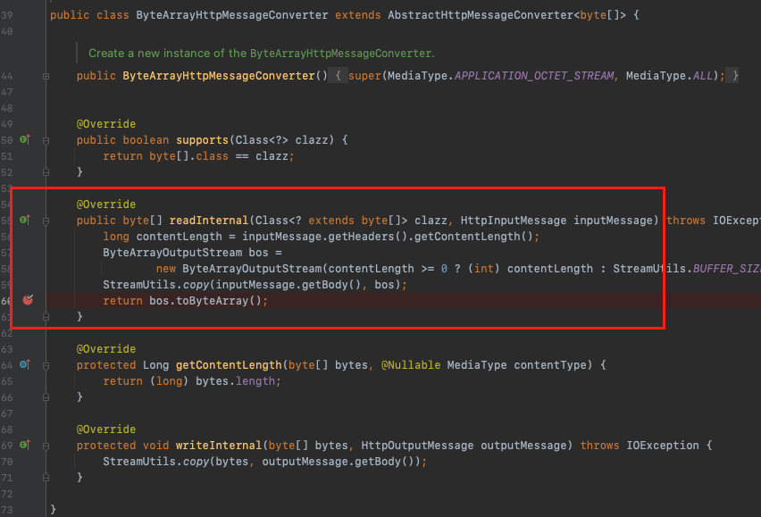

이번 장에서는 스프링 MVC의 메시지 컨버터에 대해서 알아본다.
글의 하단부에 참고한 강의와 공식문서의 경로를 첨부하였으므로 자세한 내용은 강의나 공식문서에서 확인한다.
모든 코드는 [깃허브(링크)](https://github.com/roy-zz/mvc)에 올려두었다.

---

### HTTP 메시지 컨버터

우리는 지금까지 요청을 받았을 때 HTTP 메시지를 직접 받아서 파싱한 것이 아니라 HttpServletRequest나 우리가 만든 클래스의 객체를 전달받았다.
또한 데이터를 반환할 때 HTTP 메시지를 만들어서 클라이언트에게 반환한 것이 아니라 HttpServletResponse나 우리가 만든 객체를 반환했다.
그렇다면 결국 스프링이 우리가 모르는 사이에 HTTP 메시지를 컨버팅 해준다는 것이 된다.
바로 이러한 역할을 하는 것이 스프링의 HTTP 메시지 컨버터다.

클라이언트의 요청이 들어오고 반환되는 과정을 다시 한 번 살펴본다.



우리가 만든 컨트롤러는 @ResponseBody를 사용하여 HTTP message body에 문자 내용을 직접 반환한다.
HttpMessageConverter가 동작하여 HTTP 메시지로 변환하여 반환한다.

메시지 컨버터 또한 스프링에서 많은 컨버터들을 구현해 놓았으며 상황에 맞는 컨버터가 사용된다.

- **StringHttpMessageConverter**: 기본 문자를 처리하는데 사용된다.
- **MappingJackson2HttpMessageConverter**: 기본 객체를 처리하는데 사용된다.

응답의 경우 클라이언트가 요청한 HTTP Accept 헤더와 컨트롤러의 반환 타입을 조합하여 적절한 HttpMessageConverter가 선택된다.

스프링 MVC는 다읨의 경우에 HTTP 메시지 컨버터를 적용한다.

- HTTP 요청: @RequestBody, HttpEntity(RequestEntity)
- HTTP 응답: @ResponseBody, HttpEntity(ResponseEntity)

---

### HtpMessageConverter Interface

```java
public interface HttpMessageConverter<T> {
	boolean canRead(Class<?> clazz, @Nullable MediaType mediaType);
	boolean canWrite(Class<?> clazz, @Nullable MediaType mediaType);
	List<MediaType> getSupportedMediaTypes();
	default List<MediaType> getSupportedMediaTypes(Class<?> clazz) {
		return (canRead(clazz, null) || canWrite(clazz, null) ?
				getSupportedMediaTypes() : Collections.emptyList());
	}
	T read(Class<? extends T> clazz, HttpInputMessage inputMessage)
			throws IOException, HttpMessageNotReadableException;
	void write(T t, @Nullable MediaType contentType, HttpOutputMessage outputMessage)
			throws IOException, HttpMessageNotWritableException;
}
```

HTTP 메시지 컨버터는 요청과 응답에 모두 사용된다.
canRead(), canWrite()를 사용하여 해당 클래스, 미디어 타입을 지원하는지 확인한다.
read(), write()를 사용하여 메시지 컨버터를 통해서 메시지를 읽고 쓴다.

---

### 스프링 부트 기본 메시지 컨버터

스프링 부트는 많은 메시지 컨버터를 구현해 놓았으며 상황에 맞는 컨버터를 사용한다.
어떠한 컨버터가 있는지 몇가지만 살펴보고 넘어가도록 한다.

```java
public class ByteArrayHttpMessageConverter extends AbstractHttpMessageConverter<byte[]> {}
```

byte[] 데이터를 처리한다. 클래스 타입이 byte[]이며 미디어 타입이 */*인 경우 사용된다.
요청 예시: @RequestBody byte[] data
응답 예시: @ResponseBody return byte[], 미디어 타입 application/octet-stream

```java
public class StringHttpMessageConverter extends AbstractHttpMessageConverter<String> {}
```

String 문자로 데이터를 처리한다. 클래스 타입은 String이며 미디어 타입 */*인 경우 선택된다.
요청 예시: @RequestBody String data
응답 예시: @ResponseBody return "OK", 미디어 타입 text/plain

```java
public class MappingJackson2HttpMessageConverter extends AbstractJackson2HttpMessageConverter {}
```

application/json인 경우 사용된다. 클래스 타입은 객체 또는 HashMap이며 미디어 타입 application/json인 경우 선택된다.
요청 예시: @RequestBody ResponseDTO dto
응답 예시: @ResponseBody return dto, 미디어 타입 application/json

**확인!**

정말로 우리가 예상하는 것 처럼 작동하는지 확인해본다.
@RequestBody로 byte[]를 받는 컨트롤러를 하나 생성한다.

```java
@Slf4j
@Controller
public class ConverterController {
    @ResponseBody
    @RequestMapping("/byte")
    void byteController(@RequestBody byte[] data) {
        log.info("data: {}", data);
    }
}
```

Postman에서 Content-Type을 application/octet-stream으로 변경한다.



Body 탭에서 raw를 선택하고 JSON을 선택한다.
이미지와 같이 배열에 숫자들을 입력한다.



바로 전송하지 말고 디버거를 통하여 정말 우리가 예상하는 컨버터가 호출되는지 확인해본다.
ByteArrayHttpMessageConverter의 readInternal() 메서드의 중간에 디버거를 걸어둔다.
(파일을 찾을 때는 cmd + O를 사용하여 찾는다. 맥 기준)



이후 포스트맨에서 Send 버튼을 눌러서 정말 우리가 예상하는 메서드가 호출되는지 확인해본다.
아마 필자와 같은 방식으로 진행한다면 정상적으로 디버거의 포인트에 걸리게 될 것이다.

---

HTTP 요청 데이터 조회

HTTP 요청이 왔을 때 컨트롤러에서 @RequestBody, HttpEntity 파라미터를 사용한다.
메시지 컨버터가 메시지를 일을 수 있는지 확인하기 위해 canRead()를 호출한다.
이때 canRead의 파라미터로 대상 클래스와 Content-Type 미디어 타입을 전달한다.
canRead() 조건을 만족하면 read()를 호출해서 객체를 생성하고 반환한다.

HTTP 응답 데이터 생성

컨트롤러에서 @ResponseBody, HttpEntity로 값이 반환된다.
메시지 컨버터는 자신이 메시지를 쓸 수 있는지 확인하기 위해 canWrite()를 호출한다.
이때 canWrite의 파라미터로 대상 클래스와 HTTP 요청 헤더의 Accept 미디어 타입을 파라미터로 전달한다.
canWrite() 조건을 만족하면 write()를 호출하여 HTTP 응답 메시지 바디에 데이터를 생성한다.

---

**참고한 강의**:

- https://www.inflearn.com/course/%EC%8A%A4%ED%94%84%EB%A7%81-%ED%95%B5%EC%8B%AC-%EC%9B%90%EB%A6%AC-%EA%B8%B0%EB%B3%B8%ED%8E%B8

- https://www.inflearn.com/course/%EC%8A%A4%ED%94%84%EB%A7%81-mvc-1

**Spring 공식문서**:

- https://docs.spring.io/spring-framework/docs/current/reference/html/web.html#spring-web