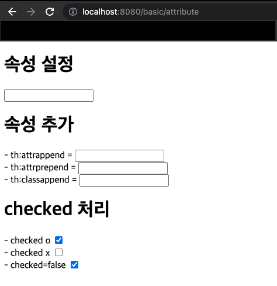

[이전 장(링크)](https://imprint.tistory.com/248) 에서는 `타임리프`의 `텍스트`와 `표준 표현식 구문`에 대해서 알아보았다.
이번 장에서는 그 이외의 기능들에 대해서 알아본다.
글의 하단부에 참고한 강의와 공식문서의 경로를 첨부하였으므로 자세한 내용은 강의나 공식문서에서 확인한다.
모든 코드는 [깃 허브(링크)](https://github.com/roy-zz/mvc) 에 올려두었다.

---

### Attribute

타임리프는 주로 HTML 태그에 `th:*` 속성을 지정하는 방식으로 동작한다.
`th:*`로 속성을 적용하면 기존 속성을 대체하며 기존 속성이 없는 경우 새로 만든다.

#### 예제

**Controller**
```java
@GetMapping("/attribute")
public String attribute() {
    return "basic/attribute";
}
```

**attribute.html**
```html
<h1>속성 설정</h1>
<input type="text" name="mock" th:name="userA" />

<h1>속성 추가</h1>
- th:attrappend = <input type="text" class="text" th:attrappend="class=' large'" /><br/>
- th:attrprepend = <input type="text" class="text" th:attrprepend="class='large '" /><br/>
- th:classappend = <input type="text" class="text" th:classappend="large" /><br/>

<h1>checked 처리</h1>
- checked o <input type="checkbox" name="active" th:checked="true" /><br/>
- checked x <input type="checkbox" name="active" th:checked="false" /><br/>
- checked=false <input type="checkbox" name="active" checked="false" /><br/>
```

**Result**



`<input type="text" name="mock" th:name="userA" />`를 타임리프 렌더링하면 `<input type="text" name="userA" />`와 같이 변경된다.
`th:attrappend`는 속성 값의 뒤에 값을 추가한다. `th:attrprepend`는 속성 값의 앞에 값을 추가한다. `th:classappend`의 경우 class 속성에 자연스럽게 추가한다.
HTML에서는 `<input type="checkbox" name="active" checked="false" />` 이런 경우에도 `checked` 속성이 있기 때문에 체크박스가 `checked`처리가 되어버린다.
HTML에서 `checked` 속성은 `checked` 속성의 값과 상관없이 `checked`라는 속성만 있어도 체크가 된다.

타임리프의 `th:checked`는 값이 `false`인 경우 `checked` 속성 자체를 제거한다.
`<input type="checkbox" name="active" th:checked="false" />`를 타임리프 렌더링하면 `<input type="checkbox" name="active" />`가 된다.

---


---

**참고한 강의**:
- https://www.inflearn.com/course/%EC%8A%A4%ED%94%84%EB%A7%81-%ED%95%B5%EC%8B%AC-%EC%9B%90%EB%A6%AC-%EA%B8%B0%EB%B3%B8%ED%8E%B8
- https://www.inflearn.com/course/%EC%8A%A4%ED%94%84%EB%A7%81-mvc-1
- https://www.inflearn.com/course/%EC%8A%A4%ED%94%84%EB%A7%81-mvc-2

**참고한 문서**:
- [Thymeleaf 공식 사이트](https://www.thymeleaf.org/)
- [Thymeleaf 기본 기능](https://www.thymeleaf.org/doc/tutorials/3.0/usingthymeleaf.html)
- [Thymeleaf 스프링 통합](https://www.thymeleaf.org/doc/tutorials/3.0/thymeleafspring.html)