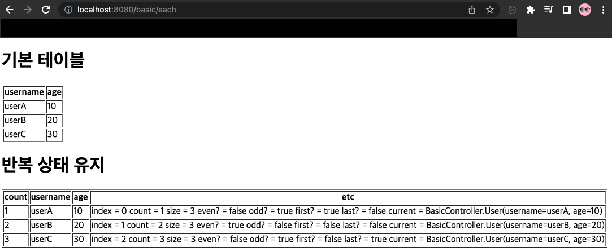
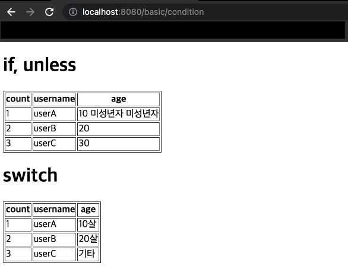

[이전 장(링크)](https://imprint.tistory.com/248) 에서는 `타임리프`의 `텍스트`와 `표준 표현식 구문`에 대해서 알아보았다.
이번 장에서는 그 이외의 기능들에 대해서 알아본다.
글의 하단부에 참고한 강의와 공식문서의 경로를 첨부하였으므로 자세한 내용은 강의나 공식문서에서 확인한다.
모든 코드는 [깃 허브(링크)](https://github.com/roy-zz/mvc) 에 올려두었다.

---

### Attribute

타임리프는 주로 HTML 태그에 `th:*` 속성을 지정하는 방식으로 동작한다.
`th:*`로 속성을 적용하면 기존 속성을 대체하며 기존 속성이 없는 경우 새로 만든다.

#### 예제

**Controller**
```java
@GetMapping("/attribute")
public String attribute() {
    return "basic/attribute";
}
```

**attribute.html**
```html
<h1>속성 설정</h1>
<input type="text" name="mock" th:name="userA" />

<h1>속성 추가</h1>
- th:attrappend = <input type="text" class="text" th:attrappend="class=' large'" /><br/>
- th:attrprepend = <input type="text" class="text" th:attrprepend="class='large '" /><br/>
- th:classappend = <input type="text" class="text" th:classappend="large" /><br/>

<h1>checked 처리</h1>
- checked o <input type="checkbox" name="active" th:checked="true" /><br/>
- checked x <input type="checkbox" name="active" th:checked="false" /><br/>
- checked=false <input type="checkbox" name="active" checked="false" /><br/>
```

**Result**


`<input type="text" name="mock" th:name="userA" />`를 타임리프 렌더링하면 `<input type="text" name="userA" />`와 같이 변경된다.
`th:attrappend`는 속성 값의 뒤에 값을 추가한다. `th:attrprepend`는 속성 값의 앞에 값을 추가한다. `th:classappend`의 경우 class 속성에 자연스럽게 추가한다.
HTML에서는 `<input type="checkbox" name="active" checked="false" />` 이런 경우에도 `checked` 속성이 있기 때문에 체크박스가 `checked`처리가 되어버린다.
HTML에서 `checked` 속성은 `checked` 속성의 값과 상관없이 `checked`라는 속성만 있어도 체크가 된다.

타임리프의 `th:checked`는 값이 `false`인 경우 `checked` 속성 자체를 제거한다.
`<input type="checkbox" name="active" th:checked="false" />`를 타임리프 렌더링하면 `<input type="checkbox" name="active" />`가 된다.

---

### Each

타임리프에서 반복은 `th:each`를 사용한다. 추가로 반복에서 사용할 수 있는 여러 상태 값을 지원한다.

#### 예제

**Controller**
```java
@GetMapping("/each")
public String each(Model model) {
    List<User> users = List.of(
            new User("userA", 10),
            new User("userB", 20),
            new User("userC", 30));
    model.addAttribute("users", users);
    return "basic/each";
}
```

**each.html**
```html
<h1>기본 테이블</h1>
<table border="1">
    <tr>
        <th>username</th>
        <th>age</th>
    </tr>
    <tr th:each="user : ${users}">
        <td th:text="${user.username}">username</td>
        <td th:text="${user.age}">0</td>
    </tr>
</table>

<h1>반복 상태 유지</h1>

<table border="1">
    <tr>
        <th>count</th>
        <th>username</th>
        <th>age</th>
        <th>etc</th>
    </tr>
    <tr th:each="user, userStat : ${users}">
        <td th:text="${userStat.count}">username</td>
        <td th:text="${user.username}">username</td>
        <td th:text="${user.age}">0</td>
        <td>
            index = <span th:text="${userStat.index}"></span>
            count = <span th:text="${userStat.count}"></span>
            size = <span th:text="${userStat.size}"></span>
            even? = <span th:text="${userStat.even}"></span>
            odd? = <span th:text="${userStat.odd}"></span>
            first? = <span th:text="${userStat.first}"></span>
            last? = <span th:text="${userStat.last}"></span>
            current = <span th:text="${userStat.current}"></span>
        </td>
    </tr>
</table>
```

**Result**



**반복 기능**
`<tr th:each="user : ${users}">`
반복 시 오른쪽 컬렉션(${users)의 값을 하나씩 꺼내서 왼쪽 변수인 user에 담아서 태그를 반복 실행한다.
`th:each`는 `List`뿐만 아니라 배열, `java.util.Iterable`, `java.util.Enumeration`을 구현한 모든 객체를 반복에 사용할 수 있다.
`Map`도 사용할 수 있으며 변수에 담기는 값은 `Map.Entry`다.

**반복 상태 유지**
`<tr th:each="user, userStat : ${users}">`
반복의 두번째 파라미터를 설정해서 반복의 상태를 확인할 수 있다.
두번째 파라미터는 생략 가능하며 생략하면 지정한 변수명(user) + Stat이 된다.
예시에서는 `user` + `Stat` = `userStat`이므로 생략 가능하다.

**반복 상태 유지 기능**
- index: 0부터 시작하는 값
- count: 1부터 시작하는 값
- size: 전체 사이즈
- even, odd: 홀수, 짝수 여부(boolean)
- first, last: 처음, 마지막 여부(boolean)
- current: 현재 객체

---

### Condition(조건부 평가)

타임리프의 조건식은 `if`와 반대 의미의 `unless`가 있다.

#### 예제

**Controller**
```java
@GetMapping("/condition")
public String condition(Model model) {
    List<User> users = getUsers();
    model.addAttribute("users", users);
    return "basic/condition";
}
private List<User> getUsers() {
    return List.of(
            new User("userA", 10),
            new User("userB", 20),
            new User("userC", 30));
}
```

**condition.html**

```html
<h1>if, unless</h1>
<table border="1">
    <tr>
        <th>count</th>
        <th>username</th>
        <th>age</th>
    </tr>
    <tr th:each="user, userStat : ${users}">
        <td th:text="${userStat.count}">1</td>
        <td th:text="${user.username}">username</td>
        <td>
            <span th:text="${user.age}">0</span>
            <span th:text="'미성년자'" th:if="${user.age lt 20}"></span>
            <span th:text="'미성년자'" th:unless="${user.age ge 20}"></span>
        </td>
    </tr>
</table>

<h1>switch</h1>
<table border="1">
    <tr>
        <th>count</th>
        <th>username</th>
        <th>age</th>
    </tr>
    <tr th:each="user, userStat : ${users}">
        <td th:text="${userStat.count}">1</td>
        <td th:text="${user.username}">username</td>
        <td th:switch="${user.age}">
            <span th:case="10">10살</span>
            <span th:case="20">20살</span>
            <span th:case="*">기타</span>
        </td>
    </tr>
</table>
```

**Result**



타임리프는 `if`와 `unless`를 사용할 때 해당 조건이 맞지 않으면 태그 자체를 렌더링하지 않는다.
만약 다음 조건이 `false`인 경우 `<span>...</span>` 부분이 렌더링 되지 않고 사라진다.
`<span th:text="'미성년자'" th:if="${user.age lt 20}"></span>`

switch
`*`는 만족하는 조건이 없는 경우에 사용한다. 자바 switch의 default.

---

### Comment

1. 표준 HTML 주석: 자바스크립트의 표준 HTML 주석은 타임리프가 렌더링 하지 않고 그대로 남겨둔다.
2. 타임리프 파서 주석: 타임리프 파서 주석은 타임리프의 주석으로 렌더링에서 주석 부분을 제거한다.
3. 타임리프 프로토타입 주석: HTML 주석에 `/*/`가 추가된 형태로 HTML 파일을 웹 브라우저에서 그대로 열어보면 HTML 주석이기 때문에 웹 브라우저가 렌더링 하지 않는다.
`타임리프 렌더링`을 거치면 정상적으로 렌더링 된다. 즉, HTML 파일을 그대로 열어보면 주석 처리가 되지만, 타임리프를 렌더링 한 경우에만 보이는 기능이다.

#### 예시

**Controller**
```java
@GetMapping("/comments")
public String comments(Model model) {
    model.addAttribute("data", "Spring!");
    return "basic/comments";
}
```

**comments.html**
```html
<h1>예시</h1>
<span th:text="${data}">html data</span>

<h1>1. 표준 HTML 주석</h1>
<!--
<span th:text="${data}">html data</span>
-->

<h1>2. 타임리프 파서 주석</h1>
<!--/* [[${data}]] */-->

<!--/*-->
<span th:text="${data}">html data</span>
<!--*/-->

<h1>3. 타임리프 프로토타입 주석</h1>
<!--/*/
<span th:text="${data}">html data</span>
/*/-->
```

**Result**

```html
<h1>예시</h1>
<span>Spring!</span>

<h1>1. 표준 HTML 주석</h1>
<!--
<span th:text="${data}">html data</span>
-->

<h1>2. 타임리프 파서 주석</h1>


<h1>3. 타임리프 프로토타입 주석</h1>

<span>Spring!</span>
```

---

### Block (블록)

`<th:block>`은 HTML 태그가 아닌 타임리프의 유일한 자체 태그다.

#### 예시

**Controller**
```java
@GetMapping("/block")
public String block(Model model) {
    List<User> users = getUsers();
    model.addAttribute("users", users);
    return "basic/block";
}
```

**block.html**
```html
<th:block th:each="user : ${users}">
    <div>
        사용자 이름 <span th:text="${user.username}"></span>
        사용자 나이 <span th:text="${user.age}"></span>
    </div>
    <div>
        요약 <span th:text="${user.username} + ' / ' + ${user.age}"></span>
    </div>
</th:block>
```

**Result**
```html
    <div>
        사용자 이름 <span>userA</span>
        사용자 나이 <span>10</span>
    </div>
    <div>
        요약 <span>userA / 10</span>
    </div>

    <div>
        사용자 이름 <span>userB</span>
        사용자 나이 <span>20</span>
    </div>
    <div>
        요약 <span>userB / 20</span>
    </div>

    <div>
        사용자 이름 <span>userC</span>
        사용자 나이 <span>30</span>
    </div>
    <div>
        요약 <span>userC / 30</span>
    </div>
```

타임리프의 특성상 HTML 태그 안에 속성으로 기능을 정의해서 사용한다.
하지만 위의 예제처럼 for 한 번에 두 개의 `div`태그를 써야하는 경우 `<th:block>`을 사용하면 된다.
타임리프에 의해 렌더링될 때 `<th:block>`은 제거된다.

---

### Javascript Inline

타임리프는 자바스크립트에서 타임리프를 편리하게 사용할 수 있는 `자바스크립트 인라인` 기능을 제공한다.
자바스크립트 인라인 기능은 아래와 같이 적용한다.

`<script th:inline="javascript">`

#### 예시

**Controller**
```java
@GetMapping("/javascript")
public String javascript(Model model) {
    model.addAttribute("user", new User("userA", 10));
    List<User> users = getUsers();
    model.addAttribute("users", users);
    return "basic/javascript";
}
```

**javascript.html**
```html
<!-- 자바스크립트 인라인 사용 전 -->
<script>
    const username = [[${user.username}]];
    const age = [[${user.age}]];
    // 자바스크립트 내추럴 템플릿
    const username2 = /*[[${user.username}]]*/ "test username";
    // 객체
    const user = [[${user}]];
</script>

<!-- 자바스크립트 인라인 사용 후 -->
<script th:inline="javascript">
    const username = [[${user.username}]];
    const age = [[${user.age}]];
    // 자바스크립트 내추럴 템플릿
    const username2 = /*[[${user.username}]]*/ "test username";
    // 객체
    const user = [[${user}]];
</script>

<!-- 자바스크립트 인라인 each -->
<script th:inline="javascript">
    [# th:each="user, stat : ${users}"]
    const user[[${stat.count}]] = [[${user}]]
    [/]
</script>
```

**Result**
```html
<!-- 자바스크립트 인라인 사용 전 -->
<script>
    const username = userA;
    const age = 10;
    // 자바스크립트 내추럴 템플릿
    const username2 = /*userA*/ "test username";
    // 객체
    const user = BasicController.User(username=userA, age=10);
</script>

<!-- 자바스크립트 인라인 사용 후 -->
<script>
    const username = "userA";
    const age = 10;
    // 자바스크립트 내추럴 템플릿
    const username2 = "userA";
    // 객체
    const user = {"username":"userA","age":10};
</script>

<!-- 자바스크립트 인라인 each -->
<script>
    const user1 = {"username":"userA","age":10}
    const user2 = {"username":"userB","age":20}
    const user3 = {"username":"userC","age":30}
</script>
```

인라인을 위하여 HTML 코드를 작성할 때 오류 표시가 나는 것은 IntelliJ의 오류이므로 무시해도 좋다.

#### 참고

**텍스트 렌더링**
`var username = [[${user.username}]];`
- 인라인 사용 전: `var username = userA`
- 인라인 사용 후: `var username = "userA"`

인라인을 사용하지 않으면 `userA`라는 변수 이름이 그대로 남아있다. 
타임리프는 코드에 있는 그대로 렌더링을 한 것이지만 우리는 "userA"라는 문자가 나오는 결과를 예상하였다.
결과적으로 userA가 변수명으로 사용되어 자바스크립트 오류가 발생하였다.
age의 경우에는 `"`가 필요 없기 때문에 자바스크립트 오류 없이 정상 렌더링되었다.

인라인 사용 후 렌더링 결과를 보면 문자 타입인 경우 `"`를 포함해줘야한다.
추가로 자바스크립트에서 문제가 될 수 있는 문자가 포함되어 있으면 이스케이프 처리해준다.

**자바스크립트 내추럴 템플릿**
타임리프는 HTML 파일을 직접 열어도 동작하는 태추럴 템플릿 기능을 제공한다.
자바스크립트 인라인 기능을 사용하면 주석을 활용해서 이 기능을 사용할 수 있다.

`var username2 = /*[[${user.username}]]*/ "test username";`
- 인라인 사용 전: `var username2 = /*userA*/ "test username";`
- 인라인 사용 후: `var username2 = "userA";`

인라인 사용 전 결과를 보면 순수하게 있는 그대로 해석했다. 
이로 인해 내추럴 템플릿 기능이 동작하지 않고 렌더링 내용이 주석처리 되어 버린다.
인라인 사용 후 결과를 보면 주석 부분이 제거되고, 기대한 "userA"가 정확하게 적용된다.

**객체**
타임리프의 자바스크립트 인라인 기능을 사용하면 객체를 `JSON`으로 자동 변환해준다.

`var user = [[${user}]]`;
- 인라인 사용 전: `var user = BasicController.User(username=userA, age=10);`
- 인라인 사용 후: `var user = {"username": "userA", "age": 10};`

인라인 사용 전은 객체의 `toString()`이 호출된 값이며 인라인 사용 후는 객체를 `JSON`으로 변환된 값이다.

---

지금까지 타임리프의 기타 기능들에 대해서 알아보았다.

---

**참고한 강의**:
- https://www.inflearn.com/course/%EC%8A%A4%ED%94%84%EB%A7%81-%ED%95%B5%EC%8B%AC-%EC%9B%90%EB%A6%AC-%EA%B8%B0%EB%B3%B8%ED%8E%B8
- https://www.inflearn.com/course/%EC%8A%A4%ED%94%84%EB%A7%81-mvc-1
- https://www.inflearn.com/course/%EC%8A%A4%ED%94%84%EB%A7%81-mvc-2

**참고한 문서**:
- [Thymeleaf 공식 사이트](https://www.thymeleaf.org/)
- [Thymeleaf 기본 기능](https://www.thymeleaf.org/doc/tutorials/3.0/usingthymeleaf.html)
- [Thymeleaf 스프링 통합](https://www.thymeleaf.org/doc/tutorials/3.0/thymeleafspring.html)