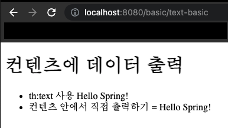
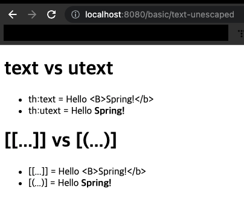
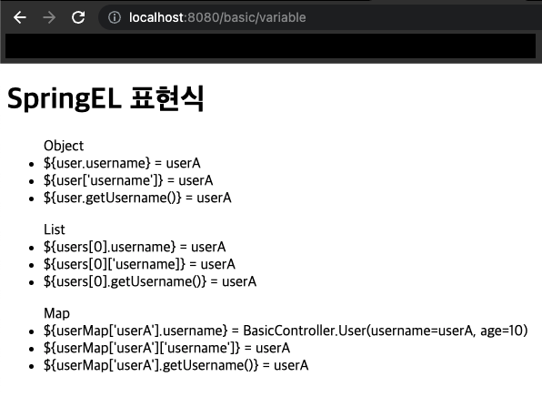
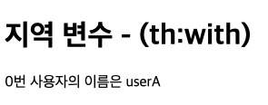
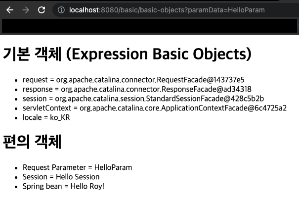

이번 장에서는 `타임리프`의 기본 기능들에 대해서 알아본다.
글의 하단부에 참고한 강의와 공식문서의 경로를 첨부하였으므로 자세한 내용은 강의나 공식문서에서 확인한다.
모든 코드는 [깃 허브(링크)](https://github.com/roy-zz/mvc) 에 올려두었다.

---

### 개요

`타임리프`는 서버에서 HTML 파일을 동적으로 렌더링해주는 `SSR(Server Side Rendering)` 용도로 사용된다.
`네츄럴 템플릿`으로 순수 HTML을 최대한 유지하는 특징이 있다. 순수하다는 의미는 타임리프로 작성한 파일이 HTML을 유지하기 때문에 웹 브라우저에서 파일을 직접 열어도 내용을 확인할 수 있다는 의미이다.
또한 서버를 통해 뷰 템플릿을 거치면 동적으로 변경된 결과를 확인할 수 있다.
`JSP`와 유사한 템플릿은 생성된 웹 브라우저를 통해 소스코드를 확인해보면 HTML이 뒤죽박죽 섞여서 웹 즈라우저에서 정상적인 HTML 결과를 확인할 수 없다.
서버를 통해서 렌더링 되어야지만 화면에 표시되는 내용을 알 수 있다.
반면 타임리프로 작성된 파일은 해당 파일을 그대로 웹 브라우저에서 열면 렌더링 되지는 않았지만 정상적인 HTML 결과를 확인할 수 있다.
이렇게 순수한 HTML 파일을 유지하면서 뷰 템플릿도 사용할 수 있는 타임리프의 특징을 `네츄럴 템플릿`이라고 한다.

타임리프는 스프링을 위해서 나왔다고 해도 될 정도로 스프링과 자연스럽게 통합되고 다양한 편의 기능을 지원한다.

---

### [기본 표현식](https://www.thymeleaf.org/doc/tutorials/3.0/usingthymeleaf.html#standard-expression-syntax)

타임리프는 다음과 같은 `기본 표현식`들을 제공한다.

```text
- 간단한 표현:
  - 변수 표현식: ${...}
  - 선택 변수 표현식: *{...}
  - 메시지 표현식: #{...}
  - 링크 URL 표현식: @{...}
  - 조각 표현식: ~{...}
- 리터럴
  - 텍스트: 'one text', 'Another one!',...
  - 숫자: 0, 34, 3.0, 12.3,...
  - 불린: true, false
  - 널: null
  - 리터럴 토큰: one, sometext, main,...
- 문자 연산:
  - 문자합치기:+
  - 리터럴 대체: |The name is ${name}|
- 산술 연산:
  - Binary operators: +, -, *, /, %
  - Minus sign (unary operator): - 
- 불린 연산:
  - Binary operators: and, or
  - Boolean negation (unary operator): !, not
- 비교와 동등
  - 비교: >, <, >=, <= (gt,lt,ge,le)
  - 동등 연산: ==, != (eq, ne) 
- 조건 연산:
  - If-then: (if) ? (then)
  - If-then-else: (if) ? (then) : (else)
  - Default: (value) ?: (defaultvalue)
- 특별한 토큰:
  - No-Operation: _
```

---

### 텍스트 - text, utext

타임리프는 기본적으로 HTML 태그 속성에 기능을 정의해서 동작한다.
HTML의 콘텐츠(content)에 데이터를 출력할 때는 아래와 같이 `th:text`를 사용한다.

```html
<span th:text="${data}"></span>
```

HTML 태그의 속성이 아니라 HTML 컨텐츠 영역에서 직접 데이터를 출력하고 싶다면 아래와 같이 `[[...]]`를 사용한다.

```html
yourVariable = [[${data}]]
```

#### 예제

**Controller**
```java
@GetMapping("/text-basic")
public String textBasic(Model model) {
    model.addAttribute("data", "Hello Spring!");
    return "basic/text-basic";
}
```

**text-basic.html**
```html
<!--생략...-->
<h1>컨텐츠에 데이터 출력</h1>
<ul>
    <li>th:text 사용 <span th:text="${data}"></span></li>
    <li>컨텐츠 안에서 직접 츌력하기 = [[${data}]]</li>
</ul>
<!--생략...-->
```

**Result**



---

### Escape

HTML 문서는 `<`, `>`와 같은 특수 문자를 기반으로 정의된다.
뷰 템플릿으로 HTML 화면을 생성할 때는 출력하는 데이터에 이런 문자가 들어가지 않도록 주의해서 사용해야한다.

**HTML 엔티티**: 웹 브라우저는 `<`를 HTML 태그의 시작으로 인식한다. 따라서 `<`를 태그의 시작이 아니라 문자로 표현할 수 있는 방법을 `HTML 엔티티`라 한다.
이렇게 HTML에서 사용하는 특수 문자를 HTML 엔티티로 변경하는 것을 `이스케이프(escape)`라 한다.
또한 타임리프에서 제공하는 `th:text`는 기본적으로 `이스케이프(escape)`를 제공한다. [HTML에 대한 자세한 사항](https://entitycode.com/#featured-content) 은 링크를 확인하도록 한다.
만약 `이스케이프(escape)`기능을 비활성화 하고 싶은 경우에는 `th:text`가 아니라 `th:utext`를 사용하면 된다.

`escape`를 사용하지 않으면 HTML이 렌더링 되지 않는 수 많은 문제가 발생하므로 기본적으로 사용하고, 꼭 필요한 경우에만 `unescape`를 사용하도록 한다.

#### 예제

**Controller**
```java
@GetMapping("/text-unescaped")
public String textUnescaped(Model model) {
    model.addAttribute("data", "Hello <B>Spring!</b>");
    return "basic/text-unescaped";
}
```

**text-unescaped.html**
```html
<h1>text vs utext</h1>
<ul>
    <li>th:text = <span th:text="${data}"></span></li>
    <li>th:utext = <span th:utext="${data}"></span></li>
</ul>

<h1><span th:inline="none">[[...]] vs [(...)]</span></h1>
<ul>
    <li><span th:inline="none">[[...]] = </span>[[${data}]]</li>
    <li><span th:inline="none">[(...)] = </span>[(${data})]</li>
</ul>
```

**Result**



---

### 변수 - SpringEL

타임리프에서는 변수를 사용할 때 `변수 표현식`(${...})을 사용한다.
`변수 표현식`에는 스프링 EL이라는 스프링이 제공하는 표현식을 사용할 수 있다.

#### 예제

**Controller**

```java
@GetMapping("/variable")
public String variable(Model model) {
    List<User> userList = List.of(
            new User("userA", 10),
            new User("userB", 20)
    );
    Map<String, User> userMap = new HashMap<>(
            Map.of("userA", userList.get(0), "userB", userList.get(1))
    );
    model.addAttribute("user", userList.get(0));
    model.addAttribute("users", userList);
    model.addAttribute("userMap", userMap);
    return "basic/variable";
}
@Data
@AllArgsConstructor
static class User {
    private String username;
    private int age;
}
```

**variable.html**

```html
<h1>SpringEL 표현식</h1>
<ul>Object
    <!--user.username: user의 username을 프로퍼티 접근 -> user.getUsername()-->
    <li>${user.username} = <span th:text="${user.username}"></span></li>
    <li>${user['username']} = <span th:text="${user['username']}"></span></li>
    <li>${user.getUsername()} = <span th:text="${user.getUsername()}"></span></li>
</ul>
<ul>List
    <li>${users[0].username} = <span th:text="${users[0].username}"></span></li>
    <li>${users[0]['username]} = <span th:text="${users[0]['username']}"></span></li>
    <li>${users[0].getUsername()} = <span th:text="${users[0].getUsername()}"></span></li>
</ul>
<ul>Map
    <li>${userMap['userA'].username} = <span th:text="${userMap['userA']}"></span></li>
    <li>${userMap['userA']['username']} = <span th:text="${userMap['userA']['username']}"></span></li>
    <li>${userMap['userA'].getUsername()} = <span th:text="${userMap['userA'].getUsername()}"></span></li>
</ul>
```

**Result**



---

#### 지역 변수 사용법

`th:with`를 사용하여 지역 변수를 선언해서 사용할 수 있으며 해당 태그 안에서만 사용할 수 있다.

**variable.html**
```html
<h1>지역 변수 - (th:with)</h1>
<div th:with="first=${users[0]}">
    <p>0번 사용자의 이름은 <span th:text="${first.username}"></span></p>
</div>
```

**Result**



---

### 기본 객체들

타임리프는 아래와 같은 기본 객체들을 제공한다.

- ${#request}
- ${#response}
- ${#session}
- ${#servletContext}
- ${#locale}

`${#request}`의 경우 `HttpServletRequest` 객체를 그대로 제공하기 때문에 데이터를 조회하기 불편하다.
이러한 문제를 해결하기 위해 편의 객체도 제공한다.

- HTTP 요청 파라미터 접근: ${param}
- HTTP 세션 접근: ${session}
- 스프링 빈 접근: @{@royBean.roy('Roy')}

#### 예제

**Controller**
```java
@GetMapping("/basic-objects")
public String basicObjects(HttpSession session) {
    session.setAttribute("sessionData", "Hello Session");
    return "basic/basic-objects";
}

@Component("royBean")
static class RoyBean {
    public String roy(String data) {
        return String.format("Hello %s", data);
    }
}
```

**basic-objects.html**
```html
<h1>기본 객체 (Expression Basic Objects)</h1>
<ul>
    <li>request = <span th:text="${#request}"></span></li>
    <li>response = <span th:text="${#response}"></span></li>
    <li>session = <span th:text="${#session}"></span></li>
    <li>servletContext = <span th:text="${#servletContext}"></span></li>
    <li>locale = <span th:text="${#locale}"></span></li>
</ul>

<h1>편의 객체</h1>
<ul>
    <li>Request Parameter = <span th:text="${param.paramData}"></span></li>
    <li>Session = <span th:text="${session.sessionData}"></span></li>
    <li>Spring bean = <span th:text="${@royBean.roy('Roy!')}"></span></li>
</ul>
```

**Result**



---

### 


---

**참고한 강의**:
- https://www.inflearn.com/course/%EC%8A%A4%ED%94%84%EB%A7%81-%ED%95%B5%EC%8B%AC-%EC%9B%90%EB%A6%AC-%EA%B8%B0%EB%B3%B8%ED%8E%B8
- https://www.inflearn.com/course/%EC%8A%A4%ED%94%84%EB%A7%81-mvc-1
- https://www.inflearn.com/course/%EC%8A%A4%ED%94%84%EB%A7%81-mvc-2

**참고한 문서**:
- [Thymeleaf 공식 사이트](https://www.thymeleaf.org/)
- [Thymeleaf 기본 기능](https://www.thymeleaf.org/doc/tutorials/3.0/usingthymeleaf.html)
- [Thymeleaf 스프링 통합](https://www.thymeleaf.org/doc/tutorials/3.0/thymeleafspring.html)
